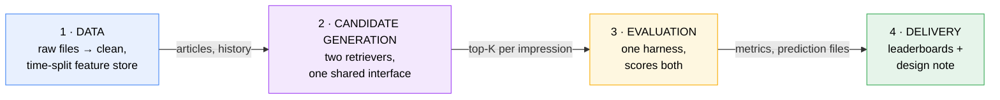
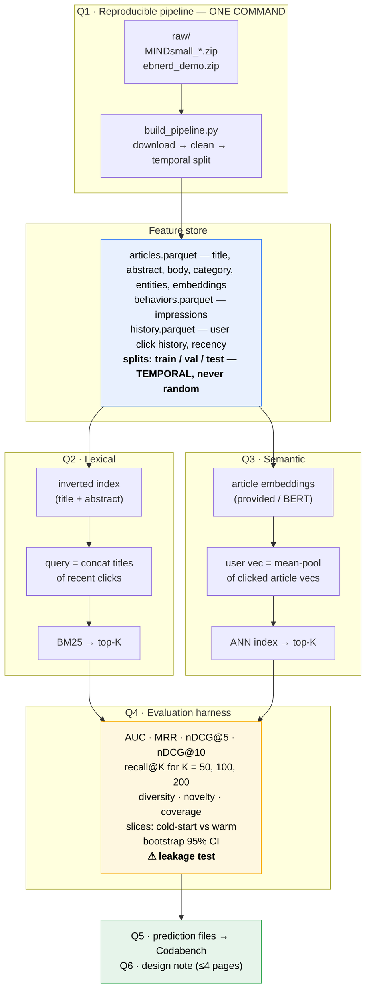

# A1 — Architecture & design decisions

Working notes for [[Assignment-1-Lexical-Semantic-Retrieval]]. Two halves: **what to build**, and
**the decisions you have to make consciously** — because the grade is on design rigour, not scores.

> [!info] New to this? Start with [[foundations|foundations.md]]
> This doc assumes you know what an embedding, an inverted index, and recall@K are. If any of those
> are unfamiliar — or you haven't done SMAI/iNLP — read [[foundations|foundations.md]] first; it
> builds every term used here from scratch, and explicitly lists what you *don't* need to learn.

**How this doc is ordered — easy to hard.** Read top to bottom on the first pass:

| Part | Sections | What it gives you |
|---|---|---|
| **A · The idea** | The whole thing in plain words · vocabulary | Ordinary language, zero notation. Enough to explain A1 to a friend. |
| **B · The shape** | Problem framing · how much pipeline · architecture · repo layout | What you're building, and how big it has to be. |
| **C · The machinery** | Algorithms, formulas, metrics | The formal half. Each subsection opens in plain words, *then* gives the maths. |
| **D · The judgement** | Decisions · ambiguities · failure modes · checks | What earns the marks. Return here repeatedly while building. |

Parts A and B are the first sitting. Part C is reference — read a subsection when you're about to
implement it. Part D is where the grade actually lives.

---

# Part A · The idea

## The whole thing in plain words

Before any formulas — this is what the assignment is actually doing, in ordinary language.

**The problem.** Someone opens a news site. You're shown who they are, when they arrived, and a list
of maybe 50 articles that *could* be displayed. Guess which ones they'll click.

**The trick that makes it a search problem.** You don't know what this person wants. But you know what
they read yesterday. So take the headlines of their recent articles, paste them together, and treat
that as a **search query**. Now "what will they click?" becomes "what articles match this query?" —
and that's a problem search engines have solved for fifty years.

**Two ways to answer it, and they disagree usefully:**

- **Word matching (lexical).** They read something with "election" in the headline; find other
  articles containing "election". Simple, fast, and blind — "car" and "automobile" look unrelated.
- **Meaning matching (semantic).** Convert every article into a list of numbers (an *embedding*) that
  captures what it's about, so articles on similar topics get similar numbers. Then find articles
  whose numbers are close to the user's. Catches "car"/"automobile"; can also drift into
  "vaguely similar-sounding but wrong".

You build both because they fail differently — and the assignment asks which wins on which kinds of user.

**Why "candidate generation" and not "ranking".** You're not producing the final order. You're
narrowing thousands of articles down to a few hundred worth considering. A later assignment does the
fine ordering. So the question is only *"did the article they actually clicked survive the cut?"* —
which is what **recall@K** measures. Missing it here is fatal; having it at position 180 instead of 3
is fine.

**The one rule that can invalidate everything.** When testing on Tuesday's data, the model may only
know what happened before Tuesday. If Wednesday's clicks leak into Tuesday's prediction, your scores
look wonderful and mean nothing. That's why the split is by *time*, never random — and why Q9 wants a
test that catches it.

### The vocabulary, in one line each

| Term | What it means |
|---|---|
| **Impression** | One moment a user was shown a set of articles — plus which ones they clicked |
| **Candidate generation** | Narrowing many articles to a shortlist worth ranking |
| **Query** | Here: the user's recent headlines, glued together and used as search text |
| **Corpus** | All the articles you can retrieve from |
| **Inverted index** | A word → articles-containing-it lookup table. Like a book index; it's what makes search fast |
| **Term frequency (TF)** | How often a word appears in an article |
| **Document frequency (DF)** | How many articles contain a word. High = common = uninformative |
| **BM25** | The standard formula for "how well does this article match this query" |
| **Embedding** | An article turned into ~768 numbers that encode its meaning |
| **Pooling** | Squashing several embeddings (the user's clicked articles) into one |
| **ANN** | Approximate Nearest Neighbours — finding close vectors fast without checking all of them |
| **Brute force** | Checking all of them. Slow but exact — your correctness reference |
| **recall@K** | Of the articles they clicked, what fraction made your top-K shortlist |
| **nDCG** | A score that rewards putting good results near the top |
| **Cold start** | A user with little or no history — you have almost nothing to search with |
| **Leakage** | Accidentally using future information. The cardinal sin |
| **Bootstrap CI** | Resampling your results to say "this number is 0.42, give or take 0.03" |

---

# Part B · The shape of what you build

## The shape of the problem

Given an **impression** (a user, a timestamp, and a slate of candidate articles), rank the candidates
by click likelihood. You have three signal families and must exercise all three:

| Axis | Signal | Brief names | This assignment (C1) |
|---|---|---|---|
| **Lexical** | word overlap | BM25, **TF-IDF** | BM25 over title + abstract (Q2.1); TF-IDF as cheap baseline |
| **Semantic** | meaning | **Word2Vec, BERT, XLM-RoBERTa** | Provided multilingual embeddings + ANN |
| **Behavioural** | prior behaviour | click history, recency/decay, **session context** | Click history + recency; **session context — see open decisions** |

> [!note] Two narrowings worth naming in the design note
> The brief's intro says lexical works over "titles/**bodies**"; **Q2.1 specifies title + abstract**,
> so the specific requirement wins. And **session context is a named behavioural signal that this
> pipeline currently ignores** — a deliberate scope choice, not an oversight, and one the design note
> should state rather than leave implicit.

The key insight: **the user's click history is your query.** You're turning a recommendation problem
into a retrieval problem — concatenate the titles of recently clicked articles, and search for
similar articles. That framing is what makes BM25 and ANN applicable at all.

## How much pipeline do you actually need?

> [!warning] The architecture below is **authored, not mandated**
> The brief specifies Q1–Q9 and nothing about how you organise them. The four-stage shape, the
> `Retriever` interface, and the repo layout in this doc are **design choices made here** — defensible,
> but yours to change. Say so in the design note; "I chose this structure because X" earns marks,
> "this is the structure" does not.

The brief's real floor is smaller than it looks. Three tiers, and you should know which one you're on:

| | **Minimum** — passes Q1–Q9 | **Recommended** — the doc below | **Overkill** — costs more than it returns |
|---|---|---|---|
| **Data** | One script, one dataset schema, temporal split | + feature store as parquet, config-driven paths | Airflow/DVC orchestration, a database |
| **Lexical** | `rank_bm25` over titles, default params | + abstracts, own inverted index, k1/b sweep | Custom posting-list compression, learned sparse (SPLADE) |
| **Semantic** | Provided embeddings + brute-force top-K | + FAISS HNSW, one own-embedding ablation | Training an encoder, distillation, multi-vector (ColBERT) |
| **Eval** | AUC/MRR/nDCG + recall@K + one slice + bootstrap | + beyond-accuracy, several slices, leakage test | A metrics DSL, experiment-tracking server |
| **Effort** | ~2 days | ~1 week | Weeks; eats the marks it was meant to earn |

**The crux: what every tier must do, no matter how small.**

1. **Temporal split with truncated history.** For a test impression at time *t*, that user's history must contain only clicks `< t`. This is the one property that, if wrong, invalidates every number you report.
2. **Two retrievers behind one interface.** Q2 and Q3 must be comparable, which means the same harness scores both.
3. **recall@K at K ∈ {50, 100, 200}.** The brief names these exactly.
4. **Every number carries a bootstrap CI.**
5. **A test that fails when you break the boundary.** Q9 says "include a test asserting this" — a test that passes both before and after you introduce leakage proves nothing.

Everything else — the parquet feature store, the `Makefile`, the config files — is engineering that makes the above easier to redo. Valuable, but not what's graded.

> [!tip] When the minimum is the right call
> If you're short on time, build the minimum tier **completely** and spend the remaining hours on the
> design note and one good ablation. A complete small pipeline with honest CIs and a sharp note beats
> a half-finished elaborate one — the grade is on *correctness, rigour, and clarity*, and an
> unfinished component scores zero on all three.

## High-level architecture

Four stages. Everything else is detail.



**Read it as:** data is prepared once, two retrievers compete on it, one harness judges them both,
and the results become your submission. The whole assignment is that sentence.

### What each component does

**1 · Data (Q1)** — Turns two differently-shaped datasets into one unified schema, split by *time*.
Its job is to make everything downstream dataset-agnostic and reproducible from one command.
*Owns the leakage boundary* — the single most important correctness property in the assignment.

**2 · Candidate generation (Q2, Q3)** — Two independent retrievers that answer the same question
("given this user's history, which articles might they click?") in completely different ways: word
overlap vs. embedding proximity. They share a `Retriever` interface so the harness treats them
identically. *Optimised for recall, not precision* — this stage only narrows thousands of articles
to a few hundred; ranking is Component-2 of the assignment.

**3 · Evaluation (Q4)** — The judge. Computes accuracy metrics (AUC, MRR, nDCG), beyond-accuracy
metrics (diversity, novelty, coverage), splits results by user/article slices, and attaches bootstrap
confidence intervals. *Also home to the leakage test* — the harness is where correctness is proven,
not just measured.

**4 · Delivery (Q5, Q6)** — Formats predictions for the two Codabench leaderboards and turns your
choices into the ≤4-page design note. Not an afterthought: the note is where most of the marks are.

## Detailed architecture



**Read it as:** one command builds the feature store → that store feeds *two independent retrievers*
→ both are measured by *the same* harness → results go to the leaderboards and the note.

The symmetry matters: Q2 and Q3 are parallel paths with the same shape (build an index → turn click
history into a query → retrieve top-K). Writing them against a shared `Retriever` interface is what
lets one evaluation harness score both.

## Is this fixed, or can I add more?

**The four stages are fixed; what goes inside them is yours.** Q1–Q6 are the graded skeleton, and
dropping any of them loses marks directly. But the assignment is explicitly graded on *"alternatives
considered"* and *"ablation rigour"* — so additions are rewarded, **as long as they're measured**.

### Safe and valuable additions

| Add | Why it earns marks |
|---|---|
| **A third retriever** — TF-IDF, or category/popularity baseline | A trivial baseline makes your real numbers meaningful. Cheap, high value. |
| **Hybrid fusion** of lexical + semantic (e.g. reciprocal rank fusion) | Q3.5 asks "which works better, on which slices?" — fusion is the natural follow-up. |
| **More slices** beyond the required one (fresh vs. stale articles, session length, time-of-day) | Slices are where the interesting findings live. |
| **Brute-force alongside ANN** | Gives you the exact recall ceiling. Practically required for an honest ANN evaluation. |
| **A parameter sweep** (BM25 k1/b, embedding model, K) | This *is* ablation rigour. |
| **Caching / timing instrumentation** | Feeds the "breaks at 10×" scale analysis with real numbers instead of speculation. |

### Additions that cost more than they return

- **A learned re-ranker.** Tempting, but that's explicitly Component-2. Building it now means less
  time on the reproducibility and evaluation work that *this* component is graded on.
- **Training your own embedding model from scratch.** Enormous compute, marginal insight over
  fine-tuning or using provided embeddings.
- **The full-size datasets.** EB-NeRD large is 600M+ impressions. Free-tier GPU won't survive it, and
  the assignment explicitly sanctions demo/small.
- **A serving API / web UI.** Zero marks. Not in the rubric.

> [!tip] The rule of thumb
> Add anything that produces **a number you can compare against another number**. Skip anything that
> only produces a feature. This assignment rewards measured comparisons, not surface area — and
> every addition has to survive a viva, so add what you can explain.

### Suggested repo layout

```
├── Makefile                 # make data / make index / make eval / make submit
├── README.md                # one-command reproduce (graded)
├── configs/
│   ├── mind.yaml
│   └── ebnerd.yaml          # dataset-specific paths, params, seeds
├── src/
│   ├── data/
│   │   ├── download.py
│   │   ├── clean.py         # → unified schema across BOTH datasets
│   │   └── split.py         # temporal split; the leakage boundary lives here
│   ├── features/store.py
│   ├── retrieval/
│   │   ├── base.py          # shared Retriever interface — both must satisfy it
│   │   ├── bm25.py
│   │   └── semantic.py
│   ├── eval/
│   │   ├── metrics.py       # AUC, MRR, nDCG, recall@K
│   │   ├── beyond.py        # diversity, novelty, coverage
│   │   ├── slices.py
│   │   └── bootstrap.py
│   └── submit/codabench.py
├── tests/
│   └── test_no_leakage.py   # ⚠ explicitly required by Q9
└── data/                    # gitignored
```

> The **unified schema** in `clean.py` is the single highest-leverage design decision. Get it right
> and every downstream component is written once for both datasets. Get it wrong and you write
> everything twice.

---

# Part C · The machinery

Reference section. **Read a subsection when you're about to implement it**, not before — each opens
with a plain-language paragraph, then gives the formula. Terms are defined in
[[foundations|foundations.md]] if any are unfamiliar.

## The algorithms — what they are, and when each is right

Everything here is either required by the brief, a named alternative you should be able to defend
rejecting, or a cheap addition that buys a comparison. **Each subsection opens with a plain-language
paragraph, then gives the formula** — read the first, skip the second, or connect them.

### BM25 — the lexical workhorse (required, Q2)

> **In plain words:** BM25 scores how well an article matches a query, using three common-sense rules.
> **(1)** Rare words count more — matching on "Ekstrabladet" tells you far more than matching on "the".
> **(2)** Repetition has diminishing returns — a word appearing 20 times doesn't make the article 20×
> more relevant, so the reward flattens out. **(3)** Long articles get a handicap — otherwise they'd
> win just by containing more words. Add up one score per query word, and that's the article's score.
>
> The two knobs, `k1` and `b`, control rules 2 and 3: how fast repetition stops helping, and how much
> the length handicap bites.

For a query $Q$ containing terms $q_1 \dots q_n$ scored against document $D$:

$$
\text{BM25}(D, Q) = \sum_{i=1}^{n} \text{IDF}(q_i) \cdot
\frac{f(q_i, D) \cdot (k_1 + 1)}{f(q_i, D) + k_1 \cdot \left(1 - b + b \cdot \frac{|D|}{\text{avgdl}}\right)}
$$

where $f(q_i, D)$ is the term's frequency in $D$, $|D|$ is the document length in tokens, and
$\text{avgdl}$ is the mean document length in the collection. The IDF term is

$$
\text{IDF}(q_i) = \ln\left(\frac{N - n(q_i) + 0.5}{n(q_i) + 0.5} + 1\right)
$$

with $N$ documents total and $n(q_i)$ containing the term.

**The intuition, term by term:**

- **IDF** — rare words carry more signal. "Ekstrabladet" discriminates; "the" doesn't. The $+1$ inside
  the log keeps the score positive for terms appearing in more than half the collection (without it,
  very common terms score negative and actively penalise documents that contain them).
- **TF saturation ($k_1$)** — the numerator and denominator both grow with $f$, so the ratio approaches
  $k_1 + 1$ asymptotically. A word appearing 20 times isn't 20× more relevant than once. **Low $k_1$
  (≈0.5)** saturates fast — near-binary "does the word appear". **High $k_1$ (≈2.0)** keeps rewarding
  repetition. For news titles (5–15 tokens, terms rarely repeat) $k_1$ barely matters; for bodies it does.
- **Length normalisation ($b$)** — $b=1$ fully normalises by length, $b=0$ ignores length entirely.
  Without it, long documents win by accumulating matches. **This is the parameter that matters for
  your assignment**, because title-only and title+abstract have very different length distributions.

**Defaults are $k_1 = 1.2$, $b = 0.75$** — a starting point from TREC-era ad-hoc retrieval, not a law.
Sweeping them is exactly the "ablation rigour" the brief rewards, and it's cheap: no re-indexing needed,
only re-scoring.

> [!warning] The BM25 trap specific to this assignment
> Your "query" is a concatenation of clicked article titles — potentially 50–150 tokens, an order of
> magnitude longer than a normal search query. BM25 was tuned for short queries. Long queries mean
> many terms contribute, common terms creep in, and the score becomes a diffuse sum. Consider
> truncating history, deduplicating terms, or weighting by recency. **Whatever you do, say you
> considered this** — it's a genuine insight about applying a retrieval model outside its design regime.

### TF-IDF — the baseline worth having (optional, high value)

$$
\text{score}(D, Q) = \sum_{i=1}^{n} \text{tf}(q_i, D) \cdot \text{idf}(q_i)
$$

with $\text{tf}$ typically $1 + \log f(q_i, D)$ and cosine normalisation applied afterwards.

**How it differs from BM25:** no saturation (a term appearing 20× contributes ~20× via raw tf, or
$1+\log 20 \approx 4$× with log-tf), and length handled by cosine normalisation rather than a tunable
$b$. BM25 is essentially TF-IDF with two knobs added for the two things TF-IDF handles poorly.

**Why include it:** it takes an hour (`sklearn.TfidfVectorizer`), and it makes your BM25 number
*mean* something. "BM25 recall@100 = 0.42" is a number; "BM25 0.42 vs TF-IDF 0.36 vs popularity 0.19"
is a finding. This is the single cheapest addition in the whole assignment.

### Query likelihood with Dirichlet smoothing — the alternative you should name

$$
P(Q \mid D) = \prod_{i=1}^{n} \frac{f(q_i, D) + \mu \cdot P(q_i \mid C)}{|D| + \mu}
$$

where $P(q_i \mid C)$ is the term's probability in the whole collection and $\mu$ (typically 1000–2000)
controls smoothing strength.

**The intuition:** treat each document as a tiny language model and ask "how likely is this document to
have generated the query?" Smoothing toward the collection model prevents a single missing query term
from zeroing the product. Short documents get smoothed more heavily — which is a *principled* length
normalisation rather than BM25's empirical $b$.

**Why you probably won't use it:** comparable performance to BM25 on most collections, less library
support, and one more thing to tune. **Why to mention it:** the design note asks for "alternatives
considered." Naming this one, with a sentence on why BM25 won (tooling, familiarity, tuning cost),
is a cheap credibility win.

### Embeddings — what to encode with (required, Q3)

> **In plain words:** an embedding turns text into a list of numbers — think of it as coordinates on a
> map where related topics sit near each other. Articles about football land in one region, elections
> in another. Once every article has coordinates, "find similar articles" becomes "find nearby points",
> which a computer does very fast.
>
> **Static vs. contextual:** older models (Word2Vec) give every word one fixed position — "bank" gets
> the same coordinates in *river bank* and *savings bank*. Newer ones (BERT and successors) read the
> whole sentence first, so the same word lands in different places depending on context.
>
> **Why the Danish thing matters:** a model that only learned English doesn't gently underperform on
> Danish — it produces coordinates that are essentially arbitrary. Your EB-NeRD numbers would be noise
> wearing the costume of results.

| Model | Dim | Multilingual | Notes for this assignment |
|---|---|---|---|
| **Word2Vec** (provided, EB-NeRD) | 300 | Danish-trained | Static: one vector per word regardless of context. Document vector = average of word vectors. Fast, weak on polysemy. |
| **BERT-base multilingual** (provided) | 768 | 104 languages | Contextual. Use `[CLS]` or mean-pool the final layer. The provided one is the safe default. |
| **XLM-RoBERTa** | 768/1024 | 100 languages | Stronger multilingual than mBERT; needs GPU time to run over 120K articles. |
| **Sentence-BERT / E5 / BGE** | 384–1024 | Varies | Trained specifically so cosine similarity is meaningful — a real advantage over vanilla BERT. |

> [!warning] The Danish problem is a correctness issue, not a quality one
> EB-NeRD is Danish. An English-only encoder doesn't degrade gracefully on Danish — it tokenises into
> near-meaningless subwords and produces vectors with no useful geometry. Your EB-NeRD numbers would be
> noise, and you might not notice because they'd still be *numbers*. Use the provided multilingual
> embeddings, or a Danish/multilingual model. This is the highest-risk silent failure in the assignment.

**Vanilla BERT's `[CLS]` token is not a sentence embedding.** Without fine-tuning for that purpose,
`[CLS]` vectors are famously poor for cosine similarity — they occupy a narrow cone where everything
looks similar. Mean-pooling the final hidden states is better; a model actually trained for sentence
similarity (SBERT-family) is better still. If you use raw BERT and get mediocre semantic recall,
**this is likely why** — and saying so in the note demonstrates you understand the tool.

### User representation — turning a click history into one query vector

> **In plain words:** each article the user clicked has coordinates. You need *one* set of coordinates
> to search with, so you combine them — the simplest way being to average them (their "centre of
> gravity").
>
> **Where averaging breaks:** someone who reads football *and* recipes gets an average sitting halfway
> between the two, in a region about neither. You search from a point matching nothing they like. Fixes:
> weight recent clicks more heavily (news goes stale fast, so this usually helps), or split their
> history into interest groups and run one search per group.

Given clicked articles with embeddings $\mathbf{v}_1 \dots \mathbf{v}_m$:

**Mean pooling** (the brief's suggested default):
$$\mathbf{u} = \frac{1}{m}\sum_{j=1}^{m} \mathbf{v}_j$$

**Recency-weighted mean**, with decay constant $\lambda$ and $\Delta t_j$ the age of click $j$:
$$\mathbf{u} = \frac{\sum_j w_j \mathbf{v}_j}{\sum_j w_j}, \qquad w_j = e^{-\lambda \Delta t_j}$$

**Max pooling** — element-wise maximum across the history, preserving peak activations rather than averaging them away.

**Multi-query** — cluster the history into $c$ interest groups, retrieve top-$K/c$ for each centroid, merge.

| Strategy | Cost | Fails when |
|---|---|---|
| Mean | Free | User has several distinct interests — the centroid lands between them and matches nothing (the "sports + cooking → vaguely nothing" problem) |
| Recency-weighted | Free, one parameter | News decays fast, so this usually helps; hurts for genuinely stable long-term interests |
| Max-pool | Free | Noisy — one outlier dimension dominates |
| Multi-query | $c\times$ ANN lookups | Rarely fails, but you must pick $c$ and merge the results |

**Recommendation:** ship recency-weighted mean (one line more than plain mean, and news recency is
central to this domain), and report plain mean as the ablation. Mention multi-query as considered.

### Similarity metrics — and the trap

$$
\cos(\mathbf{u}, \mathbf{v}) = \frac{\mathbf{u} \cdot \mathbf{v}}{\|\mathbf{u}\|\|\mathbf{v}\|}
\qquad
\text{dot}(\mathbf{u}, \mathbf{v}) = \mathbf{u} \cdot \mathbf{v}
\qquad
d_{L2}(\mathbf{u}, \mathbf{v}) = \|\mathbf{u} - \mathbf{v}\|_2
$$

**On L2-normalised vectors, all three give identical rankings** — since
$\|\mathbf{u}-\mathbf{v}\|^2 = 2 - 2\cos(\mathbf{u},\mathbf{v})$ when both are unit length. On
un-normalised vectors they diverge sharply: dot product rewards long vectors, which in practice means
**popular or verbose articles win regardless of relevance**.

> [!warning] Normalise before indexing, and check it
> FAISS `IndexFlatIP` computes inner product. Feed it un-normalised vectors and you've silently built
> a popularity ranker. If your semantic retriever seems to return the same articles for every user,
> check normalisation first — it's the most common bug in this part of the pipeline, and your doc's
> failure table already anticipates the symptom.

### ANN algorithms — the index behind Q3

> **In plain words:** you have 100,000 article vectors and a user vector, and you want the closest
> ones. The obvious way is to measure the distance to all 100,000 — correct, but slow at scale. ANN
> methods accept "almost always right" in exchange for being much faster.
>
> - **Brute force** — check everything. Exact, and honestly fine at your scale.
> - **IVF** — pre-sort vectors into neighbourhoods. At query time only search the few nearest
>   neighbourhoods. Like searching two suburbs instead of the whole city; you might miss someone
>   living just over the boundary.
> - **HNSW** — build a network of "who is near whom", with a few long-distance links layered on top.
>   Start at a random point, repeatedly hop to whichever neighbour is closer to your target. Like
>   getting across a country by flying to the right city, then driving, then walking.
> - **PQ** — compress each vector to a rough sketch so millions fit in memory. Faster and smaller,
>   less precise.
>
> **A-2 asks you to implement HNSW or IVF+PQ from scratch**, so the intuition here is the same
> intuition you'll need next month.

| Method | Build | Query | Recall | FAISS |
|---|---|---|---|---|
| **Flat (brute force)** | $O(1)$ | $O(Nd)$ | Exact, 1.0 by definition | `IndexFlatIP` / `IndexFlatL2` |
| **IVF** | $O(N \cdot \text{iters})$ k-means | $O\!\left(\frac{N}{n_{list}} \cdot n_{probe} \cdot d\right)$ | Tunable via `nprobe` | `IndexIVFFlat` |
| **HNSW** | $O(N \log N)$, slow | $O(\log N)$ | 0.95+ typical | `IndexHNSWFlat` |
| **PQ / IVFPQ** | Adds codebook training | Fast, low memory | Lower — lossy compression | `IndexIVFPQ` |

**IVF** partitions vectors into $n_{list}$ Voronoi cells by k-means, then searches only the
$n_{probe}$ cells nearest the query. The recall/speed dial is `nprobe`: at $n_{probe} = n_{list}$ it
degenerates to brute force with extra steps.

**HNSW** builds a multi-layer proximity graph — sparse long-range links on top, dense local links
below — and greedily descends from a top-layer entry point. `M` (neighbours per node) and
`efConstruction` control build quality; `efSearch` trades query time for recall at runtime.

**Product Quantisation** splits each vector into subvectors and replaces each with a centroid ID,
compressing 768 floats (3KB) to ~96 bytes. Only relevant at millions of vectors.

> [!tip] For your scale, brute force is the right primary choice
> MIND-small and EB-NeRD demo are ~100K articles at 768 dims — roughly 300MB, and a full scan is
> milliseconds with `numpy` or `IndexFlatIP`. **Use brute force for your headline numbers** (exact,
> zero tuning, no recall loss to explain) **and add HNSW as the ablation**: measure the recall gap and
> the speedup, and you've answered Q6's "where does it break at 10×" with real numbers rather than
> speculation. This is the single best cost/benefit addition in the assignment — the doc's
> "safe additions" table already flags it, and this is why.

### Fusion — combining lexical and semantic (optional; Q3.5 invites it)

**Reciprocal Rank Fusion** — combines by rank, not score, so no normalisation needed:
$$\text{RRF}(d) = \sum_{r \in R} \frac{1}{k + \text{rank}_r(d)}$$
with $k = 60$ conventional. Robust and parameter-light; the standard first choice.

**Score normalisation then weighted sum** — min-max or z-score each retriever's scores into $[0,1]$,
then $\alpha \cdot s_{lex} + (1-\alpha) \cdot s_{sem}$. More expressive, but BM25 scores are unbounded
and distribution-dependent, so normalisation is fragile across datasets. **RRF sidesteps exactly this
problem**, which is why it's preferred here.

**Why fusion earns marks:** Q3.5 asks which approach wins on which slices. If the answer is "lexical
on warm users, semantic on cold-start," fusion is the natural response, and showing it beats both
individually is a genuine finding.

### The evaluation metrics — what each one actually measures

> **In plain words:** four ways of asking "was that any good", each answering a different question.
>
> - **recall@K** — *did the right answer make the shortlist at all?* Position irrelevant. **Your main
>   metric**, because a later stage does the ordering — but it can't recover what you never shortlisted.
> - **AUC** — *pick one clicked article and one ignored one at random; did you score the clicked one
>   higher?* AUC is how often you'd win that coin-flip. 0.5 is guessing, 1.0 is perfect.
> - **MRR** — *how far down is the first correct answer?* First place scores 1, second 1/2, tenth 1/10.
>   Only counts the first hit.
> - **nDCG** — *are the good ones near the top?* Same idea as MRR but credits every relevant result,
>   with positions further down worth progressively less. Then divides by the best possible ordering,
>   so scores are comparable across users with different numbers of clicks.
>
> And three that measure whether your recommendations are *worth having* rather than merely correct:
> **diversity** (are the ten results ten different stories, or one story ten times?), **novelty** (are
> you surfacing anything they couldn't have found alone?), **coverage** (across all users, how much of
> the catalogue ever gets shown?). These fight against accuracy — showing everyone the same popular
> article scores well on nDCG and terribly on coverage. Measuring that tension is a finding worth
> reporting.

**recall@K** — the assignment's primary metric, because this is candidate generation:
$$\text{recall@}K = \frac{|\{\text{relevant items}\} \cap \{\text{top-}K\}|}{|\{\text{relevant items}\}|}$$
Measures only *whether the clicked article made the shortlist*, ignoring position entirely. That's
correct here — a re-ranker (Component-2) fixes ordering, but cannot recover an item that never made
the cut. **This is why K is deliberately large.**

**AUC** — probability a randomly chosen positive outranks a randomly chosen negative:
$$\text{AUC} = \frac{\sum_{i \in \text{pos}} \sum_{j \in \text{neg}} \mathbb{1}[s_i > s_j]}{|\text{pos}| \cdot |\text{neg}|}$$
Threshold-free and prevalence-insensitive. Weakness: it weights the whole ranking equally, so
improvements deep in the list count as much as improvements at the top — which is not how users behave.

**MRR** — mean reciprocal rank of the first relevant item:
$$\text{MRR} = \frac{1}{|Q|}\sum_{i=1}^{|Q|} \frac{1}{\text{rank}_i}$$
Right metric when there's one correct answer and only the first hit matters. Ignores all subsequent
relevant items — for impressions with multiple clicks, it discards information.

**nDCG@k** — position-discounted gain, normalised by the ideal ordering:
$$\text{DCG@}k = \sum_{i=1}^{k} \frac{2^{rel_i} - 1}{\log_2(i+1)}
\qquad
\text{nDCG@}k = \frac{\text{DCG@}k}{\text{IDCG@}k}$$
The $\log_2(i+1)$ discount encodes "position 1 matters far more than position 10." The normalisation
makes impressions with different numbers of relevant items comparable. **With binary relevance
$2^{rel}-1$ reduces to 1 for clicks, 0 otherwise** — worth stating in the note so it's clear you know
the graded form.

**Beyond-accuracy — and why they exist:**

- **Intra-list diversity** — mean pairwise *distance* within a returned list:
  $\frac{2}{k(k-1)}\sum_{i<j}(1 - \text{sim}(d_i, d_j))$. Low diversity means ten variations of one story.
- **Novelty** — typically $-\log_2 p(d)$ with $p(d)$ the item's popularity, so obscure items score
  higher. Recommending only what's already popular is safe and useless.
- **Coverage** — fraction of the catalogue that appears in *anyone's* top-K. Directly measures whether
  your system is a recommender or a popularity list.

> [!tip] The trade-off is the finding
> These genuinely oppose accuracy: recommending the top-10 most popular articles to every user scores
> well on nDCG and near-zero on coverage. Your doc already says "quantify the trade-off" — the concrete
> way is a small table of nDCG@10 against coverage across a few retrievers. That one table is a strong
> design-note exhibit.

### Bootstrap confidence intervals (required, Q4.4)

> **In plain words:** you measured recall@100 = 0.42 on 5,000 impressions. Would a different 5,000
> have given 0.42, or 0.31? You can't collect more data — so you fake it. Draw 5,000 results *from
> the ones you have, with repeats allowed*, and average. Do that 1,000 times. You now have 1,000
> plausible versions of your experiment; the middle 95% of them is your confidence interval.
>
> **The catch:** it only measures luck-of-the-draw. If your pipeline leaks future clicks, the bootstrap
> gives you a beautifully tight interval around a completely wrong number. It quantifies noise, not
> correctness.

Given per-impression metric values $x_1 \dots x_n$: resample $n$ values **with replacement**, compute
the mean, repeat $B$ times ($B = 1000$ is standard), then take the 2.5th and 97.5th percentiles of the
$B$ means as the 95% interval.

```python
def bootstrap_ci(values, B=1000, alpha=0.05, seed=0):
    rng = np.random.default_rng(seed)     # seed it — the CI must be reproducible
    n = len(values)
    means = [rng.choice(values, size=n, replace=True).mean() for _ in range(B)]
    return np.percentile(means, [100*alpha/2, 100*(1-alpha/2)])
```

**What it claims:** if you re-ran this experiment on fresh samples from the same distribution, ~95% of
such intervals would contain the true mean.

**What it does not claim:** that there's a 95% probability the true value lies in *this* interval —
and, critically for you, **it says nothing about bias**. A leaking pipeline produces beautifully tight
CIs around a wrong number. The CI quantifies sampling noise only.

**Resample at the impression level**, not the individual-prediction level — predictions within one
impression are correlated, and resampling them independently understates the interval.

---

# Part D · The judgement — where the marks are

Parts A–C describe a pipeline. **This part is what's actually graded.** The brief rewards
*"alternatives considered and why you chose what you did"* — so the content below converts directly
into the ≤4-page design note. Come back here repeatedly while building, not once at the end.

## The decisions you must make consciously

The design note is graded on **"alternatives considered and why you chose what you did."** These are
the real forks — each is a genuine trade-off, not a right answer.

### 1. Temporal split — where exactly does the boundary go?
*Never random for interaction data.* But the specifics are yours:

- How many days for test? Too few → noisy metrics; too many → stale training data given news decay.
- **The subtle one:** a user's click history spans the boundary. If a test impression is at time *t*,
  their history must be truncated to `< t` — not "all their clicks". This is exactly the leakage
  Q9 tells you to test for.
- **Compromise:** a strict boundary costs you signal on users whose history is mostly post-boundary.
  Accept it, and say so.

### 2. Query construction from click history
The whole lexical approach rests on this, and it's underdetermined:

- How many recent clicks — last 5? 10? All?
- Weight recent clicks more (recency decay), or treat equally?
- Concatenate titles only, or titles + abstracts? (Longer query → better recall, worse precision, slower.)
- **Cold-start users have no history.** What's your fallback — popularity? category priors? random?
  You need *an* answer; the slice analysis will expose it.

### 3. Candidate generation vs. ranking
Note that this assignment is **candidate generation only** (recall@K is the metric). The re-ranker
is Component-2. So:

- Optimise for **recall**, not precision. A K that seems absurdly large is correct here.
- Resist building a ranker now — but design the interface so C-2 can slot one in.

### 4. Embeddings: provided vs. computed
- **Provided** (EB-NeRD ships Word2Vec + multilingual BERT): fast, no GPU time, reproducible.
- **Your own** (BERT/XLM-RoBERTa): more control, defensible in a viva, costs GPU hours you may not have.
- **EB-NeRD is Danish** — an English-only model will silently underperform. Multilingual or Danish-specific.
- **Compromise:** use provided embeddings for the main result, compute your own for *one* ablation.
  That gets you the comparison without the compute bill.

### 5. ANN index vs. brute force
- MIND-small / EB-NeRD demo are small enough for **brute force** — and brute force is *exact*, so it
  gives you the recall ceiling to measure ANN against.
- **Do both.** Brute force is your oracle; FAISS is your scale story. The gap between them *is* the
  ablation, and "where it breaks at 10×" (Q6) writes itself.

### 6. User representation for semantic retrieval
Mean-pooling clicked-article embeddings is the suggested default. Its weakness: it blurs a user with
several distinct interests into one meaningless centroid.

- Alternatives: max-pool, recency-weighted mean, cluster the history and issue multiple queries.
- **Compromise:** multi-query retrieval is better but costs K× the ANN lookups. Mention it as an
  alternative even if you ship the mean.

### 7. Scale — pick your bundle deliberately
Demo → small → large lets you "dial scale gradually". Free-tier GPU means you'll likely live on
**MIND-small + EB-NeRD demo**. That's fine and expected — but Q6 asks *where it breaks at 10×*, so
you need to have thought about:

- Inverted index memory growth; when does it stop fitting in RAM?
- ANN build time vs. query time as vectors grow.
- Where the pipeline becomes I/O-bound rather than compute-bound.

Measure at two scales (demo and small) and **extrapolate** — that's a legitimate scale analysis.

### 8. Beyond-accuracy metrics pull against accuracy
Diversity, novelty, and coverage genuinely trade off against nDCG. Recommending the same popular
articles to everyone scores well on accuracy and terribly on coverage. Don't hide this — **quantify
the trade-off**. It's one of the more interesting things you can put in the note.

### 9. LLM-based text cleanup (e.g. the Yi models) — assessed and rejected

**The idea:** instead of deterministic cleaning in `clean.py` (strip HTML, normalise whitespace,
lowercase, handle encoding), use an open-weight LLM such as **Yi-6B/34B** (01.AI) to normalise
article text — repair encoding damage, strip boilerplate, maybe summarise bodies before indexing.

**The verdict: don't, for A1.** Four reasons, each independently sufficient:

| Objection | Detail |
|---|---|
| **It breaks reproducibility — the Q1 requirement** | Q1.5 demands *one command rebuilds everything from raw files*. LLM generation is non-deterministic without pinned weights, seeds, and fixed decoding; and the cleanup step becomes hours of GPU rather than seconds. A grader cannot re-run it. |
| **It silently corrupts your corpus** | An LLM rewriting article text will occasionally paraphrase, drop named entities, or hallucinate. **BM25 scores word overlap** — altering the words alters the ground truth of what the article says. You'd be measuring retrieval against a corpus the LLM invented. This is the same class of error as leakage: no crash, plausible numbers, wrong. |
| **The datasets are already clean** | MIND and EB-NeRD are curated research benchmarks with structured title/abstract/body fields — not scraped HTML. The cleanup they need is tokenisation and whitespace normalisation. There is no mess for an LLM to fix. |
| **Yi specifically is a poor pick in 2026** | 01.AI **halted pre-training in early 2025**; Yi Large (Nov 2024) was the final model. It's a frozen line, and it was never strong on **Danish** — which is exactly where EB-NeRD would need help. If you ever did want multilingual text repair, a current multilingual model would be the choice, not Yi. |

> [!warning] The deeper principle — don't put a generative model inside a measurement pipeline
> A1 measures retrieval quality. Every non-deterministic component between the raw data and the
> metric is a source of variance you cannot attribute, and the bootstrap CI **will not catch it** —
> it quantifies sampling noise, not corpus corruption. Keep the data path deterministic; put the
> cleverness in the retriever, where you can ablate it.

**Where an LLM *is* legitimately useful here** — outside the measured path:

- **Writing the pipeline code** (expected by the course; logged in `ai-log.md`).
- **Inspecting data** — "summarise what these 20 EB-NeRD rows contain" while exploring the schema.
- **Translating Danish samples** so you can eyeball whether semantic retrieval is behaving.
- **Drafting the design note**, then verifying every number yourself.

None of these touch the corpus the metrics are computed over. That's the line.

> [!tip] This is worth a sentence in the design note
> "Considered LLM-based text normalisation (Yi/multilingual); rejected — non-deterministic under a
> one-command rebuild requirement, and rewriting article text invalidates lexical scoring against
> ground truth." Naming a rejected alternative *with a reason* is precisely the
> "alternatives considered" rubric line. A rejection you can justify scores as well as an adoption.

### 10. Metrics with and without serving-time-unavailable features (Q9)
Some features you can compute offline aren't available when actually serving a recommendation. You
must report **both** numbers. Decide early which features fall in this bucket so you're not
retrofitting the comparison the night before.

## Ambiguities, assumptions, and open decisions

Three tiers. **Mandated** is quoted from the brief. **Authored** is a choice made in this document —
defensible, but yours to change, and worth naming in the design note. **Open** needs your decision
before code exists.

### Mandated — the brief says so

| Requirement | Where |
|---|---|
| Temporal split, never random | Q1.3 |
| One-command rebuild | Q1.5 |
| BM25 over title + abstract | Q2.1 |
| recall@K for K ∈ {50, 100, 200} | Q2.4, Q3.4 |
| ANN index (FAISS, ScaNN, **or brute-force for small scale**) | Q3.2 |
| AUC, MRR, nDCG@5, nDCG@10 | Q4.1 |
| Diversity, novelty, coverage | Q4.2 |
| At least one slice | Q4.3 |
| Bootstrap 95% CI per metric | Q4.4 |
| Submit to both leaderboards | Q5 |
| Metrics with **and without** serving-unavailable features | Q9 |
| A test asserting the behaviour-window boundary | Q9 |

Note Q3.2 explicitly sanctions brute force — so the "use brute force as primary" recommendation above
is compliant, not a shortcut.

### Authored — this document's choices, not requirements

| Choice | Alternative | Why it's here |
|---|---|---|
| Four-stage architecture | Any other decomposition | Makes the shared-harness constraint visible |
| Shared `Retriever` interface | Two independent scripts | Q4.5 requires one harness over both; an interface is the cleanest way |
| Parquet feature store | CSV, SQLite, in-memory | Fast columnar reads; nothing in the brief requires it |
| Repo layout with `src/`, `configs/` | Flat scripts | Convention, not requirement |
| Recency-weighted mean as ship default | Plain mean (brief's suggestion) | News decay; plain mean is the ablation |
| RRF for fusion | Weighted score sum | Avoids BM25 score-normalisation fragility |
| `Makefile` targets | Shell scripts, `just` | Q1.5 says "e.g. `make data`" — an example, not a mandate |

### Open — you must decide, and the brief won't tell you

| Question | Why it's genuinely undecided | Consequence of getting it wrong |
|---|---|---|
| **How many days in the test split?** | Q1.3 says "e.g. last N days" — N is unspecified | Too few → noisy CIs; too many → stale training data given news decay |
| **What counts as "cold-start"?** | Q4.3 says "few clicks" without a threshold | Your slice boundary determines your headline finding; pick and justify (< 5 clicks is common) |
| **Which features are "unavailable at serving time"?** | Q9 requires the comparison but never defines the set | The whole Q9 comparison rests on this. Candidates: full-day impression counts, future article popularity, anything aggregated over the test window |
| **How much click history per query?** | Unspecified | Long → better recall, diffuse BM25 scores, slower. Short → sharper but misses interests |
| **What is "recency" numerically?** | Named as an axis, never quantified | Needs a concrete decay constant or window; pick one and sweep it |
| **Cold-start fallback strategy** | Not addressed by the brief at all | Users with no history return nothing without a fallback. Popularity? Category prior? Random? An empty result is a legitimate choice **only if you state it** |
| **Do multiple clicks in one impression count as multiple positives?** | Affects recall denominator and MRR | Changes every number; decide once and state it |
| **Use session context, or history only?** | The brief names session context as a behavioural signal; this pipeline uses only historical clicks | Needs a session boundary definition. EB-NeRD ships session IDs; MIND needs reconstruction from impression timestamps (e.g. a 30-min inactivity gap). Ignoring it is defensible for C1 — **but C2 is explicitly click-log modelling, so it lands there regardless** |
| **Deduplicate query terms?** | Unspecified | Repeated titles inflate term frequencies in the concatenated query |

> [!warning] The Q9 feature set is the most-underestimated item here
> "Report metrics with and without features unavailable at serving time" only means something once you
> have decided which features those are. Decide it in week one, not the night before — retrofitting the
> comparison means re-running everything.

## Failure modes to watch

| Symptom | Likely cause |
|---|---|
| Recall@K suspiciously high | Future-click leakage — the thing Q9 exists to catch |
| Semantic ≫ lexical everywhere | Embeddings may encode popularity/category, not relevance |
| EB-NeRD much worse than MIND | English-only model on Danish text |
| Cold-start slice near zero | Expected — but you need a stated fallback strategy |
| recall@200 < recall@50 | Impossible by construction — a top-200 list contains the top-50. Indicates a bug in K handling or in how hits are counted |
| Semantic returns near-identical results for every user | Un-normalised vectors with inner-product search — you built a popularity ranker (see Similarity metrics) |
| Both retrievers score ~0 on EB-NeRD, fine on MIND | English-only encoder on Danish text, or a tokeniser mismatch |
| CIs suspiciously narrow | Resampling at prediction level instead of impression level |

## Sanity checks before submitting
- [ ] `make data` from an empty `data/` reproduces everything
- [ ] The leakage test exists, and **fails** if you deliberately break the boundary
- [ ] Every reported number has a bootstrap CI and a command that regenerates it
- [ ] Both leaderboards have a submission and a screenshot
- [ ] `.gitignore` covers `*.zip`, `*.pt`, `*.ckpt`, `__pycache__/`, `data/`
- [ ] AI usage log is assembled (required deliverable — start it now, not at the end)

---
[[Assignment-1-Lexical-Semantic-Retrieval|← tracking note]] · [[Claude-Code-Toolkit/09-ire-workflows|Workflows]]
