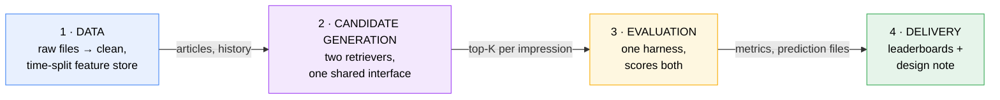
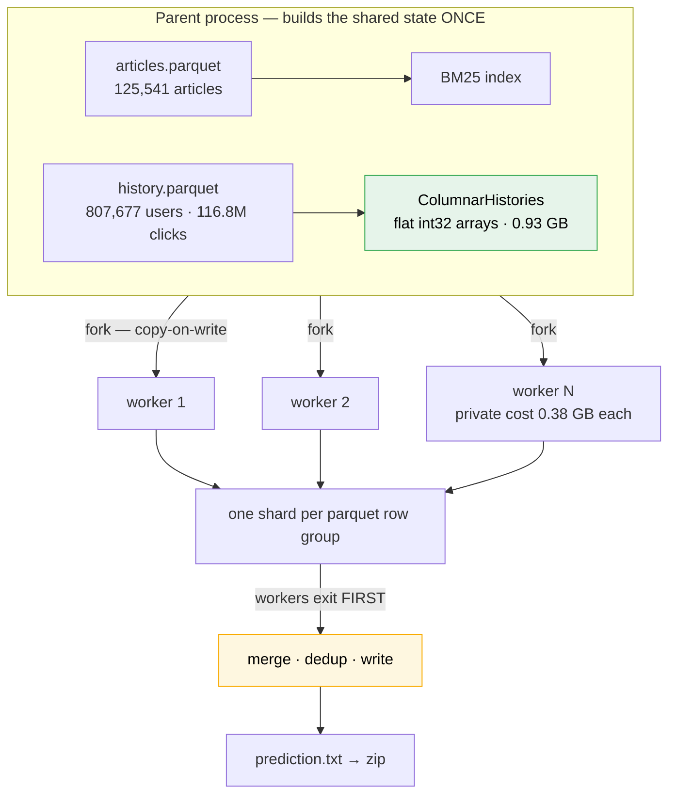
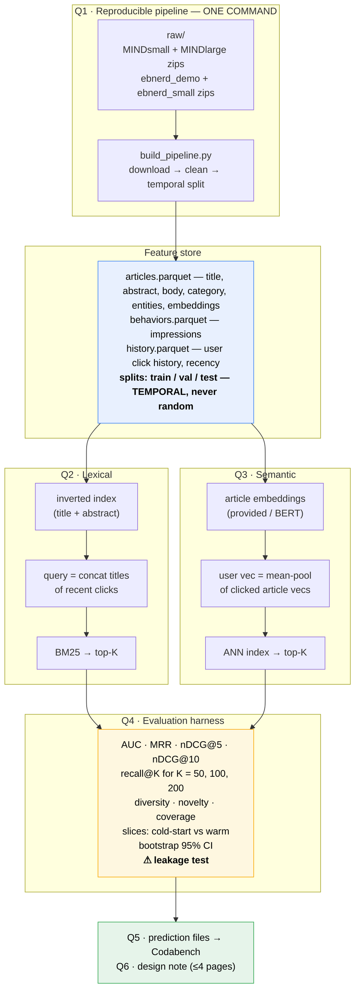
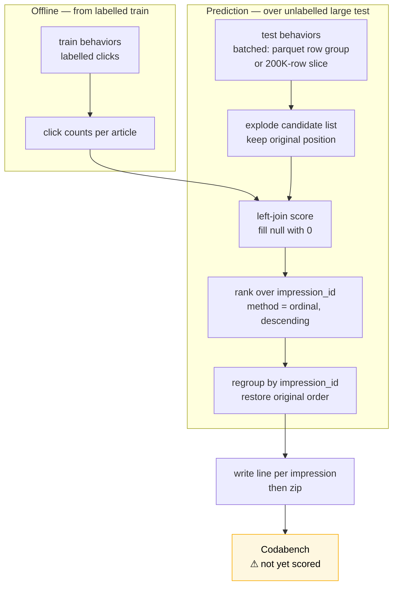

# A1 — Architecture

**What the system is** — for [[Assignment-1-Lexical-Semantic-Retrieval]]. The reasoning behind it
(alternatives considered, rejected options, open questions) lives in [[decisions|decisions.md]].

> [!info] New to this? Start with [[foundations|foundations.md]]
> This doc assumes you know what an embedding, an inverted index, and recall@K are. If any of those
> are unfamiliar — or you haven't done SMAI/iNLP — read [[foundations|foundations.md]] first; it
> builds every term used here from scratch, and explicitly lists what you *don't* need to learn.

> [!important] Design deliberation lives in [[decisions|decisions.md]] (moved 2026-08-25)
> The *why* — the options the brief offers, alternatives rejected, open questions, and the drawbacks
> of each choice — is in **[[decisions|decisions.md]]**, which is the file that converts into the Q6
> design note. Part D here is now only the operational checks.
>
> Architecture changes are logged in [[plan/execution_plan_log|execution_plan_log.md]] as dated
> entries, so this file needs no changelog of its own.

**How this doc is ordered — easy to hard.** Read top to bottom on the first pass:

| Part | Sections | What it gives you |
|---|---|---|
| **A · The idea** | The whole thing in plain words · vocabulary | Ordinary language, zero notation. Enough to explain A1 to a friend. |
| **B · The shape** | Problem framing · how much pipeline · architecture · repo layout | What you're building, and how big it has to be. |
| **C · The machinery** | Algorithms, formulas, metrics | The formal half. Each subsection opens in plain words, *then* gives the maths. |
| **D · Operational checks** | Failure modes · pre-submission checklist | Symptoms to watch while building. Decisions moved to [[decisions\|decisions.md]]. |
| **E · The data, measured** | Brief v1→v2 diff · MIND and EB-NeRD as profiled · submission path | The only part written from *observation* rather than the brief. Where it contradicts A–D, it wins. |

Parts A and B are the first sitting. Part C is reference — read a subsection when you're about to
implement it. **Part E was added after profiling the real bundles (2026-08-21) and after brief v2
landed** — read §E6 for what it invalidates above.

---

# Part A · The idea

## The whole thing in plain words

Before any formulas — this is what the assignment is actually doing, in ordinary language.

**The problem.** Someone opens a news site. You're shown who they are, when they arrived, and a list
of maybe 50 articles that *could* be displayed. Guess which ones they'll click.

**The trick that makes it a search problem.** You don't know what this person wants. But you know what
they read yesterday. So take the headlines of their recent articles, paste them together, and treat
that as a **search query**. Now "what will they click?" becomes "what articles match this query?" —
and that's a problem search engines have solved for fifty years.

**Two ways to answer it, and they disagree usefully:**

- **Word matching (lexical).** They read something with "election" in the headline; find other
  articles containing "election". Simple, fast, and blind — "car" and "automobile" look unrelated.
- **Meaning matching (semantic).** Convert every article into a list of numbers (an *embedding*) that
  captures what it's about, so articles on similar topics get similar numbers. Then find articles
  whose numbers are close to the user's. Catches "car"/"automobile"; can also drift into
  "vaguely similar-sounding but wrong".

You build both because they fail differently — and the assignment asks which wins on which kinds of user.

**Why "candidate generation" and not "ranking".** You're not producing the final order. You're
narrowing thousands of articles down to a few hundred worth considering. A later assignment does the
fine ordering. So the question is only *"did the article they actually clicked survive the cut?"* —
which is what **recall@K** measures. Missing it here is fatal; having it at position 180 instead of 3
is fine.

**The one rule that can invalidate everything.** When testing on Tuesday's data, the model may only
know what happened before Tuesday. If Wednesday's clicks leak into Tuesday's prediction, your scores
look wonderful and mean nothing. That's why the split is by *time*, never random — and why Q9 wants a
test that catches it.

### The vocabulary, in one line each

| Term | What it means |
|---|---|
| **Impression** | One moment a user was shown a set of articles — plus which ones they clicked |
| **Candidate generation** | Narrowing many articles to a shortlist worth ranking |
| **Query** | Here: the user's recent headlines, glued together and used as search text |
| **Corpus** | All the articles you can retrieve from |
| **Inverted index** | A word → articles-containing-it lookup table. Like a book index; it's what makes search fast |
| **Term frequency (TF)** | How often a word appears in an article |
| **Document frequency (DF)** | How many articles contain a word. High = common = uninformative |
| **BM25** | The standard formula for "how well does this article match this query" |
| **Embedding** | An article turned into ~768 numbers that encode its meaning |
| **Pooling** | Squashing several embeddings (the user's clicked articles) into one |
| **ANN** | Approximate Nearest Neighbours — finding close vectors fast without checking all of them |
| **Brute force** | Checking all of them. Slow but exact — your correctness reference |
| **recall@K** | Of the articles they clicked, what fraction made your top-K shortlist |
| **nDCG** | A score that rewards putting good results near the top |
| **Cold start** | A user with little or no history — you have almost nothing to search with |
| **Leakage** | Accidentally using future information. The cardinal sin |
| **Bootstrap CI** | Resampling your results to say "this number is 0.42, give or take 0.03" |

---

# Part B · The shape of what you build

## The shape of the problem

Given an **impression** (a user, a timestamp, and a slate of candidate articles), rank the candidates
by click likelihood. You have three signal families and must exercise all three:

| Axis | Signal | Brief names | This assignment (C1) |
|---|---|---|---|
| **Lexical** | word overlap | BM25, **TF-IDF** | BM25 over title + abstract (Q2.1); TF-IDF as cheap baseline |
| **Semantic** | meaning | **Word2Vec, BERT, XLM-RoBERTa** | Own multilingual embeddings + ANN; EB-NeRD's provided vectors as baseline — see decision 4 |
| **Behavioural** | prior behaviour | click history, recency/decay, **session context** | Click history + recency; **session context — see open decisions** |

> [!note] Two narrowings worth naming in the design note
> The brief's intro says lexical works over "titles/**bodies**"; **Q2.1 specifies title + abstract**,
> so the specific requirement wins. And **session context is a named behavioural signal that this
> pipeline currently ignores** — a deliberate scope choice, not an oversight, and one the design note
> should state rather than leave implicit.

The key insight: **the user's click history is your query.** You're turning a recommendation problem
into a retrieval problem — concatenate the titles of recently clicked articles, and search for
similar articles. That framing is what makes BM25 and ANN applicable at all.

## How much pipeline do you actually need?

> [!warning] The architecture below is **authored, not mandated**
> The brief specifies Q1–Q9 and nothing about how you organise them. The four-stage shape, the
> `Retriever` interface, and the repo layout in this doc are **design choices made here** — defensible,
> but yours to change. Say so in the design note; "I chose this structure because X" earns marks,
> "this is the structure" does not.

The brief's real floor is smaller than it looks. Three tiers, and you should know which one you're on:

| | **Minimum** — passes Q1–Q9 | **Recommended** — the doc below | **Overkill** — costs more than it returns |
|---|---|---|---|
| **Data** | One script, one dataset schema, temporal split | + feature store as parquet, config-driven paths | Airflow/DVC orchestration, a database |
| **Lexical** | `rank_bm25` over titles, default params | + abstracts, own inverted index, k1/b sweep | Custom posting-list compression, learned sparse (SPLADE) |
| **Semantic** | Provided embeddings + brute-force top-K | + FAISS HNSW, own embeddings for both datasets | *Fine-tuning or training* an encoder, distillation, multi-vector (ColBERT) |
| **Eval** | AUC/MRR/nDCG + recall@K + one slice + bootstrap | + beyond-accuracy, several slices, leakage test | A metrics DSL, experiment-tracking server |
| **Effort** | ~2 days | ~1 week | Weeks; eats the marks it was meant to earn |

**The crux: what every tier must do, no matter how small.**

1. **Temporal split with truncated history.** For a test impression at time *t*, that user's history must contain only clicks `< t`. This is the one property that, if wrong, invalidates every number you report.
2. **Two retrievers behind one interface.** Q2 and Q3 must be comparable, which means the same harness scores both.
3. **recall@K at K ∈ {50, 100, 200}.** The brief names these exactly.
4. **Every number carries a bootstrap CI.**
5. **A test that fails when you break the boundary.** Q9 says "include a test asserting this" — a test that passes both before and after you introduce leakage proves nothing.

Everything else — the parquet feature store, the `Makefile`, the config files — is engineering that makes the above easier to redo. Valuable, but not what's graded.

> [!tip] When the minimum is the right call
> If you're short on time, build the minimum tier **completely** and spend the remaining hours on the
> design note and one good ablation. A complete small pipeline with honest CIs and a sharp note beats
> a half-finished elaborate one — the grade is on *correctness, rigour, and clarity*, and an
> unfinished component scores zero on all three.

## High-level architecture

Four stages. Everything else is detail.



**Read it as:** data is prepared once, two retrievers compete on it, one harness judges them both,
and the results become your submission. The whole assignment is that sentence.

### What each component does

**1 · Data (Q1)** — Turns two differently-shaped datasets into one unified schema, split by *time*.
Its job is to make everything downstream dataset-agnostic and reproducible from one command.
*Owns the leakage boundary* — the single most important correctness property in the assignment.

**2 · Candidate generation (Q2, Q3)** — Two independent retrievers that answer the same question
("given this user's history, which articles might they click?") in completely different ways: word
overlap vs. embedding proximity. They share a `Retriever` interface so the harness treats them
identically. *Optimised for recall, not precision* — this stage only narrows thousands of articles
to a few hundred; ranking is Component-2 of the assignment.

**3 · Evaluation (Q4)** — The judge. Computes accuracy metrics (AUC, MRR, nDCG), beyond-accuracy
metrics (diversity, novelty, coverage), splits results by user/article slices, and attaches bootstrap
confidence intervals. *Also home to the leakage test* — the harness is where correctness is proven,
not just measured.

**4 · Delivery (Q5, Q6)** — Formats predictions for the two Codabench leaderboards and turns your
choices into the ≤4-page design note. Not an afterthought: the note is where most of the marks are.

## The submission path — how 13.3M impressions get scored

Distinct enough from the retrieval architecture to describe separately: `src/submit/codabench.py`
turns a retriever into a leaderboard file, and its constraints are about **memory**, not ranking.

**Scoring, in one sentence:** for each impression, take the user's clicks strictly *before* that
impression's timestamp, paste those headlines into a query, score the ~11 candidates on the slate,
sort, write the ranking. EB-NeRD runs that loop **13,336,711 times**.



**Read it as:** the expensive, immutable structures are built once and *inherited* rather than
rebuilt per worker — which is what makes the worker count a free parameter instead of a memory
ceiling.

Three design points, each earned by a failure rather than chosen up front:

| Decision | Why | Found by |
|---|---|---|
| Histories as flat int32 arrays, not Python objects | ~13 GB → 0.93 GB, load 160 s → 4.6 s | F60, F64 |
| Shared state built in the parent, inherited via `fork` | 19.3 GB → **0.38 GB** private per worker | F70 |
| **Merge runs only after every worker exits** | The merge hits a 13.3M-element set at *random*; under memory pressure that does not slow down, it **stops** | F38 |

> [!warning] `ps` overstates a forked worker by ~8×
> A worker shows 3.23 GB of RSS but only **0.38 GB is private** — RSS counts every shared page once
> per process. Sizing a run from RSS is what produced a request for 48 GB on a 31 GB machine. Use
> `Private_Dirty` from `/proc/PID/smaps_rollup`.

**MIND does not take this path.** Its behaviours are TSV, so there are no row groups to parallelise
over, and it has no click timestamps (F1). It runs the serial path with the original history
objects, and reproduces byte-identically on it.

## Detailed architecture



**Read it as:** one command builds the feature store → that store feeds *two independent retrievers*
→ both are measured by *the same* harness → results go to the leaderboards and the note.

The symmetry matters: Q2 and Q3 are parallel paths with the same shape (build an index → turn click
history into a query → retrieve top-K). Writing them against a shared `Retriever` interface is what
lets one evaluation harness score both.

## Is this fixed, or can I add more?

**The four stages are fixed; what goes inside them is yours.** Q1–Q6 are the graded skeleton, and
dropping any of them loses marks directly. But the assignment is explicitly graded on *"alternatives
considered"* and *"ablation rigour"* — so additions are rewarded, **as long as they're measured**.

### Safe and valuable additions

| Add | Why it earns marks |
|---|---|
| **A third retriever** — TF-IDF, or category/popularity baseline | A trivial baseline makes your real numbers meaningful. Cheap, high value. |
| **Hybrid fusion** of lexical + semantic (e.g. reciprocal rank fusion) | Q3.5 asks "which works better, on which slices?" — fusion is the natural follow-up. |
| **More slices** beyond the required one (fresh vs. stale articles, session length, time-of-day) | Slices are where the interesting findings live. |
| **Brute-force alongside ANN** | Gives you the exact recall ceiling. Practically required for an honest ANN evaluation. |
| **A parameter sweep** (BM25 k1/b, embedding model, K) | This *is* ablation rigour. |
| **Caching / timing instrumentation** | Feeds the "breaks at 10×" scale analysis with real numbers instead of speculation. |

### Additions that cost more than they return

- **A learned re-ranker.** Tempting, but that's explicitly Component-2. Building it now means less
  time on the reproducibility and evaluation work that *this* component is graded on.
- **Training or fine-tuning an embedding model.** Enormous compute, marginal insight. Note this is
  *not* the same as **running** a pre-trained encoder over the corpus — see the encoding-vs-training
  distinction under Embeddings below. Encoding is cheap and is what Q3 sanctions.
- **Full-scale runs as your headline numbers.** Q1.1 still names "MIND-small and EB-NeRD demo/small"
  as the pipeline's inputs, and only small-tier runs have labels to compute CIs over. Brief v2 makes
  large *mandatory for the Codabench submission* — that is a prediction pass over an unlabelled test
  set, not a source of headline metrics. Run large for Q5 and one Q6 anchor; report small.
- **A serving API / web UI.** Zero marks. Not in the rubric.

> [!tip] The rule of thumb
> Add anything that produces **a number you can compare against another number**. Skip anything that
> only produces a feature. This assignment rewards measured comparisons, not surface area — and
> every addition has to survive a viva, so add what you can explain.

### Suggested repo layout

```
├── Makefile                 # make data / make index / make eval / make submit
├── README.md                # one-command reproduce (graded)
├── configs/
│   ├── mind.yaml
│   ├── ebnerd.yaml          # dataset-specific paths, params, seeds
│   └── resources.yaml       # n_jobs / mem_gb / batch_size — CLI-overridable (see decision 7b)
├── src/
│   ├── data/
│   │   ├── download.py
│   │   ├── clean.py         # → unified schema across BOTH datasets
│   │   └── split.py         # temporal split; the leakage boundary lives here
│   ├── features/store.py
│   ├── retrieval/
│   │   ├── base.py          # shared Retriever interface — both must satisfy it
│   │   ├── bm25.py
│   │   └── semantic.py
│   ├── eval/
│   │   ├── metrics.py       # AUC, MRR, nDCG, recall@K
│   │   ├── beyond.py        # diversity, novelty, coverage
│   │   ├── slices.py
│   │   └── bootstrap.py
│   └── submit/codabench.py
├── tests/
│   └── test_no_leakage.py   # ⚠ explicitly required by Q9
└── data/                    # gitignored
```

> The **unified schema** in `clean.py` is the single highest-leverage design decision. Get it right
> and every downstream component is written once for both datasets. Get it wrong and you write
> everything twice.

---

# Part C · The machinery

Reference section. **Read a subsection when you're about to implement it**, not before — each opens
with a plain-language paragraph, then gives the formula. Terms are defined in
[[foundations|foundations.md]] if any are unfamiliar.

## The algorithms — what they are, and when each is right

Everything here is either required by the brief, a named alternative you should be able to defend
rejecting, or a cheap addition that buys a comparison. **Each subsection opens with a plain-language
paragraph, then gives the formula** — read the first, skip the second, or connect them.

### BM25 — the lexical workhorse (required, Q2)

> **In plain words:** BM25 scores how well an article matches a query, using three common-sense rules.
> **(1)** Rare words count more — matching on "Ekstrabladet" tells you far more than matching on "the".
> **(2)** Repetition has diminishing returns — a word appearing 20 times doesn't make the article 20×
> more relevant, so the reward flattens out. **(3)** Long articles get a handicap — otherwise they'd
> win just by containing more words. Add up one score per query word, and that's the article's score.
>
> The two knobs, `k1` and `b`, control rules 2 and 3: how fast repetition stops helping, and how much
> the length handicap bites.

For a query $Q$ containing terms $q_1 \dots q_n$ scored against document $D$:

$$
\text{BM25}(D, Q) = \sum_{i=1}^{n} \text{IDF}(q_i) \cdot
\frac{f(q_i, D) \cdot (k_1 + 1)}{f(q_i, D) + k_1 \cdot \left(1 - b + b \cdot \frac{|D|}{\text{avgdl}}\right)}
$$

where $f(q_i, D)$ is the term's frequency in $D$, $|D|$ is the document length in tokens, and
$\text{avgdl}$ is the mean document length in the collection. The IDF term is

$$
\text{IDF}(q_i) = \ln\left(\frac{N - n(q_i) + 0.5}{n(q_i) + 0.5} + 1\right)
$$

with $N$ documents total and $n(q_i)$ containing the term.

**The intuition, term by term:**

- **IDF** — rare words carry more signal. "Ekstrabladet" discriminates; "the" doesn't. The $+1$ inside
  the log keeps the score positive for terms appearing in more than half the collection (without it,
  very common terms score negative and actively penalise documents that contain them).
- **TF saturation ($k_1$)** — the numerator and denominator both grow with $f$, so the ratio approaches
  $k_1 + 1$ asymptotically. A word appearing 20 times isn't 20× more relevant than once. **Low $k_1$
  (≈0.5)** saturates fast — near-binary "does the word appear". **High $k_1$ (≈2.0)** keeps rewarding
  repetition. For news titles (5–15 tokens, terms rarely repeat) $k_1$ barely matters; for bodies it does.
- **Length normalisation ($b$)** — $b=1$ fully normalises by length, $b=0$ ignores length entirely.
  Without it, long documents win by accumulating matches. **This is the parameter that matters for
  your assignment**, because title-only and title+abstract have very different length distributions.

**Defaults are $k_1 = 1.2$, $b = 0.75$** — a starting point from TREC-era ad-hoc retrieval, not a law.
Sweeping them is exactly the "ablation rigour" the brief rewards, and it's cheap: no re-indexing needed,
only re-scoring.

> [!warning] The BM25 trap specific to this assignment
> Your "query" is a concatenation of clicked article titles — potentially 50–150 tokens, an order of
> magnitude longer than a normal search query. BM25 was tuned for short queries. Long queries mean
> many terms contribute, common terms creep in, and the score becomes a diffuse sum. Consider
> truncating history, deduplicating terms, or weighting by recency. **Whatever you do, say you
> considered this** — it's a genuine insight about applying a retrieval model outside its design regime.

### TF-IDF — the baseline worth having (optional, high value)

$$
\text{score}(D, Q) = \sum_{i=1}^{n} \text{tf}(q_i, D) \cdot \text{idf}(q_i)
$$

with $\text{tf}$ typically $1 + \log f(q_i, D)$ and cosine normalisation applied afterwards.

**How it differs from BM25:** no saturation (a term appearing 20× contributes ~20× via raw tf, or
$1+\log 20 \approx 4$× with log-tf), and length handled by cosine normalisation rather than a tunable
$b$. BM25 is essentially TF-IDF with two knobs added for the two things TF-IDF handles poorly.

**Why include it:** it takes an hour (`sklearn.TfidfVectorizer`), and it makes your BM25 number
*mean* something. "BM25 recall@100 = 0.42" is a number; "BM25 0.42 vs TF-IDF 0.36 vs popularity 0.19"
is a finding. This is the single cheapest addition in the whole assignment.

### Query likelihood with Dirichlet smoothing — the alternative you should name

$$
P(Q \mid D) = \prod_{i=1}^{n} \frac{f(q_i, D) + \mu \cdot P(q_i \mid C)}{|D| + \mu}
$$

where $P(q_i \mid C)$ is the term's probability in the whole collection and $\mu$ (typically 1000–2000)
controls smoothing strength.

**The intuition:** treat each document as a tiny language model and ask "how likely is this document to
have generated the query?" Smoothing toward the collection model prevents a single missing query term
from zeroing the product. Short documents get smoothed more heavily — which is a *principled* length
normalisation rather than BM25's empirical $b$.

**Why you probably won't use it:** comparable performance to BM25 on most collections, less library
support, and one more thing to tune. **Why to mention it:** the design note asks for "alternatives
considered." Naming this one, with a sentence on why BM25 won (tooling, familiarity, tuning cost),
is a cheap credibility win.

### Embeddings — what to encode with (required, Q3)

> **In plain words:** an embedding turns text into a list of numbers — think of it as coordinates on a
> map where related topics sit near each other. Articles about football land in one region, elections
> in another. Once every article has coordinates, "find similar articles" becomes "find nearby points",
> which a computer does very fast.
>
> **Static vs. contextual:** older models (Word2Vec) give every word one fixed position — "bank" gets
> the same coordinates in *river bank* and *savings bank*. Newer ones (BERT and successors) read the
> whole sentence first, so the same word lands in different places depending on context.
>
> **Why the Danish thing matters:** a model that only learned English doesn't gently underperform on
> Danish — it produces coordinates that are essentially arbitrary. Your EB-NeRD numbers would be noise
> wearing the costume of results.

> [!important] "Compute your own embeddings" does not mean training anything
> Q3 says *"using the provided article embeddings (or compute your own using BERT/XLM-RoBERTa)"*, and
> Q3.1 says *"compute or load"*. Computing your own = **one forward pass of an already-trained encoder
> over the corpus**. No gradients, no training loop, no labels — ~120K short texts, a matter of
> minutes on any modern GPU. That is completely different from *training* or *fine-tuning* an encoder,
> which the tiers table above rightly calls overkill. Don't let the word "compute" scare you toward
> the provided vectors; the cost is a coffee break, not a weekend.

| Model | Dim | Multilingual | Notes for this assignment |
|---|---|---|---|
| **Word2Vec** (provided, EB-NeRD) | 300 | Danish-trained | Static: one vector per word regardless of context. Document vector = average of word vectors. Fast, weak on polysemy. |
| **BERT-base multilingual** (provided) | 768 | 104 languages | Contextual. Use `[CLS]` or mean-pool the final layer. The provided one is the safe default. |
| **XLM-RoBERTa** | 768/1024 | 100 languages | Stronger multilingual than mBERT; needs GPU time to run over 120K articles. |
| **Sentence-BERT / E5 / BGE** | 384–1024 | Varies | Trained specifically so cosine similarity is meaningful — a real advantage over vanilla BERT. |

> [!warning] The Danish problem is a correctness issue, not a quality one
> EB-NeRD is Danish. An English-only encoder doesn't degrade gracefully on Danish — it tokenises into
> near-meaningless subwords and produces vectors with no useful geometry. Your EB-NeRD numbers would be
> noise, and you might not notice because they'd still be *numbers*. Use the provided multilingual
> embeddings, or a Danish/multilingual model. This is the highest-risk silent failure in the assignment.

**Vanilla BERT's `[CLS]` token is not a sentence embedding.** Without fine-tuning for that purpose,
`[CLS]` vectors are famously poor for cosine similarity — they occupy a narrow cone where everything
looks similar. Mean-pooling the final hidden states is better; a model actually trained for sentence
similarity (SBERT-family) is better still. If you use raw BERT and get mediocre semantic recall,
**this is likely why** — and saying so in the note demonstrates you understand the tool.

### User representation — turning a click history into one query vector

> **In plain words:** each article the user clicked has coordinates. You need *one* set of coordinates
> to search with, so you combine them — the simplest way being to average them (their "centre of
> gravity").
>
> **Where averaging breaks:** someone who reads football *and* recipes gets an average sitting halfway
> between the two, in a region about neither. You search from a point matching nothing they like. Fixes:
> weight recent clicks more heavily (news goes stale fast, so this usually helps), or split their
> history into interest groups and run one search per group.

Given clicked articles with embeddings $\mathbf{v}_1 \dots \mathbf{v}_m$:

**Mean pooling** (the brief's suggested default):
$$\mathbf{u} = \frac{1}{m}\sum_{j=1}^{m} \mathbf{v}_j$$

**Recency-weighted mean**, with decay constant $\lambda$ and $\Delta t_j$ the age of click $j$:
$$\mathbf{u} = \frac{\sum_j w_j \mathbf{v}_j}{\sum_j w_j}, \qquad w_j = e^{-\lambda \Delta t_j}$$

**Max pooling** — element-wise maximum across the history, preserving peak activations rather than averaging them away.

**Multi-query** — cluster the history into $c$ interest groups, retrieve top-$K/c$ for each centroid, merge.

| Strategy | Cost | Fails when |
|---|---|---|
| Mean | Free | User has several distinct interests — the centroid lands between them and matches nothing (the "sports + cooking → vaguely nothing" problem) |
| Recency-weighted | Free, one parameter | News decays fast, so this usually helps; hurts for genuinely stable long-term interests |
| Max-pool | Free | Noisy — one outlier dimension dominates |
| Multi-query | $c\times$ ANN lookups | Rarely fails, but you must pick $c$ and merge the results |

**Recommendation:** ship recency-weighted mean (one line more than plain mean, and news recency is
central to this domain), and report plain mean as the ablation. Mention multi-query as considered.

### Similarity metrics — and the trap

$$
\cos(\mathbf{u}, \mathbf{v}) = \frac{\mathbf{u} \cdot \mathbf{v}}{\|\mathbf{u}\|\|\mathbf{v}\|}
\qquad
\text{dot}(\mathbf{u}, \mathbf{v}) = \mathbf{u} \cdot \mathbf{v}
\qquad
d_{L2}(\mathbf{u}, \mathbf{v}) = \|\mathbf{u} - \mathbf{v}\|_2
$$

**On L2-normalised vectors, all three give identical rankings** — since
$\|\mathbf{u}-\mathbf{v}\|^2 = 2 - 2\cos(\mathbf{u},\mathbf{v})$ when both are unit length. On
un-normalised vectors they diverge sharply: dot product rewards long vectors, which in practice means
**popular or verbose articles win regardless of relevance**.

> [!warning] Normalise before indexing, and check it
> FAISS `IndexFlatIP` computes inner product. Feed it un-normalised vectors and you've silently built
> a popularity ranker. If your semantic retriever seems to return the same articles for every user,
> check normalisation first — it's the most common bug in this part of the pipeline, and your doc's
> failure table already anticipates the symptom.

### ANN algorithms — the index behind Q3

> **In plain words:** you have 100,000 article vectors and a user vector, and you want the closest
> ones. The obvious way is to measure the distance to all 100,000 — correct, but slow at scale. ANN
> methods accept "almost always right" in exchange for being much faster.
>
> - **Brute force** — check everything. Exact, and honestly fine at your scale.
> - **IVF** — pre-sort vectors into neighbourhoods. At query time only search the few nearest
>   neighbourhoods. Like searching two suburbs instead of the whole city; you might miss someone
>   living just over the boundary.
> - **HNSW** — build a network of "who is near whom", with a few long-distance links layered on top.
>   Start at a random point, repeatedly hop to whichever neighbour is closer to your target. Like
>   getting across a country by flying to the right city, then driving, then walking.
> - **PQ** — compress each vector to a rough sketch so millions fit in memory. Faster and smaller,
>   less precise.
>
> **A-2 asks you to implement HNSW or IVF+PQ from scratch**, so the intuition here is the same
> intuition you'll need next month.

| Method | Build | Query | Recall | FAISS |
|---|---|---|---|---|
| **Flat (brute force)** | $O(1)$ | $O(Nd)$ | Exact, 1.0 by definition | `IndexFlatIP` / `IndexFlatL2` |
| **IVF** | $O(N \cdot \text{iters})$ k-means | $O\!\left(\frac{N}{n_{list}} \cdot n_{probe} \cdot d\right)$ | Tunable via `nprobe` | `IndexIVFFlat` |
| **HNSW** | $O(N \log N)$, slow | $O(\log N)$ | 0.95+ typical | `IndexHNSWFlat` |
| **PQ / IVFPQ** | Adds codebook training | Fast, low memory | Lower — lossy compression | `IndexIVFPQ` |

**IVF** partitions vectors into $n_{list}$ Voronoi cells by k-means, then searches only the
$n_{probe}$ cells nearest the query. The recall/speed dial is `nprobe`: at $n_{probe} = n_{list}$ it
degenerates to brute force with extra steps.

**HNSW** builds a multi-layer proximity graph — sparse long-range links on top, dense local links
below — and greedily descends from a top-layer entry point. `M` (neighbours per node) and
`efConstruction` control build quality; `efSearch` trades query time for recall at runtime.

**Product Quantisation** splits each vector into subvectors and replaces each with a centroid ID,
compressing 768 floats (3KB) to ~96 bytes. Only relevant at millions of vectors.

> [!tip] For your scale, brute force is the right primary choice
> MIND-small and EB-NeRD demo are ~100K articles at 768 dims — roughly 300MB, and a full scan is
> milliseconds with `numpy` or `IndexFlatIP`. **Use brute force for your headline numbers** (exact,
> zero tuning, no recall loss to explain) **and add HNSW as the ablation**: measure the recall gap and
> the speedup, and you've answered Q6's "where does it break at 10×" with real numbers rather than
> speculation. This is the single best cost/benefit addition in the assignment — the doc's
> "safe additions" table already flags it, and this is why.

### Fusion — combining lexical and semantic (optional; Q3.5 invites it)

**Reciprocal Rank Fusion** — combines by rank, not score, so no normalisation needed:
$$\text{RRF}(d) = \sum_{r \in R} \frac{1}{k + \text{rank}_r(d)}$$
with $k = 60$ conventional. Robust and parameter-light; the standard first choice.

**Score normalisation then weighted sum** — min-max or z-score each retriever's scores into $[0,1]$,
then $\alpha \cdot s_{lex} + (1-\alpha) \cdot s_{sem}$. More expressive, but BM25 scores are unbounded
and distribution-dependent, so normalisation is fragile across datasets. **RRF sidesteps exactly this
problem**, which is why it's preferred here.

**Why fusion earns marks:** Q3.5 asks which approach wins on which slices. If the answer is "lexical
on warm users, semantic on cold-start," fusion is the natural response, and showing it beats both
individually is a genuine finding.

### The evaluation metrics — what each one actually measures

> **In plain words:** four ways of asking "was that any good", each answering a different question.
>
> - **recall@K** — *did the right answer make the shortlist at all?* Position irrelevant. **Your main
>   metric**, because a later stage does the ordering — but it can't recover what you never shortlisted.
> - **AUC** — *pick one clicked article and one ignored one at random; did you score the clicked one
>   higher?* AUC is how often you'd win that coin-flip. 0.5 is guessing, 1.0 is perfect.
> - **MRR** — *how far down is the first correct answer?* First place scores 1, second 1/2, tenth 1/10.
>   Only counts the first hit.
> - **nDCG** — *are the good ones near the top?* Same idea as MRR but credits every relevant result,
>   with positions further down worth progressively less. Then divides by the best possible ordering,
>   so scores are comparable across users with different numbers of clicks.
>
> And three that measure whether your recommendations are *worth having* rather than merely correct:
> **diversity** (are the ten results ten different stories, or one story ten times?), **novelty** (are
> you surfacing anything they couldn't have found alone?), **coverage** (across all users, how much of
> the catalogue ever gets shown?). These fight against accuracy — showing everyone the same popular
> article scores well on nDCG and terribly on coverage. Measuring that tension is a finding worth
> reporting.

**recall@K** — the assignment's primary metric, because this is candidate generation:
$$\text{recall@}K = \frac{|\{\text{relevant items}\} \cap \{\text{top-}K\}|}{|\{\text{relevant items}\}|}$$
Measures only *whether the clicked article made the shortlist*, ignoring position entirely. That's
correct here — a re-ranker (Component-2) fixes ordering, but cannot recover an item that never made
the cut. **This is why K is deliberately large.**

**AUC** — probability a randomly chosen positive outranks a randomly chosen negative:
$$\text{AUC} = \frac{\sum_{i \in \text{pos}} \sum_{j \in \text{neg}} \mathbb{1}[s_i > s_j]}{|\text{pos}| \cdot |\text{neg}|}$$
Threshold-free and prevalence-insensitive. Weakness: it weights the whole ranking equally, so
improvements deep in the list count as much as improvements at the top — which is not how users behave.

**MRR** — mean reciprocal rank of the first relevant item:
$$\text{MRR} = \frac{1}{|Q|}\sum_{i=1}^{|Q|} \frac{1}{\text{rank}_i}$$
Right metric when there's one correct answer and only the first hit matters. Ignores all subsequent
relevant items — for impressions with multiple clicks, it discards information.

**nDCG@k** — position-discounted gain, normalised by the ideal ordering:
$$\text{DCG@}k = \sum_{i=1}^{k} \frac{2^{rel_i} - 1}{\log_2(i+1)}
\qquad
\text{nDCG@}k = \frac{\text{DCG@}k}{\text{IDCG@}k}$$
The $\log_2(i+1)$ discount encodes "position 1 matters far more than position 10." The normalisation
makes impressions with different numbers of relevant items comparable. **With binary relevance
$2^{rel}-1$ reduces to 1 for clicks, 0 otherwise** — worth stating in the note so it's clear you know
the graded form.

**Beyond-accuracy — and why they exist:**

- **Intra-list diversity** — mean pairwise *distance* within a returned list:
  $\frac{2}{k(k-1)}\sum_{i<j}(1 - \text{sim}(d_i, d_j))$. Low diversity means ten variations of one story.
- **Novelty** — typically $-\log_2 p(d)$ with $p(d)$ the item's popularity, so obscure items score
  higher. Recommending only what's already popular is safe and useless.
- **Coverage** — fraction of the catalogue that appears in *anyone's* top-K. Directly measures whether
  your system is a recommender or a popularity list.

> [!tip] The trade-off is the finding
> These genuinely oppose accuracy: recommending the top-10 most popular articles to every user scores
> well on nDCG and near-zero on coverage. Your doc already says "quantify the trade-off" — the concrete
> way is a small table of nDCG@10 against coverage across a few retrievers. That one table is a strong
> design-note exhibit.

### Bootstrap confidence intervals (required, Q4.4)

> **In plain words:** you measured recall@100 = 0.42 on 5,000 impressions. Would a different 5,000
> have given 0.42, or 0.31? You can't collect more data — so you fake it. Draw 5,000 results *from
> the ones you have, with repeats allowed*, and average. Do that 1,000 times. You now have 1,000
> plausible versions of your experiment; the middle 95% of them is your confidence interval.
>
> **The catch:** it only measures luck-of-the-draw. If your pipeline leaks future clicks, the bootstrap
> gives you a beautifully tight interval around a completely wrong number. It quantifies noise, not
> correctness.

Given per-impression metric values $x_1 \dots x_n$: resample $n$ values **with replacement**, compute
the mean, repeat $B$ times ($B = 1000$ is standard), then take the 2.5th and 97.5th percentiles of the
$B$ means as the 95% interval.

```python
def bootstrap_ci(values, B=1000, alpha=0.05, seed=0):
    rng = np.random.default_rng(seed)     # seed it — the CI must be reproducible
    n = len(values)
    means = [rng.choice(values, size=n, replace=True).mean() for _ in range(B)]
    return np.percentile(means, [100*alpha/2, 100*(1-alpha/2)])
```

**What it claims:** if you re-ran this experiment on fresh samples from the same distribution, ~95% of
such intervals would contain the true mean.

**What it does not claim:** that there's a 95% probability the true value lies in *this* interval —
and, critically for you, **it says nothing about bias**. A leaking pipeline produces beautifully tight
CIs around a wrong number. The CI quantifies sampling noise only.

**Resample at the impression level**, not the individual-prediction level — predictions within one
impression are correlated, and resampling them independently understates the interval.

---

# Part D · Operational checks

> [!info] The decision content that was here moved to [[decisions|decisions.md]] on 2026-08-25
> Part D used to hold the ten design decisions, the mandated/authored/open tables, and the
> alternatives-considered material. All of it now lives in **[[decisions|decisions.md]]**, updated
> and extended, because that file is what converts into the Q6 design note.
>
> What remains below is **operational**: the symptoms to watch for while building, and the
> pre-submission checklist. Those belong with the architecture because they describe the system,
> not the reasoning behind it.

## Failure modes to watch

| Symptom | Likely cause |
|---|---|
| Recall@K suspiciously high | Future-click leakage — the thing Q9 exists to catch |
| Semantic ≫ lexical everywhere | Embeddings may encode popularity/category, not relevance |
| EB-NeRD much worse than MIND | English-only model on Danish text |
| Cold-start slice near zero | Expected — but you need a stated fallback strategy |
| recall@200 < recall@50 | Impossible by construction — a top-200 list contains the top-50. Indicates a bug in K handling or in how hits are counted |
| Semantic returns near-identical results for every user | Un-normalised vectors with inner-product search — you built a popularity ranker (see Similarity metrics) |
| Both retrievers score ~0 on EB-NeRD, fine on MIND | English-only encoder on Danish text, or a tokeniser mismatch |
| CIs suspiciously narrow | Resampling at prediction level instead of impression level |

## Sanity checks before submitting
- [ ] `make data` from an empty `data/` reproduces everything
- [ ] The leakage test exists, and **fails** if you deliberately break the boundary
- [ ] Every reported number has a bootstrap CI and a command that regenerates it
- [ ] Both leaderboards have a submission and a screenshot
- [ ] `.gitignore` covers `*.zip`, `*.pt`, `*.ckpt`, `__pycache__/`, `data/`
- [ ] AI usage log is assembled (required deliverable — start it now, not at the end)
- [ ] Submission files cover **every** impression id in the large test set (2,370,727 MIND /
      13,336,711 EB-NeRD) — a short file is rejected, not partially scored

---

# Part E · What the data actually looks like

Everything above Part E was written from the brief. **This part is measured** — from
`brief/Assignment1_v2.pdf` and from the two exploration notebooks (`notebooks/mind_analysis.ipynb`,
`notebooks/ebnerd_analysis.ipynb`) run on the downloaded bundles on 2026-08-21. Where a number here contradicts
an assumption earlier in the doc, this part wins.

> [!important] Nothing in this part is a retrieval metric
> These are dataset statistics and one popularity baseline that has **not been scored offline or on
> the leaderboard**. No recall@K, nDCG, or CI is claimed anywhere below. Per the subject rule, a
> number you did not run does not go in a note — so the baseline's quality is simply unknown at time
> of writing.

## E1 · What changed between brief v1 and v2

`brief/Assignment1_v1.pdf` → `brief/Assignment1_v2.pdf`. **Q1–Q9, the deliverables, the rubric, the due date
(2026-08-27) and the references are byte-identical.** Every change is in the datasets/logistics
section on pages 1–2, and every change pushes in one direction: *the large bundles are now required.*

| # | v1 | v2 |
|---|---|---|
| 1 | EB-NeRD described as demo/small/large "to dial scale gradually" | Adds: **`ebnerd_large.zip` + `ebnerd_testset.zip` required for Codabench**; test set is **13.5M impressions with no click labels** |
| 2 | MIND described as ~1M users, MIND-small for fast iteration | Adds: **`MINDlarge_test.zip` required for Codabench**; **2.37M impressions, no click labels** |
| 3 | — | New **Important** callout: "Large datasets are required for Codabench submissions… the test sets used by both leaderboards come from the large bundles only. Make sure to download the large test sets early — they are several GB each." |
| 4 | EB-NeRD download block: demo/small + optional embeddings | Adds a **LARGE set** block: `ebnerd_large.zip`, `articles_large_only.zip`, `ebnerd_testset.zip` |
| 5 | MIND download: two `wget` lines for `MINDsmall_train/dev` | Switched to **`hf download yjw1029/MIND --repo-type dataset`**, and names `MINDlarge_test.zip` (submission) and `MINDlarge_train/dev.zip` (full-scale training) |
| 6 | Compute: "MIND-small and EB-NeRD demo run on a single free GPU in a few hours." | Same, plus: **"ensure your prediction pipeline is memory-efficient (use Polars, PyArrow, or batch processing)"** — citing the 13.5M / 2.37M test sizes |

**Read it as:** v2 does not change *what you build*; it changes *what you must run it over at the
end*. Three consequences for this document:

- Decision 7 above is amended — large is mandatory-for-submission, not optional-for-scale.
- The prediction path (Q5) becomes a **streaming/batched** component, not an afterthought. v2 names
  Polars and PyArrow explicitly; both notebooks were written that way (§E4).
- The download is on the critical path — "several GB each", and the due date did not move.

> [!note] Worth one line in the design note
> The brief itself now prescribes a memory strategy. Saying "prediction is batched by parquet row
> group because the test set is 13.5M impressions and does not fit in RAM" is a design decision with
> a stated cost — exactly the shape the rubric wants — and it is now traceable to the brief.

## E2 · MIND, as measured

TSV, English, Oct–Nov 2019. Four files per split: `behaviors.tsv`, `news.tsv`,
`entity_embedding.vec`, `relation_embedding.vec`.

| | MINDsmall_train | MINDsmall_dev | MINDlarge_test |
|---|---|---|---|
| behaviors rows | 156,965 (92 MB) | 73,152 (43 MB) | **2,370,727 (1.46 GB)** |
| unique users | 50,000 | 50,000 | 702,005 |
| news.tsv articles | 51,282 | 42,416 | 120,961 |
| entity embeddings | 26,904 | 22,893 | 46,807 |
| impression window | 11/09 – 11/14/2019 | 11/15/2019 (one day) | 11/16 – 11/22/2019 |
| click labels | ✅ `-1`/`-0` | ✅ | ❌ **none** |

**Train-split distributions** (the numbers that shape query construction and the cold-start slice):

- History length: mean 32.6, median 19, max 558 articles.
- Candidates per impression: mean 37.2, median 24, max 299.
- Click rate per impression: **0.1085** — i.e. ~4 clicks in a 37-article slate.
- **Null history (cold-start): 3,238 rows = 2.1% of train.** Dev/test users are warmer (test history
  mean 41.6, max 1,021).

> [!warning] The cold-start slice is small in MIND — 2.1% by the null-history definition
> Slicing on "history is literally absent" gives you ~3.2K impressions in train, which will produce a
> wide CI and a weak finding. The open decision "what counts as cold-start" (< 5 clicks is the common
> threshold) now has a concrete reason to prefer the *threshold* definition over the *null* one: the
> null slice is too thin to say anything with.

**Schema notes that affect the pipeline:**

- `news.tsv` has 8 columns: `news_id, category, subcategory, title, abstract, url, title_entities,
  abstract_entities`. **No header row; use `quote_char=None`** — the text fields contain bare quotes.
- **`abstract` is 5.2% null.** Q2.1 mandates BM25 over title + abstract, so ~2.7K articles are
  title-only. Decide the fallback (title alone) rather than indexing an empty string.
- **No body text at all.** MIND ships URLs (many expired); the crawler in the MIND repo is the only
  route to bodies and is not worth the time. This is a hard asymmetry vs. EB-NeRD, which ships full
  bodies — a cross-dataset claim about body-text retrieval is not available.
- Entities are JSON per row: `Label`, `Type`, `WikidataId`, `Confidence`, `OccurrenceOffsets`,
  `SurfaceForms`.
- 17 categories (`news` 15,774 and `sports` 14,510 dominate; `northamerica` has 1 article),
  and the subcategory tail is long — relevant to the coverage metric.
- `history` is **inline** in each behaviors row as space-separated news ids.

> [!warning] The `time` column is a string in US format and does not sort
> `"11/11/2019 9:05:58 AM"`. Taking `min()`/`max()` on the raw strings in the notebook returned
> `11/10/2019 10:00:00 AM` to `11/9/2019 9:59:58 AM` — a lexicographic artefact, not a real range.
> **Parse to datetime before any temporal split**, or the leakage boundary will be silently wrong,
> which is precisely the failure mode Q9 exists to catch.

## E3 · EB-NeRD, as measured

Parquet, Danish, May–Jun 2023. Splits carry `behaviors.parquet` + `history.parquet`; `articles.parquet`
is shared.

| | large/train | large/validation | testset/test |
|---|---|---|---|
| behaviors rows | 12,063,890 | 12,566,385 | **13,536,710** |
| unique impression ids | 12,063,890 | — | **13,336,711** (⚠ fewer than rows) |
| users | 788,090 | 791,582 | 807,677 |
| window | 2023-05-18 → 05-25 | 2023-05-25 → 06-01 | 2023-06-01 → 06-08 |
| avg articles in view | 11.09 | 11.95 | 15.21 |
| columns | 17 | 17 | **14** |

**Read it as:** three consecutive, non-overlapping one-week windows. The dataset's own split is
already temporal, which is a useful cross-check on your own `split.py` boundary.

> [!warning] Test has 13,536,710 rows but only 13,336,711 unique impression ids
> ~200K impression ids repeat. The submission format is one line per impression id, so a naive
> row-wise write produces duplicate lines. Deduplicate on `impression_id` — the notebook's
> `group_by("impression_id")` does this implicitly and wrote exactly 13,336,711 lines.

**Columns present in train/val but absent from test** — this is the Q9 "unavailable at serving time"
question answered for you by the dataset itself:

| Column | Why it's gone |
|---|---|
| `article_ids_clicked` | the label |
| `article_id` | the clicked article — also the label |
| `next_read_time`, `next_scroll_percentage` | **future information** |

Test adds one column: **`is_beyond_accuracy`** (bool) — **1.48%** of test impressions, flagging the
subset the leaderboard scores for diversity/novelty/coverage.

> [!important] `next_read_time` / `next_scroll_percentage` are the concrete Q9 feature set
> Q9 asks for metrics *with and without features unavailable at serving time* and never defines the
> set (it's listed as an open decision above). EB-NeRD defines it empirically: the four columns the
> organisers removed from test are exactly the ones unavailable at serving time, and two of them
> (`next_*`) are pure future-information. **Adopt the dataset's own boundary as your definition** and
> say so — it is defensible, checkable, and costs no argument. MIND has no equivalent signal, so the
> Q9 comparison is an EB-NeRD-only result; state that rather than inventing a MIND analogue.

**`articles.parquet` — 125,541 rows, 21 columns**, richer than MIND on every axis but entities:

- Full `body`, `title`, `subtitle` — **all 0% null.**
- `sentiment_score` (0.34–1.0) + `sentiment_label`: Negative 61,130 / Neutral 44,001 / Positive
  20,410. A tabloid corpus skews negative.
- `category_str`: 33 values — `nyheder` 27,876, `underholdning` 24,909, `krimi` 22,579, `sport`
  18,767, then a long tail down to single-article categories.
- `article_type`: 16 values, but `article_default` is 115,251 of 125,541 (92%).
- `premium` (paywall): 10,160 = 8.1%.
- **`total_inviews` 85.4% null, `total_pageviews` / `total_read_time` 86.5% null** — popularity stats
  exist only for recent articles. A popularity prior built from these covers ~1 article in 7.
- `published_time` spans **1993-09-15 → 2023-07-11** — the corpus contains a 30-year archive, while
  impressions cover one week. Recency features must handle articles decades older than the impression.

**Behaviours, train:** 6,227,464 sessions; `article_id` null 8,458,027/12,063,890 (**70%** — set only
on a click); `scroll_percentage` null 71%; **`gender`/`postcode`/`age` ~97% null**; `is_sso_user`
11%, `is_subscriber` 7%. Clicks per impression: 12,004,156 impressions have exactly 1, tailing to 10.
Device: desktop 7.59M, mobile 4.11M, tablet 363K.

> [!note] Demographics are unusable, and that is worth stating
> 97% null on gender/age/postcode means no demographic feature is learnable. The open decision list
> can drop it: cold-start fallback must be popularity- or category-based, because there is no user
> attribute to fall back on.

**`history.parquet`, train:** 788,090 users, four parallel lists per user
(`impression_time_fixed`, `article_id_fixed`, `scroll_percentage_fixed`, `read_time_fixed`).
History length mean **158.8**, median **92**, min 5, max 2,696.

> [!warning] Correction to an earlier assumption
> A "avg 144 articles" figure appears in the EB-NeRD notebook's prose summary; the computed value in
> the same notebook is **158.84 mean / 92 median**. Use the computed pair — and prefer the **median**,
> since the mean is dragged by a 2,696-article tail. EB-NeRD histories are ~5× longer than MIND's
> (median 92 vs 19), so "how much click history per query" cannot have one answer across both
> datasets; it must be a config value, swept per dataset.

## E4 · The two datasets side by side

| Feature | MIND | EB-NeRD |
|---|---|---|
| Language | English | Danish |
| Format | TSV (no header) | Parquet |
| Article body | ❌ (URLs expired) | ✅ full text |
| Title / abstract-subtitle | ✅ / ✅ (5.2% null) | ✅ / ✅ |
| Category | 17 + subcategory | 33 + subcategory list |
| Entities | ✅ Wikidata-linked JSON + **TransE 100-dim embeddings** | ✅ `ner_clusters`, `entity_groups`, `topics` — no embeddings shipped |
| Sentiment | ❌ | ✅ score + label |
| Popularity stats | ❌ | ✅ but 85%+ null |
| Read time / scroll % | ❌ | ✅ |
| Session id | ❌ (must be reconstructed) | ✅ |
| Demographics | ❌ | ✅ but ~97% null |
| User history | inline in behaviors | separate `history.parquet` |
| Beyond-accuracy flag | ❌ | ✅ `is_beyond_accuracy` (1.48% of test) |
| Submission format | **identical:** `impression_id [rank_order]` | **identical** |

> [!important] The asymmetry that constrains the design
> The only features present in **both** datasets are title, abstract/subtitle, category, and click
> history. **The unified schema in `clean.py` should be exactly that intersection** — everything else
> becomes an optional per-dataset column that no shared component may depend on. This retroactively
> justifies the decision-4 choice of one multilingual encoder: MIND's TransE entity vectors and
> EB-NeRD's provided vectors have no counterpart on the other side, so neither can carry a
> cross-dataset claim.

Note also that **MIND's entity embeddings are the one axis where MIND is richer** — 100-dim TransE
vectors over Wikidata, usable for knowledge-aware retrieval (the DKN line of work). That is a
MIND-only ablation if you want one, not a shared component.

## E5 · The submission path, verified end to end

Both leaderboards take **the same format**: one line per impression,
`impression_id [rank1,rank2,...,rankN]`, where the ranks are a permutation of 1..N aligned to the
candidate list *in its original order*, rank 1 = most likely click. Zip the `.txt` and upload.



**Read it as:** score offline, then stream the test set through in batches — the only per-row work is
the file write, everything else is vectorised. The pattern is retriever-agnostic: swapping the
popularity join for a BM25 or ANN score changes one node.

**Measured cost of the popularity baseline** (the run that exists; quality unknown):

| | MIND | EB-NeRD |
|---|---|---|
| Batching | 12 × 200K-row slices | 51 parquet row groups + `gc.collect()` |
| Lines written | 2,370,727 | 13,336,711 |
| `.txt` | 291.3 MB | ~1.5 GB |
| `.zip` | **28.1 MB** | **199.5 MB** |
| Articles with any click signal | 7,713 of 120,961 test articles | 4,766 of 125,541 |

> [!warning] The popularity prior covers ~4–6% of the corpus
> Only 7,713 MIND / 4,766 EB-NeRD articles were ever clicked in train, so almost every test candidate
> joins to null and is scored 0. With `rank(method="ordinal")` the entire zero-scored mass is ranked
> by **arbitrary tie-break order**, which is why the first MIND prediction line is the identity
> permutation `[1,2,...,16]`. The baseline is therefore "popularity where known, original slate order
> otherwise" — closer to a slate-order baseline than a popularity one. Say that when you report it,
> and consider a random tie-break so the number is honest about being uninformed.

Practical notes from the runs:

- **Rank alignment is the bug to fear.** The output permutation must line up with the candidate list
  as it appeared in the source row. Both notebooks sort by `[impression_id, pos]` before and after
  the windowed rank for exactly this reason. A misalignment scores as noise and looks like a bad model.
- **`explode` + `empty_as_null`** emits a Polars deprecation warning; behaviour changes in Polars 2.0.
  Pin the polars version in `requirements.txt` (measured on **1.43.2**) or set the flag explicitly.
- The MIND repo's `sample_pred/prediction.txt` and EB-NeRD's `predictions_large_random/` are the
  format references — diff your first five lines against them before uploading.
- 199.5 MB is a large upload; check the leaderboard's size cap before the deadline, not on 27 Aug.

> [!question] Not yet done — the honest gap
> Neither prediction file has been submitted, and neither baseline has been evaluated offline against
> dev/validation. Until it is, there is **no number** for this pipeline — the popularity baseline is a
> plumbing test that proves the format and the memory strategy, nothing more. Its value is that it
> de-risks Q5 early; it is not a result.

## E6 · What this changes upstream

| Earlier in this doc | Amended by |
|---|---|
| Decision 7: "MIND large — scale story only" | v2 makes large mandatory for Q5 (§E1) |
| "ebnerd_testset.zip not yet downloaded" | Downloaded and profiled (§E3) |
| Open decision: "which features are unavailable at serving time?" | Answered by EB-NeRD's test schema: `article_id`, `article_ids_clicked`, `next_read_time`, `next_scroll_percentage` (§E3) |
| Open decision: "what counts as cold-start?" | Null-history is only 2.1% of MIND — use a click-count threshold instead (§E2) |
| Open decision: "how much click history per query?" | Must be per-dataset: MIND median 19, EB-NeRD median 92 (§E3) |
| Open decision: "cold-start fallback strategy" | Cannot be demographic — those columns are ~97% null (§E3) |
| Q5 as a formatting step | It is a streaming component with its own memory design (§E5) |
| Unified schema scope | Should be the intersection: title, abstract/subtitle, category, history (§E4) |

Still open, and unaffected by anything measured here: number of days in the test split, the recency
decay constant, multi-click positives, session context, query-term deduplication.

---
[[Assignment-1-Lexical-Semantic-Retrieval|← tracking note]] · [[Claude-Code-Toolkit/09-ire-workflows|Workflows]]
