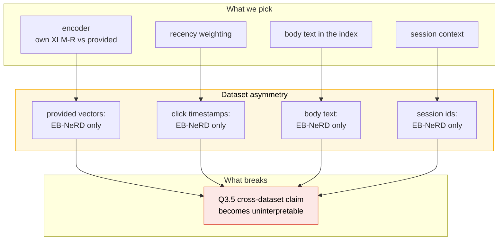

# A1 — Design decisions and open questions

The **deliberation** record for [[Assignment-1-Lexical-Semantic-Retrieval]]. Split out of
`architecture.md` on 2026-08-25 so that document describes *what the system is* while this one holds
*what we chose, what we rejected, and what is still open*.

> [!info] Which document do I want?
> | Question | Go to |
> |---|---|
> | "What does the pipeline look like?" | [[architecture\|architecture.md]] |
> | "Why is it that way, and what else did we consider?" | **this file** |
> | "What did we measure, and when?" | [[plan/execution_plan_log\|execution_plan_log.md]] |
> | "What does the brief ask for?" | [[plan/Pipeline\|plan/]] phase files |
>
> The design note (Q6) is graded on *"alternatives considered and why you chose what you did"*, so
> **this file is the one that converts into the deliverable**, section for section.

---

# Part 1 · What the brief actually offers

Most of the brief's technology names are `e.g.` — examples, not menus. That distinction is worth
holding onto: an `e.g.` is a place where a *justified* alternative earns marks, while a bare
requirement is non-negotiable and departing from it just loses them.

| Where | Options the brief names | Binding? |
|---|---|---|
| Intro, three axes | Lexical: **BM25, TF-IDF** · Semantic: **Word2Vec, BERT, XLM-RoBERTa** · Behavioural: **click history, recency/decay, session context** | Descriptive — "what the datasets natively exercise" |
| Q1.3 split | "e.g., last N days as test, preceding M days as validation" | *Temporal* is binding; N and M are ours |
| Q1.4 store | title, abstract, **body**, category, entities, embeddings · click history, **recency** | A field list, not an algorithm |
| Q1.5 rebuild | "e.g., `make data` or `python build_pipeline.py`" | *One command* is binding; the tool is not |
| Q2.1 index | title + abstract | **Binding** (note the intro said "titles/bodies" — the specific requirement wins) |
| Q2.2 query | "e.g., concatenate titles of recently clicked articles" | Fully open |
| Q3.1 embeddings | "**provided** article embeddings (or compute your own using **BERT/XLM-RoBERTa**)" | Both routes explicitly sanctioned |
| Q3.2 index | "e.g., FAISS, ScaNN, **or brute-force for small scale**" | Brute force explicitly allowed |
| Q3.3 user rep | "e.g., mean-pooled embeddings of clicked articles" | Fully open |
| Q4.3 slice | cold-start vs. warm, **or** head vs. tail | At least one; either |
| Q2.4 / Q3.4 | K ∈ {50, 100, 200} | **Binding, exact** |
| Q4.1 / 4.2 / 4.4 | AUC, MRR, nDCG@5, nDCG@10 · diversity, novelty, coverage · bootstrap 95% CI | **Binding** |

## The combinational effect — these options are not independent

Choosing one constrains others, and almost every Q3 choice is really a **Q3.5 choice**, because it
decides whether the cross-dataset comparison means anything.



**Read it as:** every richer feature EB-NeRD offers is one MIND does not have, so using it for a
headline number silently turns a dataset comparison into a feature-availability comparison.

**The governing rule this implies:** *the shared path uses only the intersection; everything
one-sided becomes a single-dataset ablation, clearly labelled.* That one rule resolves four separate
decisions below (D-ENC, D-REC, D-BODY, D-SESS) and is the single most load-bearing choice in the
component.

| Feature | MIND | EB-NeRD | Verdict |
|---|---|---|---|
| Title, abstract, category, click history | ✅ | ✅ | **The shared path** |
| Provided embeddings | ❌ | ✅ (300-dim w2v, 768-dim mBERT) | EB-NeRD baseline row |
| Click timestamps → recency decay | ❌ | ✅ | EB-NeRD ablation |
| Body text | ❌ | ✅ | EB-NeRD ablation |
| Session ids | ❌ (0%) | ✅ (100%) | **Dropped from C-1** — see D-SESS |
| Publish time → recency filter | ❌ (0%) | ✅ (100%) | EB-NeRD only, and it dominates (F16) |
| Entity embeddings | ✅ (TransE 100-dim) | ❌ | MIND-only ablation, probably skip |

---

# Part 2 · Decisions taken

Each carries the alternative rejected and why — the shape the Q6 rubric asks for.

## D-SPLIT — Test window: 7 days on EB-NeRD, 1 day on MIND

**Decision: keep the existing rule** (hold out the official test period; carve val from the tail of
the train window), which *already* realises 7 days on EB-NeRD.

> [!warning] "Last 7 days as test" is physically impossible on MIND
> Measured from the built store:
>
> | Dataset | Total labelled span | Realised test |
> |---|---|---|
> | MIND | **6.0 days** (2019-11-09 → 11-15) | 1 day (11-15) |
> | EB-NeRD | 14.0 days (2023-05-18 → 06-01) | **7 days** (05-25 → 06-01) |
>
> MIND's *entire* labelled range is under 7 days, so a 7-day test split would consume the training
> data as well. The rule stays constant; the realised spans differ because the datasets do.

**Rejected:** a literal "7 days on both" (impossible), and a literal 80/10/10 (discards ~40% of
EB-NeRD's labelled impressions — F4).

**The evaluation surfaces, settled** (2026-08-25) — the "7 days large / 2 days small" idea does not
survive contact with the tiers:

| Tier | What ships | What we evaluate on |
|---|---|---|
| EB-NeRD small | `train/` + `validation/` only — **no test split** | **val** (~18 h, labelled) |
| MIND small | official train + dev | **val** carved from train tail (1 day, labelled) |
| EB-NeRD large | + `ebnerd_testset` | **test, 7 days** — leaderboard, unlabelled |
| MIND large | + `MINDlarge_test` | **test, 7 days** — leaderboard, unlabelled |

There is nothing to carve a 2-day test *from* in the small tiers (F11), and MIND-small's total
labelled span is 6.0 days. So: **small tiers are the offline surface (val, with labels and CIs);
large tiers are the leaderboard surface (test, 7 days, no labels).** This is the hybrid official-split
setup — the official split is honoured wherever one exists, and val is carved only where it does not.

**Rejected:** carving a 2-day test from small's train tail (shrinks MIND's train from 6 days to 3,
and is not the official split, so leaderboard and offline numbers would measure different regimes).

**Cost:** MIND's 1-day val window is a single day of news, so a topical anomaly that day moves every
MIND number. EB-NeRD's ~18 h val is thinner still. Worth one sentence in the note.

## D-CORPUS — Union corpus for the headline, per-split as an ablation

**Decision: the retrievable corpus is the union of MIND's two `news.tsv` files (65,238 articles)**
for every reported number, **plus a per-split run as a measured ablation.**

MIND ships two different article files. Measured:

| File | Articles |
|---|---|
| `train/news.tsv` | 51,282 |
| `dev/news.tsv` | 42,416 |
| **union** | **65,238** |
| dev-only (absent from train) | **13,956 (21%)** |

**Why the union is the headline.** With a train-only corpus, those 13,956 articles are unretrievable
when evaluating on dev — so any impression whose click landed there scores 0 regardless of the
retriever. Measured over 61,028 sampled dev clicks: **23.3% are on articles absent from train's
`news.tsv`**, giving a **structural recall ceiling of 0.767** that is invisible in the output.

That is precisely the artefact F17 caught by accident (a truncated corpus produced recall 0.0000
everywhere because 372 of 379 clicked articles fell outside the kept slice). A ceiling imposed by
corpus construction looks exactly like a weak retriever.

**Why per-split is still worth running.** The realistic objection is sound: a live system cannot index
articles that do not exist yet. So the per-split number measures something real — *how much of
retrieval depends on articles unseen at training time* — and the union-minus-per-split gap is a
genuine Q3.5/Q6 observation about news freshness.

**Rejected:** per-split as the headline (the 0.767 ceiling would have to be restated with every MIND
number, and would still invite misreading).

**Cost:** two corpus builds for MIND rather than one, and the ablation row needs its ceiling stated
explicitly or it looks like a regression.

## D-LEX-QUERY — Last 20 clicks, log-based mild decay

**Decision: `last_n = 20` with logarithmic position decay**, weight `w_j = 1 / log2(rank_from_recent + 2)`.

Rationale for the shape you asked for: exponential decay at any meaningful λ makes the query
effectively the last 2–3 titles, throwing away the mid-history signal. Log decay keeps the 20th click
at ~0.28 of the 1st click's weight instead of ~0.02 — recent clicks lead, older ones still
contribute.

| Position from most recent | Exponential (λ=0.3) | **Log (chosen)** |
|---|---|---|
| 1st | 1.00 | 1.00 |
| 5th | 0.30 | 0.50 |
| 10th | 0.07 | 0.39 |
| 20th | 0.002 | 0.28 |

**Rejected:** plain unweighted mean (F8 — averaging 160 EB-NeRD clicks makes a bland query);
exponential decay (too aggressive, see table); last-click-only (high variance).

> [!warning] The decay is positional, not temporal — and that is a MIND compromise
> Weighting by *elapsed time* needs per-click timestamps. **MIND has none** (F1). So decay here means
> *position in the history list*, under the assumption the list is chronologically ordered — which the
> MIND authors do not document. On EB-NeRD, true time-decay is available and is the ablation.

**Cost:** F23 measured `last_n` as worth ~0.03 recall at most, well inside the CI. This decision is
defensible as reasoning but is **not** currently supported by a detectable effect. Say so.

## D-LEX-FIELDS — Title + abstract, with title-only as a measured ablation

**Decision: keep title + abstract** (Q2.1 mandates it), **and report title-only alongside.**

You asked whether abstracts actually add value. Measured, and the answer is uncomfortable:

| Corpus | Title tokens (mean) | Abstract tokens (mean) | Abstract share of index |
|---|---|---|---|
| MIND | 11.2 | 36.1 | **76.3%** |
| EB-NeRD | 6.8 | 18.3 | **72.8%** |

So abstracts are ~3× the title and **dominate the document representation**. And their measured
contribution, EB-NeRD, BM25+24h, n=800:

| Indexed text | recall@50 |
|---|---|
| Title + abstract | 0.2475 |
| Title only | 0.2362 |

**+0.011 — well inside the ±0.03 CI.** Three quarters of the index buys an effect too small to detect
at this sample size.

**Why keep them anyway:** Q2.1 is binding, and a null result reported *as* a null result is a finding
("the mandated field pair is not measurably better than titles alone, despite being 75% of the
index"). That is a better design-note paragraph than a silent choice either way.

**Cost / open risk:** abstracts also make document lengths bimodal (5.2% of MIND and 8.2% of EB-NeRD
articles have none), which interacts with BM25's `b`. F23 found `b` barely matters, so this is a
theoretical concern that did not materialise.

## D-COLD — Cold start = fewer than 7 clicks; fallback = rising + popular mix

**Decision: cold-start threshold `< 7 clicks`** (your call, adopted), and a **fallback blending
recent-rising with all-time-popular** rather than popularity alone.

> [!warning] `< 7` selects a real slice on EB-NeRD only because its minimum is 5
> F9 measured EB-NeRD's minimum history length as **5**, so `< 5` would select *nobody*. `< 7`
> catches the 5- and 6-click users. This is a narrow band — report the realised slice size with every
> cold-start number, and if it is tiny the CI will say so.

**The fallback, and its Q9 entanglement:**

| Fallback option | Buys | Costs |
|---|---|---|
| Return nothing | Honest — no signal, no answer | recall = 0 on the slice; drags the headline |
| All-time popular | Non-zero recall | Stale in a news corpus; and popularity over the *evaluation* window is future knowledge |
| Recent rising | Matches news dynamics; F16 says freshness dominates | Needs a window and a rate definition |
| **Rising + popular mix** ✅ | Freshness where it exists, stability where it does not | Two parameters; **and it is the Q9 with/without pair** |

**Implementation:** score `α · rising + (1 − α) · popular`, `α = 0.7` default, both computed on the
**train split only**. Every fallback result carries an `is_fallback` flag so the harness can report
metrics with and without them — which is exactly the Q9 comparison, obtained for free.

## D-ENC — Own XLM-RoBERTa, compared against the provided 768-dim mBERT

**Decision: compute our own with `xlm-roberta-base` (768) as the primary**, per your call and because
**the brief names XLM-RoBERTa explicitly**.

You asked what the provided embeddings' dimension is, for comparison:

| Provided artifact (EB-NeRD only) | Dim | Coverage |
|---|---|---|
| `Ekstra_Bladet_word2vec` | 300 | all 125,541 articles |
| `google_bert_base_multilingual_cased` | **768** | all 125,541 articles |

**768 is the directly comparable one** — same dimension as XLM-R-base, both MLM-trained multilingual
models, so a head-to-head isolates the model rather than the dimension. Word2Vec-300 is a second,
weaker baseline.

**The planned ablation ladder:**

| Row | Model | Dim | Why it is there |
|---|---|---|---|
| Primary | `xlm-roberta-base` | 768 | Brief-named; runs on both datasets |
| Capacity ablation | `xlm-roberta-large` | 1024 | The 768-vs-1024 question; also the Q6 scale anchor |
| Objective ablation | `paraphrase-multilingual-MiniLM-L12-v2` | 384 | Similarity-trained — the anisotropy control |
| Baseline (EB-NeRD) | provided mBERT | 768 | Same-dim reference; catches bugs |
| Baseline (EB-NeRD) | provided word2vec | 300 | Weak reference |

> [!warning] The known risk with XLM-R, stated before we run it
> XLM-R and BERT are trained for **masked-language modelling**, not for producing vectors whose cosine
> similarity is meaningful. Their `[CLS]` vectors are known to occupy a narrow cone where everything
> looks similar (anisotropy). The failure is silent: you get plausible numbers that are simply
> mediocre, and the natural misdiagnosis is "semantic retrieval doesn't work here."
>
> **Mitigations:** (a) **mean-pool** the final hidden states masked by attention, never `[CLS]`;
> (b) **L2-normalise**; (c) run the Danish sanity probe below *before* computing any metric; (d) keep
> the MiniLM row so the anisotropy hypothesis is **measured**, not assumed.
>
> If XLM-R fails the probe and MiniLM passes it, that is a real finding and a strong design-note
> paragraph — better than either of us picking a model on reputation.

> [!important] The Danish sanity probe gates everything downstream
> Embed 20 known-related Danish article pairs and 20 unrelated pairs; confirm related pairs score
> higher. An English-centric encoder on Danish does not degrade gracefully — it tokenises into
> near-meaningless subwords and produces vectors with no useful geometry, while still producing
> *numbers*. This is the highest-risk silent failure in the assignment.

**Note also:** "compute our own" is **one forward pass of an already-trained encoder** over ~86K
articles. No gradients, no labels, minutes on the 4060. That is categorically different from
fine-tuning, which stays out of scope.

## D-POOL — Conditional pooling with a fallback ladder

**Decision:** adopt your conditional scheme. Mean-pool by default, but **detect the meaningless
centroid and fall back**.

The failure this addresses: a user who reads football *and* recipes gets a centroid sitting between
the two clusters, matching neither. Averaging is worst exactly when the user is most interesting.

**The ladder, in order:**

1. Compute the recency-weighted mean (log decay, matching D-LEX-QUERY).
2. Measure **history coherence** — mean cosine similarity of each clicked vector to the centroid.
3. If coherence ≥ τ (default 0.35): the user has one interest. **Use the mean.**
4. If coherence < τ: the centroid is meaningless. **Fall back** to (a) recency-weighted mean over the
   most recent half only, else (b) max-pool.

**Rejected:** plain mean always (the blur problem); max-pool always (noisy — one outlier dimension
dominates); multi-query clustering (properly correct, but *c*× the searches and needs a merge
strategy — named as considered-not-built, which the rubric credits).

**Cost:** τ is a free parameter with no principled value; it must be swept and reported. And the
conditional branch means two users with similar histories can be scored by *different* mechanisms,
which complicates the ablation story. Worth stating.

## D-ANN — Brute force on demo/small, FAISS HNSW on large

**Decision:** exactly your split. Brute force for demo and small (Q3.2 explicitly permits it, and it
is **exact**, so it gives the recall ceiling); **FAISS HNSW** for large.

**FAISS over ScaNN**, per your call — and independently the right one: ScaNN is TensorFlow-coupled and
awkward on this stack, while FAISS is the field default with a stable Python wheel.

> [!note] HNSW is a CPU algorithm — the 4060 is for the encoder, not the index
> Worth being explicit since the GPU motivated the choice: `faiss-gpu` is not on PyPI for current
> versions (conda-only, CUDA-version-sensitive), so we use `faiss-cpu`. This costs nothing here —
> HNSW graph search is CPU-bound by design, and the 28-core budget is a better fit for it than 8 GB
> of VRAM. **The GPU earns its place on the embedding forward pass**, which is the actual
> VRAM-bound step.

**The brute-force row is not a fallback, it is the measurement instrument:** ANN recall is only
interpretable against the exact answer. The gap between HNSW and brute force *is* the Q6 ablation.

**Cost:** HNSW's `M` and `efSearch` trade recall against latency, and an under-tuned `efSearch`
silently caps recall. Report the ANN-vs-exact gap, never ANN alone.

## D-BUDGET — 28 cores / 28 GB, all-inclusive

**Decision:** hard cap at **28 cores and 28 GB total across all processes**, down from the previous
26/26 default, per your instruction, and now *all-inclusive* rather than per-stage.

This tightens an existing rule (architecture decision 7b): budgets are arguments, never constants,
and the resolved values are logged with every result so a number traces to the budget that produced
it. What changes is that the cap now covers the whole run — a parallel sweep must divide 28 cores
among its workers rather than each worker claiming 28.

**FAISS specifically** needs `faiss.omp_set_num_threads(n)`; it ignores the process pool and will
otherwise grab every core.

## D-STORE — Parquet, already polars-native

**Decision: no change — the store is already parquet**, read and written through polars/pyarrow.

You asked for a store usable with polars; `data/store/{mind,ebnerd}/*.parquet` already is. Embeddings
will be added as a `vectors.parquet` per dataset keyed on `article_id`, so the join stays a polars
operation and the ANN index is built from a column read rather than a bespoke format.

**Cost:** parquet is poor at storing wide float arrays row-wise; a 1024-dim vector per article is a
1024-wide list column. At 125K articles that is ~500 MB — acceptable, but if it becomes awkward the
alternative is a raw `.npy` beside a parquet id index. Noted, not yet needed.

## D-SESS — Session context dropped from C-1

**Decision: do not build session context in this component.** Named as considered-and-rejected, with
the measurement behind it.

The brief names session context as one of three behavioural signals, so dropping it needs a reason.
Two, measured (F29):

| Dataset | Rows | Non-null `session_id` | Mean impressions/session |
|---|---|---|---|
| MIND | 141,265 | **0 (0.0%)** | — |
| EB-NeRD | 209,597 | 209,597 (100%) | **1.9** (max 24) |

1. **Structurally unavailable on MIND.** No session ids at all, so it can never enter a cross-dataset
   claim — the governing rule in Part 1 puts it in the one-sided bucket automatically.
2. **Thinner than the phrase suggests even on EB-NeRD.** A "session" averages **1.9 impressions**, so
   session context means roughly *one prior impression*. That is a very small amount of extra signal
   for a full feature.

**Rejected:** building it as an EB-NeRD-only ablation (a day of work for an effect likely below the
CI width we are already fighting — F25 showed ±0.03 at n=800).

**Where it lands instead:** **C-2**, which is explicitly click-log modelling and where session
structure is the natural unit. Deferred, not forgotten.

**Cost:** C-1 exercises two of the brief's three named behavioural signals rather than three. State
this plainly in the design note — "dropped after measuring the signal, not overlooked" is a defensible
position; silence is not.

## D-C2 — An interface for Component-2, built now

**Decision:** define the re-ranker seam now, per your call, but **do not implement a ranker** (that is
explicitly C-2 and building it now costs the marks this component is graded on).

```python
class Reranker(Protocol):
    """C-2 slots in here. C-1 ships exactly one implementation: identity."""
    name: str
    def fit(self, train_impressions, features) -> None: ...
    def rerank(self, user_id: str, candidates: list[tuple[str, float]],
               at_time: datetime) -> list[tuple[str, float]]: ...
```

The seam matters because candidate generation and ranking optimise different things (recall vs.
precision), and C-1's `Retriever` already returns `(id, score)` pairs rather than bare ids —
precisely so a downstream stage can consume scores without a second retrieval pass.

---

# Part 3 · Still open

Questions that remain genuinely undecided, now that this round has closed several.

| # | Question | Why it is open | Consequence of getting it wrong |
|---|---|---|---|
| O1 | **λ / τ values** — the log-decay base and the coherence threshold | Both chosen by reasoning, neither swept yet | Under-tuned, they make their features look useless |
| O2 | **HNSW `M` / `efSearch`** | Not yet benchmarked on our corpora | Silent recall cap that looks like a bad encoder |
| O3 | **Does the recency window generalise to MIND at all?** | MIND has no publish time (F20); first-seen-in-impressions is the only proxy and it is not documented | The single biggest recall lever on EB-NeRD may be unavailable on MIND, making the datasets incomparable on the thing that matters most |
| O4 | **Multi-click positives** | 99.5% single-click (F7), so it barely moves a number — but it changes every denominator | Decide once, state it |
| O5 | **Query-term dedup** | F23 swept `last_n` but not dedup | Repeated titles inflate TF in the concatenated query |
| ~~O6~~ | ~~Whether session context is worth building~~ | **Resolved 2026-08-25** → D-SESS: dropped from C-1, deferred to C-2 | — |
| O7 | **Which XLM-R survives the Danish probe** | Not yet run | Everything in Q3 depends on it |

## Questions the brief raises that we have not yet answered

Worth listing explicitly, because an unasked question is the expensive kind:

- **"Where does your pipeline break at 10×?" (Q6)** — we have F15's answer for the *data* layer (the
  join breaks before the model does) but nothing measured for the ANN or encoder layers. The
  HNSW-vs-brute-force gap and the encode throughput are the two numbers that answer this properly.
- **Leaderboard screenshots (Q7.3)** — cannot exist until we submit. On the critical path.
- **"Marking of AI-generated vs. human-written code" (Q7.4)** — `ai-log.md` captures prompts
  automatically, but the *marking* of which code is which has not been done and is a deliverable.
- **TF-IDF** — named in the brief's lexical axis and not yet built. Cheap (~1 hour) and it isolates
  what BM25's two knobs actually buy. Currently the most under-priced row available.

---

# Part 4 · Drawbacks of the choices, collected

The rubric rewards naming costs. Every decision above has one; here they are in one place so the
design note can quote them.

| Choice | What it gives up |
|---|---|
| Intersection-only shared schema | EB-NeRD's body, sentiment, popularity, sessions — the richest signals in either dataset — cannot inform any headline number |
| Title + abstract | 75% of the index for an effect inside the CI; bimodal doc lengths |
| Log decay, `last_n = 20` | No measured support (F23); positional not temporal on MIND, under an undocumented ordering assumption |
| Cold start `< 7` | A narrow band on EB-NeRD (min is 5); slice may be too small for a tight CI |
| Rising+popular fallback | Two unswept parameters; entangles the cold-start slice with the Q9 comparison |
| Own XLM-R | Anisotropy risk; ~3× encode cost for the `large` row; no click-training, so the provided EB-NeRD vectors *should* beat it |
| Conditional pooling | Free parameter τ; two users scored by different mechanisms complicates ablation |
| Brute force on small | Does not exercise the ANN path that large will use — a code path first stressed at the worst moment |
| FAISS CPU | Leaves the GPU idle during search (correct, but worth saying so nobody assumes it is used) |
| 28/28 all-inclusive cap | Parallel sweeps get fewer workers each; wall time up |
| Parquet for vectors | Wide list columns are not parquet's strength; ~500 MB at 1024-dim |
| Deferring session context | Drops one of the brief's three named behavioural signals from C-1 entirely |

---

# Part 5 · The earlier decision record (merged from architecture.md Part D)

Moved here on 2026-08-25 when `architecture.md` was reduced to describing the system. This is the
pre-2026-08-25 reasoning, preserved because much of it is still the live justification — the
numbered decisions below are referenced from the phase files, and several feed the Q6 note directly.

**Where Parts 2–4 above disagree with anything here, Parts 2–4 win** — they are later and are backed
by measurements this material predates.

### The decisions you must make consciously

The design note is graded on **"alternatives considered and why you chose what you did."** These are
the real forks — each is a genuine trade-off, not a right answer.

#### 1. Temporal split — where exactly does the boundary go?
*Never random for interaction data.* But the specifics are yours:

- How many days for test? Too few → noisy metrics; too many → stale training data given news decay.
- **The subtle one:** a user's click history spans the boundary. If a test impression is at time *t*,
  their history must be truncated to `< t` — not "all their clicks". This is exactly the leakage
  Q9 tells you to test for.
- **Compromise:** a strict boundary costs you signal on users whose history is mostly post-boundary.
  Accept it, and say so.

#### 2. Query construction from click history
The whole lexical approach rests on this, and it's underdetermined:

- How many recent clicks — last 5? 10? All?
- Weight recent clicks more (recency decay), or treat equally?
- Concatenate titles only, or titles + abstracts? (Longer query → better recall, worse precision, slower.)
- **Cold-start users have no history.** What's your fallback — popularity? category priors? random?
  You need *an* answer; the slice analysis will expose it.

#### 3. Candidate generation vs. ranking
Note that this assignment is **candidate generation only** (recall@K is the metric). The re-ranker
is Component-2. So:

- Optimise for **recall**, not precision. A K that seems absurdly large is correct here.
- Resist building a ranker now — but design the interface so C-2 can slot one in.

#### 4. Embeddings: provided vs. computed — **decided: compute your own, keep one provided as baseline**

- **Provided** (EB-NeRD ships Word2Vec, mBERT, XLM-R, contrastive vectors): fast, no GPU time, and the
  contrastive ones are *click-trained*, so they're a strong reference.
- **Your own** (mBERT/XLM-R forward pass): a coffee break on a local GPU, not a weekend — see the
  encoding-vs-training callout in Part C.
- **EB-NeRD is Danish** — an English-only model will silently underperform. Multilingual or Danish-specific.

> [!important] The deciding argument is Q1's unified schema, not compute cost
> **The provided embeddings are EB-NeRD-only — MIND ships no equivalent.** So "load for EB-NeRD,
> compute for MIND" means your two datasets are encoded by *different models*, and Q3.5 ("compare
> lexical vs. semantic — on which slices?") plus every cross-dataset claim becomes uninterpretable.
> You would be measuring the encoder difference, not the dataset difference. Computing **both** with
> one multilingual encoder is the only clean basis for comparison.

**Ship:** own embeddings from a single multilingual encoder over both corpora — the headline
semantic result.
**Baseline row:** EB-NeRD's provided vectors, on EB-NeRD only, as a correctness check and an
ablation. They are click-trained and *should* beat generic mBERT; **if your own vectors win, suspect
a bug** (pooling, truncation, normalisation) rather than celebrating.

This also strengthens the Q6 scale analysis: having actually run the encoder, you can report real
throughput and memory for the embedding stage instead of speculating about it.

#### 5. ANN index vs. brute force
- MIND-small / EB-NeRD demo are small enough for **brute force** — and brute force is *exact*, so it
  gives you the recall ceiling to measure ANN against.
- **Do both.** Brute force is your oracle; FAISS is your scale story. The gap between them *is* the
  ablation, and "where it breaks at 10×" (Q6) writes itself.

#### 6. User representation for semantic retrieval
Mean-pooling clicked-article embeddings is the suggested default. Its weakness: it blurs a user with
several distinct interests into one meaningless centroid.

- Alternatives: max-pool, recency-weighted mean, cluster the history and issue multiple queries.
- **Compromise:** multi-query retrieval is better but costs K× the ANN lookups. Mention it as an
  alternative even if you ship the mean.

#### 7. Scale — pick your bundle deliberately

Demo → small → large lets you "dial scale gradually". **All tiers are downloaded** (EB-NeRD demo +
small + large + testset, MIND small + large test), so the choice is about where to spend time, not
what's available.

> [!important] Brief v2 changed this decision — large is no longer optional
> The **v2 brief (2026-08-21) makes the large bundles mandatory for Codabench**: "the test sets used
> by both leaderboards come from the large bundles only." `MINDlarge_test.zip` (2.37M impressions)
> and `ebnerd_large.zip` + `ebnerd_testset.zip` (13.5M impressions) are now *required* for Q5, not a
> Q6 nice-to-have. See the brief-diff section below.
>
> This does **not** promote large to the headline tier. The split is now: **small for every metric
> you report, large for the two submissions you must make.**

| Tier | Role | Use for |
|---|---|---|
| **EB-NeRD demo** (5K users) | smoke test | Does the pipeline run end to end? Every code change. |
| **EB-NeRD small + MIND small** | **headline pair** | Every reported metric with a CI. Comparable size, both feasible locally. |
| **MIND large test + EB-NeRD large/testset** | **mandatory submission tier** | Q5 leaderboard predictions. Also the one real anchor point for the Q6 scale story. |

The headline pair is still the important line: your cross-dataset claims are only meaningful if both
sides are the same tier. Large produces a leaderboard number, not a CI-bearing comparison.

> [!warning] EB-NeRD small and demo have **no test split**
> Both ship `train/` and `validation/` only. Test impressions exist solely in `ebnerd_testset.zip`,
> which is what Q5's mandatory EB-NeRD leaderboard submission needs. **Downloaded and verified** —
> see the measured schema section below. Q1–Q4 are unaffected.

Q6 asks *where it breaks at 10×*, so you still need to have thought about:

- Inverted index memory growth; when does it stop fitting in RAM?
- ANN build time vs. query time as vectors grow.
- Where the pipeline becomes I/O-bound rather than compute-bound.

Measure at two scales (demo and small) and **extrapolate** — that's a legitimate scale analysis. With
MIND-large downloaded you can optionally anchor the extrapolation with one real large-tier data point,
which is stronger than pure projection.

#### 7b. Compute budget — local hardware, and why it's parameterised

Measured on this machine: **i9-14900HX (24 cores / 32 threads), 31 GB RAM, RTX 4060 Laptop 8 GB
VRAM, torch 2.5.1 + CUDA**, 134 GB free disk.

**This is enough for all of C1 — Colab/Kaggle are not needed.** It beats free Colab on CPU and RAM;
the only place it loses is VRAM (8 GB vs a T4's 16 GB), which matters for exactly one step:

| Stage | Bound by | Local verdict |
|---|---|---|
| Data pipeline, temporal split | RAM + disk I/O | Comfortable |
| BM25 / inverted index | CPU cores | Strong — far more cores than any free tier |
| **Embedding forward pass** | **VRAM** | Fine at batch 32–64 in fp16; slower than a T4, still minutes |
| ANN (brute force at ~120K × 768) | RAM | ~300 MB of vectors — trivial |
| Eval + bootstrap CIs | CPU cores | Embarrassingly parallel; scales with cores |

Reach for **Kaggle** (30 GB RAM, 12-hour sessions, no idle disconnect — better than free Colab) only
if a MIND-large embedding run proves too slow locally. If you do, pull the data there from source
rather than uploading — local upload throughput was measured at ~19 KB/s.

> [!important] Never hardcode core or memory limits — take them as arguments
> The machine is shared with other work. A run that grabs all 32 cores or all 31 GB will thrash
> (observed: load average 26.5 and 9.5 GB of swap already in use while another job was running).
> Every stage that parallelises or allocates in bulk must accept a budget:
>
> - `--n-jobs` / `n_jobs` in config — worker processes. **Cap, don't default to `os.cpu_count()`.**
> - `--mem-gb` — memory ceiling, used to size batches and chunked reads rather than loading whole
>   parquet files.
> - `--batch-size` — embedding batch, the VRAM dial, separate from host memory.
>
> **Working default: 26 cores / 26 GB** — a sensible ceiling *on an idle machine*, leaving headroom
> for the OS and editor. Both must be overridable per run, from CLI and from `configs/*.yaml`, and
> the resolved values logged with every result so a number can be tied to the budget that produced it.
>
> **Check availability before trusting the ceiling.** 26 GB is unusable when only 8 GB is free; a run
> should read actual availability at startup and either scale down or refuse, not swap itself to death.

#### 8. Beyond-accuracy metrics pull against accuracy
Diversity, novelty, and coverage genuinely trade off against nDCG. Recommending the same popular
articles to everyone scores well on accuracy and terribly on coverage. Don't hide this — **quantify
the trade-off**. It's one of the more interesting things you can put in the note.

#### 9. LLM-based text cleanup (e.g. the Yi models) — assessed and rejected

**The idea:** instead of deterministic cleaning in `clean.py` (strip HTML, normalise whitespace,
lowercase, handle encoding), use an open-weight LLM such as **Yi-6B/34B** (01.AI) to normalise
article text — repair encoding damage, strip boilerplate, maybe summarise bodies before indexing.

**The verdict: don't, for A1.** Four reasons, each independently sufficient:

| Objection | Detail |
|---|---|
| **It breaks reproducibility — the Q1 requirement** | Q1.5 demands *one command rebuilds everything from raw files*. LLM generation is non-deterministic without pinned weights, seeds, and fixed decoding; and the cleanup step becomes hours of GPU rather than seconds. A grader cannot re-run it. |
| **It silently corrupts your corpus** | An LLM rewriting article text will occasionally paraphrase, drop named entities, or hallucinate. **BM25 scores word overlap** — altering the words alters the ground truth of what the article says. You'd be measuring retrieval against a corpus the LLM invented. This is the same class of error as leakage: no crash, plausible numbers, wrong. |
| **The datasets are already clean** | MIND and EB-NeRD are curated research benchmarks with structured title/abstract/body fields — not scraped HTML. The cleanup they need is tokenisation and whitespace normalisation. There is no mess for an LLM to fix. |
| **Yi specifically is a poor pick in 2026** | 01.AI **halted pre-training in early 2025**; Yi Large (Nov 2024) was the final model. It's a frozen line, and it was never strong on **Danish** — which is exactly where EB-NeRD would need help. If you ever did want multilingual text repair, a current multilingual model would be the choice, not Yi. |

> [!warning] The deeper principle — don't put a generative model inside a measurement pipeline
> A1 measures retrieval quality. Every non-deterministic component between the raw data and the
> metric is a source of variance you cannot attribute, and the bootstrap CI **will not catch it** —
> it quantifies sampling noise, not corpus corruption. Keep the data path deterministic; put the
> cleverness in the retriever, where you can ablate it.

**Where an LLM *is* legitimately useful here** — outside the measured path:

- **Writing the pipeline code** (expected by the course; logged in `ai-log.md`).
- **Inspecting data** — "summarise what these 20 EB-NeRD rows contain" while exploring the schema.
- **Translating Danish samples** so you can eyeball whether semantic retrieval is behaving.
- **Drafting the design note**, then verifying every number yourself.

None of these touch the corpus the metrics are computed over. That's the line.

> [!tip] This is worth a sentence in the design note
> "Considered LLM-based text normalisation (Yi/multilingual); rejected — non-deterministic under a
> one-command rebuild requirement, and rewriting article text invalidates lexical scoring against
> ground truth." Naming a rejected alternative *with a reason* is precisely the
> "alternatives considered" rubric line. A rejection you can justify scores as well as an adoption.

#### 10. Metrics with and without serving-time-unavailable features (Q9)
Some features you can compute offline aren't available when actually serving a recommendation. You
must report **both** numbers. Decide early which features fall in this bucket so you're not
retrofitting the comparison the night before.

### Ambiguities, assumptions, and open decisions

Three tiers. **Mandated** is quoted from the brief. **Authored** is a choice made in this document —
defensible, but yours to change, and worth naming in the design note. **Open** needs your decision
before code exists.

#### Mandated — the brief says so

| Requirement | Where |
|---|---|
| Temporal split, never random | Q1.3 |
| One-command rebuild | Q1.5 |
| BM25 over title + abstract | Q2.1 |
| recall@K for K ∈ {50, 100, 200} | Q2.4, Q3.4 |
| ANN index (FAISS, ScaNN, **or brute-force for small scale**) | Q3.2 |
| AUC, MRR, nDCG@5, nDCG@10 | Q4.1 |
| Diversity, novelty, coverage | Q4.2 |
| At least one slice | Q4.3 |
| Bootstrap 95% CI per metric | Q4.4 |
| Submit to both leaderboards | Q5 |
| Metrics with **and without** serving-unavailable features | Q9 |
| A test asserting the behaviour-window boundary | Q9 |

Note Q3.2 explicitly sanctions brute force — so the "use brute force as primary" recommendation above
is compliant, not a shortcut.

#### Authored — this document's choices, not requirements

| Choice | Alternative | Why it's here |
|---|---|---|
| Four-stage architecture | Any other decomposition | Makes the shared-harness constraint visible |
| Shared `Retriever` interface | Two independent scripts | Q4.5 requires one harness over both; an interface is the cleanest way |
| Parquet feature store | CSV, SQLite, in-memory | Fast columnar reads; nothing in the brief requires it |
| Repo layout with `src/`, `configs/` | Flat scripts | Convention, not requirement |
| Recency-weighted mean as ship default | Plain mean (brief's suggestion) | News decay; plain mean is the ablation |
| RRF for fusion | Weighted score sum | Avoids BM25 score-normalisation fragility |
| `Makefile` targets | Shell scripts, `just` | Q1.5 says "e.g. `make data`" — an example, not a mandate |
| Own embeddings as headline, provided as baseline | Provided as headline | MIND ships no provided vectors; one encoder over both is the only comparable basis (decision 4) |
| Resource budget as CLI/config args | Hardcoded `os.cpu_count()` | Shared machine; caps must be tunable per run and logged with results (decision 7b) |

#### Open — you must decide, and the brief won't tell you

| Question | Why it's genuinely undecided | Consequence of getting it wrong |
|---|---|---|
| **How many days in the test split?** | Q1.3 says "e.g. last N days" — N is unspecified | Too few → noisy CIs; too many → stale training data given news decay |
| **What counts as "cold-start"?** | Q4.3 says "few clicks" without a threshold | Your slice boundary determines your headline finding; pick and justify (< 5 clicks is common) |
| **Which features are "unavailable at serving time"?** | Q9 requires the comparison but never defines the set | The whole Q9 comparison rests on this. Candidates: full-day impression counts, future article popularity, anything aggregated over the test window |
| **How much click history per query?** | Unspecified | Long → better recall, diffuse BM25 scores, slower. Short → sharper but misses interests |
| **What is "recency" numerically?** | Named as an axis, never quantified | Needs a concrete decay constant or window; pick one and sweep it |
| **Cold-start fallback strategy** | Not addressed by the brief at all | Users with no history return nothing without a fallback. Popularity? Category prior? Random? An empty result is a legitimate choice **only if you state it** |
| **Do multiple clicks in one impression count as multiple positives?** | Affects recall denominator and MRR | Changes every number; decide once and state it |
| **Use session context, or history only?** | The brief names session context as a behavioural signal; this pipeline uses only historical clicks | Needs a session boundary definition. EB-NeRD ships session IDs; MIND needs reconstruction from impression timestamps (e.g. a 30-min inactivity gap). Ignoring it is defensible for C1 — **but C2 is explicitly click-log modelling, so it lands there regardless** |
| **Deduplicate query terms?** | Unspecified | Repeated titles inflate term frequencies in the concatenated query |

> [!warning] The Q9 feature set is the most-underestimated item here
> "Report metrics with and without features unavailable at serving time" only means something once you
> have decided which features those are. Decide it in week one, not the night before — retrofitting the
> comparison means re-running everything.


---
[[architecture|← architecture]] · [[Assignment-1-Lexical-Semantic-Retrieval|tracking note]] ·
[[plan/execution_plan_log|execution log]]
