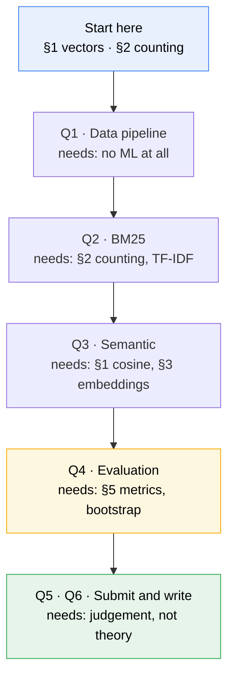

# A1 — Startup foundations

**Read this before [[architecture|architecture.md]].** This doc assumes you have *not* done SMAI
(Statistical Methods in AI) or iNLP (Intro to NLP). It builds, from scratch, only the ideas A1
actually uses — nothing more. Its companion [[architecture|architecture.md]] says *what we're
building and why*; this one says *what the words mean*.

> [!abstract] What you actually need to know
> A1 uses far less machine learning than it looks like. There is **no model training, no gradient
> descent, no neural network to design**. You need four things:
> 1. Text turned into **counts** (that's the lexical half — BM25 is arithmetic on word counts).
> 2. Text turned into **vectors**, which you *download pre-computed* (that's the semantic half).
> 3. **Cosine similarity** — one formula, high-school geometry.
> 4. **Averages with error bars** (the bootstrap — resampling, not statistics theory).
>
> If you can write a `for` loop over a dictionary of word counts, you can do the lexical half today.

---

## 0 · The one-paragraph version

A news site shows a user a list of ~50 articles. You predict which they'll click. You don't know
their mind — but you know **what they read yesterday**. So you take yesterday's headlines, treat them
as a **search query**, and search the article database for similar articles. You do this twice: once
matching **words**, once matching **meaning**. Then you measure which worked better, and on whom.

That's it. Everything below is detail on those sentences.

---

## 1 · Vectors — the one piece of maths everything rests on

Skip if you're comfortable with dot products and cosine. It's genuinely all you need.

### A vector is a list of numbers

$\mathbf{v} = [0.2,\ -1.4,\ 0.7]$ is a vector with 3 **dimensions**. Think of it as a point in space:
this one is at *x*=0.2, *y*=−1.4, *z*=0.7. You can't picture 768 dimensions — **nobody can, and you
don't need to**. Every formula below works identically at 3 or 768 dimensions; the geometry
intuition from 3D carries over, which is the only reason we use spatial language at all.

### Length (norm)

How far the point is from the origin — Pythagoras, extended:

$$\|\mathbf{v}\| = \sqrt{v_1^2 + v_2^2 + \dots + v_d^2}$$

```python
import numpy as np
v = np.array([0.2, -1.4, 0.7])
np.linalg.norm(v)        # 1.58...
```

### Dot product

Multiply matching positions, add them up:

$$\mathbf{u} \cdot \mathbf{v} = \sum_{i=1}^{d} u_i v_i$$

```python
u @ v          # numpy's dot product operator
```

The dot product is large when the two vectors **point the same way** *and* are **long**. That second
part causes a real bug in this assignment — see §5.

### Cosine similarity — the one you'll actually use

We want "do these point the same way?", **without** length interfering. So divide the length out:

$$\cos(\mathbf{u}, \mathbf{v}) = \frac{\mathbf{u} \cdot \mathbf{v}}{\|\mathbf{u}\|\,\|\mathbf{v}\|}$$

It ranges from **+1** (same direction — "these articles are about the same thing") through **0**
(unrelated, at right angles) to **−1** (opposite). This is *the* similarity measure in retrieval.

> [!important] Normalising is dividing by length, once, up front
> If you scale every vector to length 1 first (`v / np.linalg.norm(v)`) — called **L2
> normalisation** — then the denominator above is $1 \times 1$, and **cosine similarity is just the
> dot product**. That's why real systems normalise once at index-build time and then use fast dot
> products forever. Remember this; §5 is a bug that comes from forgetting it.

### Why "similar meaning = nearby point" is not obvious

It isn't a law of nature — it's an *engineered* property. Embedding models are trained so that texts
appearing in similar contexts get similar coordinates. It works well, but it's a learned
approximation, and it fails in ways worth knowing (a model trained only on English produces
meaningless coordinates for Danish — §6).

---

## 2 · Turning text into numbers, part 1: counting (the lexical half)

### Tokenisation

Splitting text into words ("tokens"). `"Denmark's election results"` → `["denmark", "s",
"election", "results"]`. Usually lowercased, punctuation stripped. Naive splitting is fine for A1.

### The bag of words

Throw away word order, keep counts. `"the cat sat on the mat"` becomes
`{the: 2, cat: 1, sat: 1, on: 1, mat: 1}`.

This is obviously lossy — "dog bites man" and "man bites dog" become identical. **It works anyway**
for retrieval, because word *presence* carries most of the topical signal. Accepting that loss is
what makes lexical search fast.

### TF and DF — the two counts that matter

| Term | Means | Intuition |
|---|---|---|
| **TF** (term frequency) | times a word appears **in one document** | more mentions → more likely about it |
| **DF** (document frequency) | how many documents contain the word **at all** | high DF = common word = tells you nothing |
| **IDF** (inverse DF) | $\log(N/\text{DF})$, roughly | the *rarer* the word, the more it discriminates |

**The whole idea of lexical search:** a match on a rare word ("Ekstrabladet") is strong evidence; a
match on "the" is none. IDF is how that gets encoded numerically.

### The inverted index

A dictionary from **word → list of documents containing it**:

```python
{"election": [12, 47, 891], "denmark": [47, 102], ...}
```

Exactly like the index at the back of a textbook. To answer a query you look up only the handful of
words in it, instead of scanning all 120,000 articles. **This data structure is the reason search
engines are fast**, and it's a plain dictionary — you could write one this afternoon.

### BM25 in one sentence

For each query word, score = (how rare it is) × (how often it appears here, with diminishing
returns) × (a penalty if the document is long). Sum over query words.

That's all BM25 is: three common-sense corrections to naive counting. The formula and its knobs
(`k1`, `b`) are in [[architecture#BM25 — the lexical workhorse (required, Q2)|architecture.md §BM25]] —
the intuition above is the part you need first.

> [!warning] You do **not** need to implement BM25 from scratch to start
> `rank_bm25` is a pip install and ~5 lines. Get the pipeline working end-to-end with it, *then*
> decide whether writing your own index buys you anything. Building the index yourself is on the
> "Recommended" tier in [[architecture|architecture.md]], not the minimum.

---

## 3 · Turning text into numbers, part 2: embeddings (the semantic half)

### The problem lexical search can't solve

Someone reads an article about a **car**. Another article says **automobile**. Zero shared words →
BM25 scores it zero. Humans see the connection instantly; word counting cannot. This gap — the
**vocabulary mismatch problem** — is the entire reason embeddings exist.

### What an embedding is

A function from text to a vector, where **similar meanings land near each other**:

```
"Danish election results"   → [0.21, -0.05, ..., 0.88]   (768 numbers)
"vote count in Denmark"     → [0.19, -0.07, ..., 0.85]   ← nearly the same
"Manchester United squad"   → [-0.62, 0.44, ..., 0.10]   ← far away
```

Now "find related articles" = "find nearby vectors" — a geometry problem, and computers are very
fast at geometry.

**Where the numbers come from:** a neural network trained on enormous text corpora. **For A1 you
download them pre-computed** (EB-NeRD ships them) or run a pretrained model. You are **not training
anything**. This is the single biggest thing people over-estimate about this assignment.

### Static vs. contextual — the one distinction to hold

| | Static (Word2Vec) | Contextual (BERT & successors) |
|---|---|---|
| Vector per | word, fixed forever | word *in its sentence* |
| "bank" in *river bank* / *savings bank* | **identical vector** | two different vectors |
| Document vector | average the word vectors | feed the sentence in, read the output |
| Cost | trivial | needs a GPU pass over the corpus |
| In A1 | provided for EB-NeRD | provided (mBERT), or run your own |

**Why it matters here:** static models are cheap and surprisingly decent for topical news matching;
contextual ones are better but cost GPU time. EB-NeRD provides **both**, so you can compare them —
and a comparison is exactly what earns marks.

### Pooling — many vectors into one

A user clicked 12 articles → 12 vectors. Your search needs **one** query vector. Combining them is
**pooling**; the default is the average (**mean pooling**), i.e. their centre of gravity.

> [!warning] Where averaging breaks — and it's a real finding, not a footnote
> A user who reads football **and** recipes gets an average sitting *between* the two clusters —
> a region about neither. You then search from a point matching nothing they like. Fixes: weight
> recent clicks higher, or cluster the history and search once per interest. Discussed at
> [[architecture#User representation — turning a click history into one query vector|architecture.md
> §User representation]].

### Nearest-neighbour search and ANN

You have 120,000 article vectors and one user vector; you want the closest ones.

- **Brute force** — compute similarity to all 120,000, take the top K. **Exact.** At your scale this
  is milliseconds in numpy. **Start here.**
- **ANN (Approximate Nearest Neighbours)** — clever index structures (HNSW, IVF) that are much faster
  but occasionally miss a true neighbour. Necessary at millions of vectors; at your scale it's the
  *ablation*, not the requirement.

The brief explicitly permits brute force. Use it for headline numbers, add ANN to measure the
speed/recall trade-off.

---

## 4 · The recommendation vocabulary

These are the domain words the brief uses without defining.

| Term | Plain meaning |
|---|---|
| **Impression** | One moment a user was shown a slate of articles — plus which they clicked. The basic unit of data. |
| **Click history** | The articles this user clicked *before* now. Your only evidence about them. |
| **Candidate generation** | Narrowing 120K articles → a shortlist of a few hundred. **This assignment.** |
| **Ranking / re-ranking** | Ordering that shortlist precisely. **The next assignment.** |
| **Corpus** | All articles you can retrieve from. |
| **Cold start** | A user (or article) with almost no history — you have nearly nothing to go on. |
| **Session** | One continuous browsing visit. EB-NeRD gives IDs; MIND needs reconstructing. |
| **Slice** | A subgroup you report metrics separately for (cold vs. warm users). Where findings live. |
| **Ground truth** | What actually happened — the articles really clicked. |
| **Positive / negative** | A clicked article / a shown-but-not-clicked article. |

> [!important] Candidate generation vs. ranking — internalise this one
> You are building a **filter**, not a **sorter**. The question is only *"did the article they
> clicked survive the cut?"* — never *"was it at position 3?"* That's why the metric is **recall@K**
> with K as large as 200. A later stage fixes the order; **nothing** can recover an article you
> discarded. Optimising for precision here is the classic misunderstanding of this assignment.

---

## 5 · How you know if it worked — metrics without the statistics course

### recall@K — your primary metric

> Of the articles the user actually clicked, what fraction appeared in your top-K shortlist?

Clicked 2 articles, 1 was in your top-100 → recall@100 = 0.5. Average over all impressions. Position
inside the shortlist is **irrelevant** — that's the point of candidate generation.

**Sanity check that catches real bugs:** recall@200 can *never* be less than recall@50, because the
top-200 contains the top-50. If you see otherwise, you have a bug — not a finding.

### The ranking metrics, in one line each

The brief also requires these (they're rank-aware, unlike recall):

- **AUC** — pick one clicked and one ignored article at random; how often did you score the clicked
  one higher? 0.5 = coin flip, 1.0 = perfect.
- **MRR** — how far down is the *first* correct answer? Position 1 → 1.0, position 4 → 0.25.
- **nDCG@k** — like MRR but credits *every* relevant result, discounted by position, then normalised
  so users with different click counts are comparable.

Formulas in [[architecture#The evaluation metrics — what each one actually measures|architecture.md
§Metrics]]. Use a library; understand the one-liners.

### Beyond-accuracy metrics — why "correct" isn't "good"

Recommending the 10 most popular articles to everyone scores decently on accuracy and is a **useless
product**. So you also measure:

- **Diversity** — are the 10 results 10 different stories, or one story 10 times?
- **Novelty** — are you surfacing anything they couldn't have found alone?
- **Coverage** — across all users, how much of the catalogue ever gets recommended?

These genuinely **fight** accuracy. Measuring that tension is a finding worth reporting — and the
course's spine is *"every design claim names its trade-off."*

### The bootstrap — error bars without statistics theory

You measured recall@100 = 0.42 on 5,000 impressions. Would a *different* 5,000 have given 0.42, or
0.31? You can't collect more data, so you **fake it**:

1. Draw 5,000 results **from the ones you have, with repeats allowed**. Average them.
2. Do that 1,000 times → 1,000 plausible re-runs of your experiment.
3. The middle 95% of those averages is your **95% confidence interval**.

You report `recall@100 = 0.42 [0.39, 0.45]`. No distributions, no t-tests — just resampling in a
loop. That's the whole technique, and the subject convention is that **every number in your notes
carries its CI**.

> [!warning] The bootstrap measures noise, not correctness
> It tells you about luck-of-the-draw only. **A pipeline that leaks future data gives you a
> beautifully tight interval around a completely wrong number.** Tight CIs are not evidence of
> correctness — see §6.

---

## 6 · The three things that silently ruin this assignment

Not style issues. Each produces *plausible-looking numbers that are wrong*, which is far worse than
a crash.

### 6.1 · Leakage — the cardinal sin

**The rule:** when predicting an impression at time *t*, you may use **only** information from before
*t*.

The obvious half is easy: split train/test by **date**, never randomly. The half people get wrong:

> A test impression is on Tuesday. That user's click history in your feature store contains their
> Wednesday clicks too. You just told your model the future.

The history must be **truncated per-impression** to clicks strictly before *t*. This is the single
most important correctness property in A1, it's why Q9 demands a test asserting it, and its symptom
is *suspiciously good scores* — the failure mode that feels like success.

> [!important] A test that can't fail proves nothing
> Q9 wants a test that **fails when you deliberately break the boundary**. Write the test, then
> intentionally introduce leakage and confirm it goes red. A green test that was always green is
> worthless. Verify the verifier.

### 6.2 · The Danish problem

EB-NeRD is **Danish**. An English-only embedding model doesn't degrade gracefully on Danish — it
shreds the text into meaningless subwords and emits vectors with **no useful geometry**. Your numbers
would be noise wearing the costume of results, and nothing crashes.

Use the **provided multilingual embeddings**, or an explicitly multilingual/Danish model. Symptom:
EB-NeRD scores near zero while MIND looks fine.

### 6.3 · Forgetting to normalise

From §1: dot product rewards **long** vectors. FAISS's `IndexFlatIP` computes inner product. Feed it
un-normalised vectors and long-vector articles win regardless of relevance — you've silently built a
**popularity ranker**.

**Symptom:** your semantic retriever returns nearly the same articles for every user. **Fix:** L2-
normalise before indexing. Check it: `np.linalg.norm(vecs, axis=1)` should be all ones.

---

## 7 · What you do *not* need to know

Explicitly out of scope — so you don't spiral into background reading:

| Not needed | Why |
|---|---|
| Backpropagation, gradient descent, optimisers | You train nothing in A1. |
| Neural network architectures, attention internals | You *use* a pretrained encoder as a black box. |
| Transformer maths (Q/K/V) | Same — helps in the exam, not needed to build A1. |
| Loss functions, regularisation, overfitting theory | No model fitting here. |
| Probability theory, hypothesis testing | The bootstrap replaces it — resampling in a loop. |
| Linear algebra beyond dot products | §1 is genuinely the whole requirement. |
| Fine-tuning, LoRA, distillation | Explicitly listed as "costs more than it returns". |

A1 is a **systems and measurement** assignment wearing ML clothing. The grade is on pipeline
correctness, honest evaluation, and clear design reasoning — none of which require SMAI or iNLP.

---

## 8 · A learning path that matches the build order

Learn each idea the week you need it. Don't front-load theory.



**Read it as:** the hardest *conceptual* step is Q3 (embeddings), but the hardest *correctness* step
is Q1 — where the leakage boundary is set. Most of the grade is decided in the first and last boxes,
not the middle.

> [!tip] The order that avoids wasted work
> **Build the thinnest end-to-end pipeline first** — even with a dumb retriever that returns random
> articles. Once data → retrieve → measure runs start-to-finish, every improvement is a small,
> measurable change. Perfecting BM25 before you can *evaluate* it means you cannot tell whether it
> helped.

---

## 9 · Glossary — the acronyms, decoded

| | |
|---|---|
| **BM25** | Best Matching 25. A word-overlap scoring formula. Not machine learning. |
| **TF-IDF** | Term Frequency × Inverse Document Frequency. BM25's simpler ancestor. |
| **ANN** | *Approximate Nearest Neighbours*. **Not** "artificial neural network" — a constant source of confusion, including in A2's title. |
| **HNSW / IVF / PQ** | Specific ANN index structures. |
| **FAISS** | Facebook AI Similarity Search — the standard vector-index library. |
| **BERT / mBERT** | A pretrained contextual encoder; **m** = multilingual. |
| **XLM-R** | XLM-RoBERTa. Stronger multilingual encoder. |
| **SBERT** | Sentence-BERT. BERT tuned so cosine similarity is actually meaningful. |
| **nDCG** | Normalised Discounted Cumulative Gain. Position-aware quality score. |
| **AUC** | Area Under the ROC Curve. |
| **MRR** | Mean Reciprocal Rank. |
| **CI** | Confidence Interval. |
| **MIND** | Microsoft News Dataset (English). |
| **EB-NeRD** | Ekstra Bladet News Recommendation Dataset (Danish). |
| **Codabench** | The leaderboard platform for both competitions. |

---

## 10 · Checking you're ready

You're ready to start Q1 if you can answer these without scrolling up:

- [ ] Why is the user's click history treated as a *search query*?
- [ ] What does IDF do, and why does matching "the" tell you nothing?
- [ ] What is an embedding, and are you training one? *(No.)*
- [ ] Why does recall@K matter more than nDCG **for this assignment**?
- [ ] What is leakage, and why is a *passing* leakage test not enough?
- [ ] Why might a semantic retriever return the same articles for every user?
- [ ] Why is EB-NeRD being Danish a **correctness** issue, not a quality one?

Any you can't answer, the section is above. Then go to [[architecture|architecture.md]].

---
[[Assignment-1-Lexical-Semantic-Retrieval|← tracking note]] · [[architecture|Architecture & design decisions →]]
