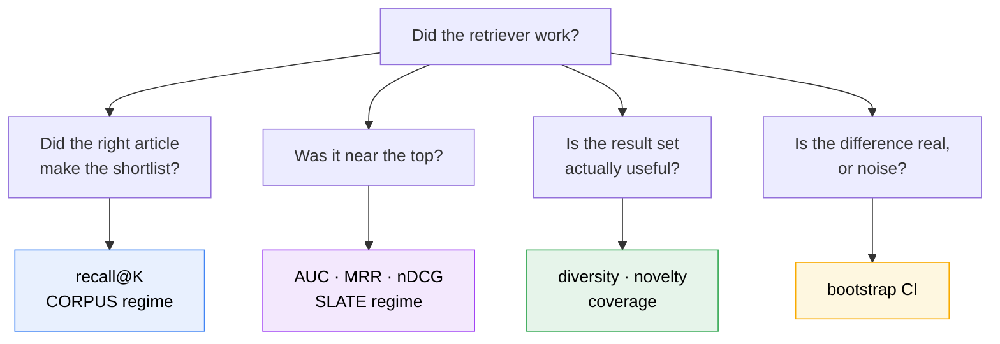
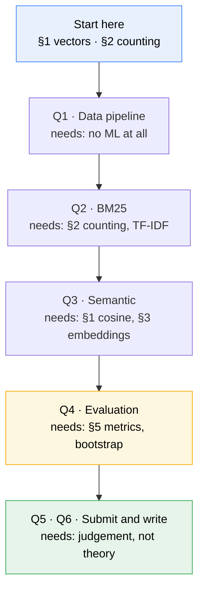

# A1 — Startup foundations

**Read this before [[architecture|architecture.md]].** This doc assumes you have *not* done SMAI
(Statistical Methods in AI) or iNLP (Intro to NLP). It builds, from scratch, only the ideas A1
actually uses — nothing more. Its companion [[architecture|architecture.md]] says *what we're
building and why*; this one says *what the words mean*.

> [!abstract] What you actually need to know
> A1 uses far less machine learning than it looks like. There is **no model training, no gradient
> descent, no neural network to design**. You need four things:
> 1. Text turned into **counts** (that's the lexical half — BM25 is arithmetic on word counts).
> 2. Text turned into **vectors**, which you *download pre-computed* (that's the semantic half).
> 3. **Cosine similarity** — one formula, high-school geometry.
> 4. **Averages with error bars** (the bootstrap — resampling, not statistics theory).
>
> If you can write a `for` loop over a dictionary of word counts, you can do the lexical half today.

---

## 0 · The one-paragraph version

A news site shows a user a list of ~50 articles. You predict which they'll click. You don't know
their mind — but you know **what they read yesterday**. So you take yesterday's headlines, treat them
as a **search query**, and search the article database for similar articles. You do this twice: once
matching **words**, once matching **meaning**. Then you measure which worked better, and on whom.

That's it. Everything below is detail on those sentences.

---

## 1 · Vectors — the one piece of maths everything rests on

Skip if you're comfortable with dot products and cosine. It's genuinely all you need.

### A vector is a list of numbers

$\mathbf{v} = [0.2,\ -1.4,\ 0.7]$ is a vector with 3 **dimensions**. Think of it as a point in space:
this one is at *x*=0.2, *y*=−1.4, *z*=0.7. You can't picture 768 dimensions — **nobody can, and you
don't need to**. Every formula below works identically at 3 or 768 dimensions; the geometry
intuition from 3D carries over, which is the only reason we use spatial language at all.

### Length (norm)

How far the point is from the origin — Pythagoras, extended:

$$\|\mathbf{v}\| = \sqrt{v_1^2 + v_2^2 + \dots + v_d^2}$$

```python
import numpy as np
v = np.array([0.2, -1.4, 0.7])
np.linalg.norm(v)        # 1.58...
```

### Dot product

Multiply matching positions, add them up:

$$\mathbf{u} \cdot \mathbf{v} = \sum_{i=1}^{d} u_i v_i$$

```python
u @ v          # numpy's dot product operator
```

The dot product is large when the two vectors **point the same way** *and* are **long**. That second
part causes a real bug in this assignment — see §5.

### Cosine similarity — the one you'll actually use

We want "do these point the same way?", **without** length interfering. So divide the length out:

$$\cos(\mathbf{u}, \mathbf{v}) = \frac{\mathbf{u} \cdot \mathbf{v}}{\|\mathbf{u}\|\,\|\mathbf{v}\|}$$

It ranges from **+1** (same direction — "these articles are about the same thing") through **0**
(unrelated, at right angles) to **−1** (opposite). This is *the* similarity measure in retrieval.

> [!important] Normalising is dividing by length, once, up front
> If you scale every vector to length 1 first (`v / np.linalg.norm(v)`) — called **L2
> normalisation** — then the denominator above is $1 \times 1$, and **cosine similarity is just the
> dot product**. That's why real systems normalise once at index-build time and then use fast dot
> products forever. Remember this; §5 is a bug that comes from forgetting it.

### Why "similar meaning = nearby point" is not obvious

It isn't a law of nature — it's an *engineered* property. Embedding models are trained so that texts
appearing in similar contexts get similar coordinates. It works well, but it's a learned
approximation, and it fails in ways worth knowing (a model trained only on English produces
meaningless coordinates for Danish — §6).

---

## 2 · Turning text into numbers, part 1: counting (the lexical half)

### Tokenisation

Splitting text into words ("tokens"). `"Denmark's election results"` → `["denmark", "s",
"election", "results"]`. Usually lowercased, punctuation stripped. Naive splitting is fine for A1.

### The bag of words

Throw away word order, keep counts. `"the cat sat on the mat"` becomes
`{the: 2, cat: 1, sat: 1, on: 1, mat: 1}`.

This is obviously lossy — "dog bites man" and "man bites dog" become identical. **It works anyway**
for retrieval, because word *presence* carries most of the topical signal. Accepting that loss is
what makes lexical search fast.

### TF and DF — the two counts that matter

| Term | Means | Intuition |
|---|---|---|
| **TF** (term frequency) | times a word appears **in one document** | more mentions → more likely about it |
| **DF** (document frequency) | how many documents contain the word **at all** | high DF = common word = tells you nothing |
| **IDF** (inverse DF) | $\log(N/\text{DF})$, roughly | the *rarer* the word, the more it discriminates |

**The whole idea of lexical search:** a match on a rare word ("Ekstrabladet") is strong evidence; a
match on "the" is none. IDF is how that gets encoded numerically.

### The inverted index

A dictionary from **word → list of documents containing it**:

```python
{"election": [12, 47, 891], "denmark": [47, 102], ...}
```

Exactly like the index at the back of a textbook. To answer a query you look up only the handful of
words in it, instead of scanning all 120,000 articles. **This data structure is the reason search
engines are fast**, and it's a plain dictionary — you could write one this afternoon.

### BM25 in one sentence

For each query word, score = (how rare it is) × (how often it appears here, with diminishing
returns) × (a penalty if the document is long). Sum over query words.

That's all BM25 is: three common-sense corrections to naive counting. The formula and its knobs
(`k1`, `b`) are in [[architecture#BM25 — the lexical workhorse (required, Q2)|architecture.md §BM25]] —
the intuition above is the part you need first.

> [!warning] You do **not** need to implement BM25 from scratch to start
> `rank_bm25` is a pip install and ~5 lines. Get the pipeline working end-to-end with it, *then*
> decide whether writing your own index buys you anything. Building the index yourself is on the
> "Recommended" tier in [[architecture|architecture.md]], not the minimum.

---

## 3 · Turning text into numbers, part 2: embeddings (the semantic half)

### The problem lexical search can't solve

Someone reads an article about a **car**. Another article says **automobile**. Zero shared words →
BM25 scores it zero. Humans see the connection instantly; word counting cannot. This gap — the
**vocabulary mismatch problem** — is the entire reason embeddings exist.

### What an embedding is

A function from text to a vector, where **similar meanings land near each other**:

```
"Danish election results"   → [0.21, -0.05, ..., 0.88]   (768 numbers)
"vote count in Denmark"     → [0.19, -0.07, ..., 0.85]   ← nearly the same
"Manchester United squad"   → [-0.62, 0.44, ..., 0.10]   ← far away
```

Now "find related articles" = "find nearby vectors" — a geometry problem, and computers are very
fast at geometry.

**Where the numbers come from:** a neural network trained on enormous text corpora. **For A1 you
download them pre-computed** (EB-NeRD ships them) or run a pretrained model. You are **not training
anything**. This is the single biggest thing people over-estimate about this assignment.

### Static vs. contextual — the one distinction to hold

| | Static (Word2Vec) | Contextual (BERT & successors) |
|---|---|---|
| Vector per | word, fixed forever | word *in its sentence* |
| "bank" in *river bank* / *savings bank* | **identical vector** | two different vectors |
| Document vector | average the word vectors | feed the sentence in, read the output |
| Cost | trivial | needs a GPU pass over the corpus |
| In A1 | provided for EB-NeRD | provided (mBERT), or run your own |

**Why it matters here:** static models are cheap and surprisingly decent for topical news matching;
contextual ones are better but cost GPU time. EB-NeRD provides **both**, so you can compare them —
and a comparison is exactly what earns marks.

### Pooling — many vectors into one

A user clicked 12 articles → 12 vectors. Your search needs **one** query vector. Combining them is
**pooling**; the default is the average (**mean pooling**), i.e. their centre of gravity.

> [!warning] Where averaging breaks — and it's a real finding, not a footnote
> A user who reads football **and** recipes gets an average sitting *between* the two clusters —
> a region about neither. You then search from a point matching nothing they like. Fixes: weight
> recent clicks higher, or cluster the history and search once per interest. Discussed at
> [[architecture#User representation — turning a click history into one query vector|architecture.md
> §User representation]].

### Nearest-neighbour search and ANN

You have 120,000 article vectors and one user vector; you want the closest ones.

- **Brute force** — compute similarity to all 120,000, take the top K. **Exact.** At your scale this
  is milliseconds in numpy. **Start here.**
- **ANN (Approximate Nearest Neighbours)** — clever index structures (HNSW, IVF) that are much faster
  but occasionally miss a true neighbour. Necessary at millions of vectors; at your scale it's the
  *ablation*, not the requirement.

The brief explicitly permits brute force. Use it for headline numbers, add ANN to measure the
speed/recall trade-off.

---

## 4 · The recommendation vocabulary

These are the domain words the brief uses without defining.

| Term | Plain meaning |
|---|---|
| **Impression** | One moment a user was shown a slate of articles — plus which they clicked. The basic unit of data. |
| **Click history** | The articles this user clicked *before* now. Your only evidence about them. |
| **Candidate generation** | Narrowing 120K articles → a shortlist of a few hundred. **This assignment.** |
| **Ranking / re-ranking** | Ordering that shortlist precisely. **The next assignment.** |
| **Corpus** | All articles you can retrieve from. |
| **Cold start** | A user (or article) with almost no history — you have nearly nothing to go on. |
| **Session** | One continuous browsing visit. EB-NeRD gives IDs; MIND needs reconstructing. |
| **Slice** | A subgroup you report metrics separately for (cold vs. warm users). Where findings live. |
| **Ground truth** | What actually happened — the articles really clicked. |
| **Positive / negative** | A clicked article / a shown-but-not-clicked article. |

> [!important] Candidate generation vs. ranking — internalise this one
> You are building a **filter**, not a **sorter**. The question is only *"did the article they
> clicked survive the cut?"* — never *"was it at position 3?"* That's why the metric is **recall@K**
> with K as large as 200. A later stage fixes the order; **nothing** can recover an article you
> discarded. Optimising for precision here is the classic misunderstanding of this assignment.

---

## 5 · How you know if it worked — the evaluation metrics, built up

This is the longest section here, deliberately. **Q4 is the part of the assignment where the marks
actually live**, and every metric below has a *need* (what goes wrong without it), a *why* (what it
measures that nothing else does), and a *how* (the arithmetic, on numbers small enough to check by
hand).

Read it once now. Come back to a single subsection when you implement it.

### 5.0 · Why "did it work?" is a harder question than it looks

You have a retriever. It returns articles. Did it do well?

The naive answer — "count how often the clicked article came back" — falls apart immediately:

- A user shown 11 articles who clicks 1: is getting that 1 into a top-**200** list impressive? (No.)
- A retriever that returns the same 10 popular articles to everyone will be right surprisingly
  often. Is it good? (No — but accuracy alone says yes.)
- You measured 0.42 on 800 impressions. Is that better than 0.39? (**Unanswerable without a CI.**)

Each of those three failures is why one family of metrics exists:



**Read it as:** four different questions, four families of metric. Reporting one family and calling
it "the results" answers a quarter of the question.

### 5.1 · The two regimes — the distinction that causes the most confusion

Before any formula. **The same retriever gets measured against two different candidate sets**, and
mixing them up produces numbers that look fine and mean nothing.

| | **Corpus regime** | **Slate regime** |
|---|---|---|
| Candidates | **every article** (21K–65K) | just the **~11 shown in that impression** |
| Question | *Did the clicked article survive the cut?* | *Did you rank the clicked one above the others shown?* |
| Metric | recall@K | AUC, MRR, nDCG |
| Who cares | candidate generation — this assignment | the leaderboard — Codabench scores this |

**Why both exist.** Your retriever's job (Q2/Q3) is narrowing thousands of articles to a few hundred
— that's the corpus regime, and recall@K is its natural metric. But Codabench hands you an
impression's slate and asks you to *order* it. So you take your corpus-wide scores, keep only the
articles in that slate, and sort. Same retriever, two measurements.

> [!warning] An AUC of 0.99 usually means you measured the wrong regime
> If you compute AUC over the whole corpus rather than the slate, almost every article is a
> "negative" and trivially ranks below the click. The number looks spectacular and means nothing.
> **Always say which regime a number belongs to** — our results tables carry a `regime` column for
> exactly this reason.

### 5.2 · recall@K — your primary metric

**The need.** Candidate generation can fail in one fatal way: the article the user clicked never
makes the shortlist. Once it's missing, no downstream re-ranker can recover it. Everything else is
recoverable; this isn't.

**The why.** recall@K ignores position entirely, and that is *correct here*. Getting the right
article to position 180 of 200 is a total success for a candidate generator — position is the
re-ranker's job (Component-2).

**The how.**

$$\text{recall@K} = \frac{|\{\text{clicked articles}\} \cap \{\text{top-K retrieved}\}|}{|\{\text{clicked articles}\}|}$$

Worked: the user clicked 2 articles. Your top-100 contains 1 of them.
recall@100 = 1/2 = **0.5**. Average that over every impression.

Since 99.5% of our impressions have exactly one click, in practice each impression scores **1.0 or
0.0**, and the average is "the fraction of impressions where we found it."

The brief fixes **K ∈ {50, 100, 200}** exactly.

> [!warning] The bug this catches for free
> **recall@200 can never be less than recall@50** — a top-200 list contains the top-50. If you see
> otherwise, you have a bug in K handling or hit counting, not a finding. We assert this in a test.

> [!note] A flat recall curve is not always a bug
> If recall@50 = recall@100 = recall@200 exactly, the usual cause is that your retriever **returned
> fewer than 50 results**. We hit this: a 24-hour recency window admits only ~132 of 20,738 articles,
> so lists averaged 7 results at K=50. The window, not K, was binding. Log the realised list length
> beside recall and this diagnoses itself.

### 5.3 · The rank-aware metrics — AUC, MRR, nDCG

All three operate on the **slate** (§5.1). All three answer "is the good stuff near the top?", but
they disagree about what "near the top" is worth.

#### AUC — the pairwise view

**The need.** recall@K is blind to order. You need something that says whether clicked articles
generally outrank ignored ones.

**The why.** AUC has an unusually clean interpretation: *pick one clicked article and one ignored
article at random — how often did you score the clicked one higher?* 0.5 is a coin flip, 1.0 is
perfect, below 0.5 means you're anti-correlated with reality.

**The how.** Don't enumerate pairs; use the rank-sum identity:

$$\text{AUC} = 1 - \frac{\sum_{i \in \text{pos}} r_i - \frac{n_{\text{pos}}(n_{\text{pos}}+1)}{2}}{n_{\text{pos}} \cdot n_{\text{neg}}}$$

where $r_i$ are the 1-indexed ranks of the clicked articles in your ordering.

Worked, slate of 4, one click at position 2: $n_{pos}=1$, $n_{neg}=3$, rank sum = 2.
AUC $= 1 - (2 - 1)/3 = 2/3 \approx 0.67$. Two of the three ignored articles fell below the click.

> [!warning] AUC is **undefined** when a slate is all-clicks or no-clicks
> With no negatives there is no pair to compare. The tempting fix — call it 0.5 — quietly injects a
> fabricated value into your average. **Drop those impressions and report how many you dropped.**

#### MRR — how far to the first hit

**The need.** Users don't read to position 40. The first correct answer's position is what they
experience.

**The why/how.** $\text{MRR} = \frac{1}{\text{rank of first hit}}$, averaged. Position 1 → 1.0,
position 2 → 0.5, position 4 → 0.25, never found → 0.

MRR ignores everything after the first hit — irrelevant for us, since almost every impression has
exactly one click. **With single-click impressions, MRR is essentially recall@1 generalised.**

#### nDCG@k — position-discounted credit, normalised

**The need.** MRR only counts the first hit; recall counts hits with no position credit. nDCG does
both: every relevant result contributes, discounted by how far down it sits.

**The why "n".** Raw DCG isn't comparable between users — someone with 5 clicks can score higher than
someone with 1 just by having more to find. Dividing by the *ideal* DCG (the best possible ordering
of the same relevance set) normalises to [0, 1].

**The how**, with binary relevance (clicked = 1, not = 0):

$$\text{DCG@k} = \sum_{i=1}^{k} \frac{rel_i}{\log_2(i+1)}, \qquad \text{nDCG@k} = \frac{\text{DCG@k}}{\text{IDCG@k}}$$

The usual $2^{rel}-1$ gain reduces to 1/0 when relevance is binary — worth stating so the graded
form is unambiguous.

Worked, slate of 3, one click at position 2:
DCG $= 1/\log_2(3) = 0.631$. Ideal puts it first: IDCG $= 1/\log_2(2) = 1.0$.
nDCG = **0.631**.

> [!important] Why nDCG@5 and nDCG@10 will look almost identical here
> EB-NeRD slates average **11–12 articles**. nDCG@10 therefore covers nearly the whole slate, so it
> and nDCG@5 measure almost the same thing. Expect them to correlate strongly — that's the data, not
> a bug, and presenting them as independent evidence would be overclaiming.

> [!warning] The reference row you must not omit
> We measured **random** ranking scoring nDCG@10 = 0.42 on EB-NeRD. Not because random is good — because
> an 11-item slate with one click is an easy thing to score well on by luck. **Any slate-regime table
> without a random baseline row is misleading**, because 0.46 looks respectable until you know the
> floor is 0.42.

### 5.4 · Beyond-accuracy — why "correct" isn't "good"

**The need.** Recommend the 10 most popular articles to everyone. Accuracy: decent. Product: useless.
Accuracy metrics cannot see this failure at all.

**Intra-list diversity** — are the K results K different stories, or one story K times?

$$\text{ILD} = \frac{2}{k(k-1)}\sum_{i<j}\left(1 - \text{sim}(d_i, d_j)\right)$$

We use **category** for similarity rather than embeddings. Not laziness — scoring an embedding
retriever with embedding similarity is circular, measuring the retriever against its own objective.

**Novelty** — are you surfacing anything the user couldn't have found alone? Self-information of
what you recommend:

$$\text{novelty} = \frac{1}{k}\sum_i -\log_2 p(d_i)$$

$p(d)$ is the article's click share **in the train split only**. Using the evaluation period's
popularity is leakage — and the kind that flatters you.

**Coverage** — across all users, what fraction of the catalogue ever gets recommended?

> [!important] These genuinely fight accuracy — and that tension is the finding
> Measured on EB-NeRD: adding the 24-hour recency window multiplied recall by 33× and **cut coverage
> by 46×** (0.5037 → 0.0110). Popularity's novelty (8.64 bits) sits 4 bits below everything else,
> because it recommends exactly what everyone already clicked.
>
> Also measured: **random has the highest diversity of any retriever.** Diversity alone is not a
> quality signal — it must always be read next to an accuracy column.

### 5.5 · The bootstrap — error bars without a statistics course

**The need.** You measured recall@100 = 0.42 on 800 impressions. Another 800 impressions would have
given a slightly different number. Is 0.42 meaningfully better than 0.39, or is that just which
impressions you happened to evaluate?

Without an answer, **you cannot compare two retrievers at all** — which is most of what Q3.5 asks.

**The why.** Classical statistics would need assumptions about the distribution. Metrics like recall
are bounded in [0,1] and skewed, so the normal approximation is wrong. The bootstrap assumes nothing.

**The how**, the entire technique:

1. You have 800 per-impression scores. Draw **800 of them at random, with repeats allowed**. Average.
2. Repeat 1,000 times → 1,000 plausible re-runs of your experiment.
3. Sort those 1,000 averages. The **2.5th and 97.5th percentiles** are your 95% CI.

Report `recall@100 = 0.42 [0.39, 0.45], n = 800`. No t-tests, no distributions — just resampling.

**Reading a CI:** if two retrievers' intervals **don't overlap**, the difference is real. If they
overlap substantially, you cannot claim one is better — no matter how different the point estimates
look. We used exactly this to conclude BM25 and popularity are indistinguishable on EB-NeRD.

> [!warning] Resample **impressions**, not predictions
> The 200 predictions within one impression are correlated — they answer the same query. Resampling
> them independently pretends you have 160,000 independent observations instead of 800, and produces
> intervals that are far too narrow. **Suspiciously tight CIs are the symptom.**

> [!warning] The bootstrap measures noise, not correctness
> It quantifies luck-of-the-draw only. **A pipeline that leaks future data produces a beautifully
> tight interval around a completely wrong number.** Tight CIs are not evidence of correctness — that
> is what the leakage test in §6 is for.

> [!note] One metric legitimately has no CI — and knowing why is worth marks
> **Coverage counts *distinct* articles**, so it only grows as you evaluate more impressions.
> Bootstrap resampling draws with replacement, making ~37% of draws duplicates — so every resample
> sees *fewer* unique articles than the real sample, and the whole interval sits below the estimate.
> We measured a point of 0.9783 against an interval of [0.9035, 0.9235]: **the estimate outside its
> own CI**, which is impossible for a valid interval.
>
> Subsampling without replacement fails at every ratio too. There is no honest percentile interval
> here, so coverage is reported as a point estimate marked `(no CI)`. Saying so beats shipping a
> plausible-looking number that is biased by construction.

### 5.6 · Slices — where the findings actually live

**The need.** A single headline number hides everything interesting. "recall@100 = 0.25" doesn't tell
you *who* it fails for.

**The why.** Q4.3 requires at least one slice, and slices are where you find things worth writing
about — a retriever that works for warm users and collapses for cold ones is a *finding*, not a bug.

**The two we use:**

- **Cold vs. warm users**, split on click-history length. Tests whether you have anything to offer a
  new user.
- **Head vs. tail articles**, split on train popularity. Tests whether you built a recommender or an
  elaborate popularity list.

> [!warning] The threshold is a decision, and it must come before the results
> "Few clicks" has no universal number. EB-NeRD's *minimum* history is 5, so a "< 5 clicks" rule
> selects **nobody** there, while MIND's median is 19 against EB-NeRD's 92. We derive the boundary
> from each dataset's measured distribution and report it with every cold-start number.
>
> **A slice boundary chosen after seeing which one gives a nicer result is not a finding.**

### 5.7 · Putting it together — what one honest result row looks like

```
bm25+24h   cold   recall@100   0.1863 [0.1176, 0.2647], n = 102
└─ retriever  └─ slice   └─ metric   └─ value  └─ 95% CI      └─ sample size
```

Six pieces, all required. The IRE convention is that **a bare number is never acceptable** — the CI
and the n travel with it, always, because without them the number cannot be compared to anything.

---

## 5b · Why the data's *shape* decides what the system can do

Not on the syllabus, and it turned out to govern the whole submission path. The concept is worth
having because it generalises far past this assignment.

**Two ways to hold 116.8 million numbers.**

Python's normal way gives each number its own little labelled box — flexible, and about **57 bytes of
packaging for a value worth 4**. A *columnar array* stores them as one solid block: 4 bytes each, no
packaging, laid out end to end.

| 116.8M click ids | as Python objects | as one `int32` array |
|---|---|---|
| Memory | ~13 GB | **0.93 GB** |
| Time to load | 160 s | **4.6 s** |

**Why the array is faster to *load*, not just smaller.** Building 116.8M Python objects means 116.8M
separate allocations. The array is one allocation and a copy — the file already stores the numbers
this way, so nothing has to be unpacked at all.

> [!important] The non-obvious part: shape decides whether *sharing* is possible
> When a program splits into several worker processes, each normally gets its own copy of everything.
> Six workers, six copies.
>
> Linux offers a way out: **copy-on-write.** After a `fork`, parent and children share the same
> physical memory until someone **writes** to it. Read-only data is therefore free to share.
>
> Here is the catch, and it is pure consequence of representation. Python tracks how many references
> point at each object, and it stores that count *inside the object*. So merely **reading** a Python
> object writes to it — updating the count — which dirties the page and forces a private copy. A
> forked worker "just reading" 807,677 objects would gradually copy nearly all of them.
>
> An array has no per-element bookkeeping. Reading it touches nothing. So the 116.8M clicks stay in
> **exactly one physical copy** no matter how many workers read them: **19.3 GB per worker → 0.38 GB**.

**Read it as:** the memory saving was the visible win, but the real one was that a solid block of
numbers can be *shared* while a pile of objects cannot. Choosing a representation quietly chooses
which parallel designs are available to you later.

See [[architecture#Parallel designs considered|architecture]] for the four designs this ruled
between, and [[plan/execution_plan_log|F64–F70]] for the measurements.

## 6 · The three things that silently ruin this assignment

Not style issues. Each produces *plausible-looking numbers that are wrong*, which is far worse than
a crash.

### 6.1 · Leakage — the cardinal sin

**The rule:** when predicting an impression at time *t*, you may use **only** information from before
*t*.

The obvious half is easy: split train/test by **date**, never randomly. The half people get wrong:

> A test impression is on Tuesday. That user's click history in your feature store contains their
> Wednesday clicks too. You just told your model the future.

The history must be **truncated per-impression** to clicks strictly before *t*. This is the single
most important correctness property in A1, it's why Q9 demands a test asserting it, and its symptom
is *suspiciously good scores* — the failure mode that feels like success.

> [!important] A test that can't fail proves nothing
> Q9 wants a test that **fails when you deliberately break the boundary**. Write the test, then
> intentionally introduce leakage and confirm it goes red. A green test that was always green is
> worthless. Verify the verifier.

### 6.2 · The Danish problem

EB-NeRD is **Danish**. An English-only embedding model doesn't degrade gracefully on Danish — it
shreds the text into meaningless subwords and emits vectors with **no useful geometry**. Your numbers
would be noise wearing the costume of results, and nothing crashes.

Use the **provided multilingual embeddings**, or an explicitly multilingual/Danish model. Symptom:
EB-NeRD scores near zero while MIND looks fine.

### 6.3 · Forgetting to normalise

From §1: dot product rewards **long** vectors. FAISS's `IndexFlatIP` computes inner product. Feed it
un-normalised vectors and long-vector articles win regardless of relevance — you've silently built a
**popularity ranker**.

**Symptom:** your semantic retriever returns nearly the same articles for every user. **Fix:** L2-
normalise before indexing. Check it: `np.linalg.norm(vecs, axis=1)` should be all ones.

---

## 7 · What you do *not* need to know

Explicitly out of scope — so you don't spiral into background reading:

| Not needed | Why |
|---|---|
| Backpropagation, gradient descent, optimisers | You train nothing in A1. |
| Neural network architectures, attention internals | You *use* a pretrained encoder as a black box. |
| Transformer maths (Q/K/V) | Same — helps in the exam, not needed to build A1. |
| Loss functions, regularisation, overfitting theory | No model fitting here. |
| Probability theory, hypothesis testing | The bootstrap replaces it — resampling in a loop. |
| Linear algebra beyond dot products | §1 is genuinely the whole requirement. |
| Fine-tuning, LoRA, distillation | Explicitly listed as "costs more than it returns". |

A1 is a **systems and measurement** assignment wearing ML clothing. The grade is on pipeline
correctness, honest evaluation, and clear design reasoning — none of which require SMAI or iNLP.

---

## 8 · A learning path that matches the build order

Learn each idea the week you need it. Don't front-load theory.



**Read it as:** the hardest *conceptual* step is Q3 (embeddings), but the hardest *correctness* step
is Q1 — where the leakage boundary is set. Most of the grade is decided in the first and last boxes,
not the middle.

> [!tip] The order that avoids wasted work
> **Build the thinnest end-to-end pipeline first** — even with a dumb retriever that returns random
> articles. Once data → retrieve → measure runs start-to-finish, every improvement is a small,
> measurable change. Perfecting BM25 before you can *evaluate* it means you cannot tell whether it
> helped.

---

## 9 · Glossary — the acronyms, decoded

| | |
|---|---|
| **BM25** | Best Matching 25. A word-overlap scoring formula. Not machine learning. |
| **TF-IDF** | Term Frequency × Inverse Document Frequency. BM25's simpler ancestor. |
| **ANN** | *Approximate Nearest Neighbours*. **Not** "artificial neural network" — a constant source of confusion, including in A2's title. |
| **HNSW / IVF / PQ** | Specific ANN index structures. |
| **FAISS** | Facebook AI Similarity Search — the standard vector-index library. |
| **BERT / mBERT** | A pretrained contextual encoder; **m** = multilingual. |
| **XLM-R** | XLM-RoBERTa. Stronger multilingual encoder. |
| **SBERT** | Sentence-BERT. BERT tuned so cosine similarity is actually meaningful. |
| **nDCG** | Normalised Discounted Cumulative Gain. Position-aware quality score. |
| **AUC** | Area Under the ROC Curve. |
| **MRR** | Mean Reciprocal Rank. |
| **CI** | Confidence Interval. |
| **MIND** | Microsoft News Dataset (English). |
| **EB-NeRD** | Ekstra Bladet News Recommendation Dataset (Danish). |
| **Codabench** | The leaderboard platform for both competitions. |

---

## 10 · Checking you're ready

You're ready to start Q1 if you can answer these without scrolling up:

- [ ] Why is the user's click history treated as a *search query*?
- [ ] What does IDF do, and why does matching "the" tell you nothing?
- [ ] What is an embedding, and are you training one? *(No.)*
- [ ] Why does recall@K matter more than nDCG **for this assignment**?
- [ ] What is leakage, and why is a *passing* leakage test not enough?
- [ ] Why might a semantic retriever return the same articles for every user?
- [ ] Why is EB-NeRD being Danish a **correctness** issue, not a quality one?

Any you can't answer, the section is above. Then go to [[architecture|architecture.md]].

---
[[Assignment-1-Lexical-Semantic-Retrieval|← tracking note]] · [[architecture|Architecture & design decisions →]]
