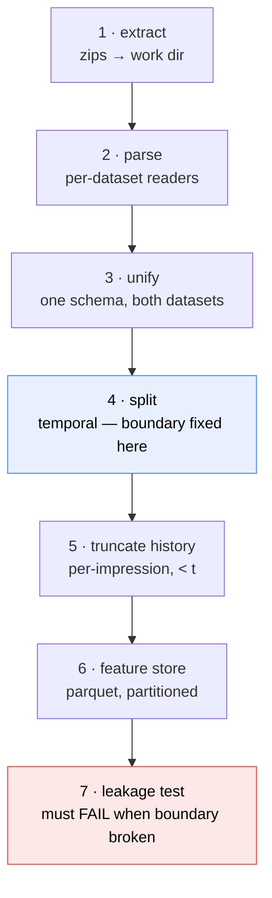

# Phase 1 — Data pipeline (Q1)

The executable half of Q1. [[Pipeline]] says what a correct pipeline looks like; this file says what
to build, in what order, with which alternative rejected and why. Decisions get logged to
[[execution_plan_log]] as they are made.

> [!abstract] What this phase commits to
> Raw zips → **one unified schema** across MIND and EB-NeRD → **temporal split** → a **parquet feature
> store** → all of it rebuildable with **one command**. The leakage boundary is fixed here, in
> `split.py`, and nothing downstream can repair a mistake made at this stage.

> [!important] This phase owns the only irrecoverable property in the assignment
> A wrong BM25 parameter costs you a few points of recall and can be fixed by re-running. **A leaked
> future click invalidates every number in the report** and is invisible in the output — the metrics
> just look good. Everything in this file is ordered so the boundary is decided before any code that
> could violate it exists.

## Q1 requirements, and their status

| # | Requirement (from the brief) | Status |
|---|---|---|
| Q1.1 | Download raw files for MIND-small and EB-NeRD demo/small | ✅ **Done** — see below |
| Q1.2 | Clean and parse into a unified schema | ⬜ This phase |
| Q1.3 | Temporal split train/val/test, never random | ⬜ This phase |
| Q1.4 | Feature store — article + user features | ⬜ This phase |
| Q1.5 | One command rebuilds everything from raw | ⬜ This phase |

### Q1.1 — download status, verified 2026-08-18

All archives verified with a **CRC check over every compressed member plus a central-directory
read** — no extraction, no truncation.

| File | Size | Members | Integrity | Role |
|---|---|---|---|---|
| `ebnerd_small.zip` | 80.2 MB | 14 | ✅ OK | **headline** |
| `MINDsmall_train.zip` | 50.5 MB | 5 | ✅ OK | **headline** |
| `MINDsmall_dev.zip` | 29.5 MB | 5 | ✅ OK | **headline** |
| `ebnerd_demo.zip` | 20.5 MB | 14 | ✅ OK | smoke test |
| `Ekstra_Bladet_word2vec.zip` | 133 MB | 5 | ✅ OK | baseline ablation |
| `google_bert_base_multilingual_cased.zip` | 344.5 MB | 5 | ✅ OK | baseline ablation |
| `ebnerd_large.zip` | 3.0 GB | 18 | ✅ OK | idle — Q6 only |
| `MINDlarge_train/dev/test.zip` | 1.2 GB | 6 each | ✅ OK | idle — Q6 / Q5 |

**Q1.1 is satisfied for the small tier.** One gap remains, and it is not a Q1 gap:

> [!warning] `ebnerd_testset.zip` (1.5 GB) is not downloaded — blocks Q5, not Q1
> Neither EB-NeRD small nor demo ships a test split, so the EB-NeRD Codabench submission needs the
> separate test archive. Q1–Q4 are unaffected. Download before ~24 Aug.
> `https://ebnerd-dataset.s3.eu-west-1.amazonaws.com/ebnerd_testset.zip`

## What "clean and parse" actually requires

Q1.2 says "clean and parse into a unified schema (articles, behaviors/impressions, click history)".
Concretely, given what the two datasets actually contain:

### The two schemas, side by side

| Concept | MIND-small | EB-NeRD small |
|---|---|---|
| Format | TSV, no header | Parquet, typed |
| Article id | `N55528` (string) | `9738663` (int32) |
| Article text | title, abstract | title, subtitle, **body** |
| Category | `lifestyle` / `lifestyleroyals` | `category_str` + `topics[]` |
| Entities | JSON in cols 7–8 | `ner_clusters[]`, `entity_groups[]` |
| Impression | one row, 5 cols | one row, 17 cols |
| Candidate slate | `N55689-1 N35729-0` (id-label pairs) | `article_ids_inview[]` + `article_ids_clicked[]` |
| Click history | **inline**, col 4, space-separated ids | **separate parquet**, `article_id_fixed[]` |
| History timestamps | ❌ none | ✅ `impression_time_fixed[]` |
| Session id | ❌ none | ✅ `session_id` |
| Publish time | ❌ none | ✅ `published_time` |
| User attributes | ❌ none | age, gender, postcode, subscriber |
| Engagement | ❌ none | `read_time`, `scroll_percentage` |

**The asymmetry is the whole difficulty.** EB-NeRD is far richer, and every field MIND lacks is a
field the unified schema must treat as optional.

### The unified schema

Three tables, one row-shape per dataset:

```
articles.parquet
  article_id      str    # normalised to string for both
  title           str
  abstract        str    # MIND abstract | EB-NeRD subtitle
  body            str    # EB-NeRD only; empty for MIND
  category        str
  subcategory     str
  entities        list<str>
  published_time  ts     # EB-NeRD only; null for MIND
  dataset         str    # "mind" | "ebnerd"

impressions.parquet
  impression_id   str
  user_id         str
  time            ts
  candidates      list<str>   # the in-view slate
  clicked         list<str>   # subset of candidates
  session_id      str         # EB-NeRD only; null for MIND
  split           str         # "train" | "val" | "test"

history.parquet
  user_id         str
  clicked_ids     list<str>
  clicked_times   list<ts>    # EB-NeRD only; null for MIND
```

> [!warning] The MIND text fields are *not* what the brief implies
> The brief's intro says lexical retrieval works over "titles/**bodies**", and Q2.1 says
> "**title + abstract**". MIND-small's `news.tsv` has **no body column** — only title and abstract.
> EB-NeRD has a real body. So "title + abstract" is the only field pair available on *both* datasets,
> which is a second, independent reason to follow Q2.1 over the intro. **Using EB-NeRD's body would
> break comparability**; note it as an available-but-unused field.

### Cleaning — what is actually needed

The datasets are curated research benchmarks, not scraped HTML. Cleaning is therefore narrow:

| Operation | Needed? | Why |
|---|---|---|
| Lowercase, whitespace normalise | ✅ yes | Tokenisation consistency |
| Strip HTML | ⬜ check | EB-NeRD `body` may contain markup; MIND does not |
| Unicode NFC normalise | ✅ yes | Danish `æ ø å` must not vary by encoding form |
| Handle empty abstracts | ✅ yes | MIND has articles with blank abstracts — decide fallback |
| Parse the entity JSON | ✅ yes | Two JSON columns per MIND row; keep `SurfaceForms` + `Label` |
| Deduplicate articles | ✅ yes | The MIND train/dev union will contain the same id twice |
| LLM-based text repair | ❌ **no** | Non-deterministic under a one-command rebuild; corrupts the corpus BM25 scores against. See [[../architecture|architecture.md]] decision 9. |

## Design decisions

Every decision below states the alternatives, what each buys, and why the pick was made. These
convert directly into the Q6 design note's "alternatives considered" section.

### D1 — Temporal split: honour the official boundary, or re-split?

This is the highest-stakes decision in the phase, and the datasets force different answers.

**The measured reality:**

| | MIND-small | EB-NeRD small |
|---|---|---|
| train | 9–14 Nov 2019 (6 days) | 18–25 May 2023 (7 days) |
| official second split | dev = **15 Nov only** (1 day) | validation = 25 May–1 Jun (7 days) |
| user overlap | **12%** (5,943 / 50,000) | high (15,143 vs 15,342 users) |

| Option | What it buys | What it costs |
|---|---|---|
| **A · Honour official splits** | Matches the leaderboard setup exactly; zero risk of inventing a boundary the graders don't expect; reproducible by anyone | MIND gives you **no val split** — dev is a single day and is your only labelled non-train data; you would have to carve val out of train anyway |
| **B · Pool everything, re-split 80/10/10 by time** | One consistent rule across both datasets; a real val split on both; directly answers the "N days" question | Discards the authors' boundary; for MIND, the pooled range is only 7 days so 10% ≈ 0.7 days of test — thin; **EB-NeRD validation users barely overlap train**, so pooling changes the user population per split |
| **C · Hybrid — official train/test boundary, val carved from the tail of train** | Keeps the official test period intact (leaderboard-faithful) while giving a genuine val split; same *rule* on both datasets | Slightly more code; val and test are different lengths on MIND (1 day vs ~0.6 day) |

**Chosen: C, expressed as 80/10/10 over the training period.**

Concretely, and this is the part that answers the 80/10/10 request directly:

- **Test** = the official held-out period, untouched (MIND dev = 15 Nov; EB-NeRD validation =
  25 May–1 Jun).
- **Train + val** = the official train period, split **by time** at the 90th percentile of impression
  timestamps → last ~10% of the train window becomes val.
- Net effect on MIND ≈ **80 / 10 / 10** across the whole labelled range; on EB-NeRD ≈ **45 / 5 / 50**
  because its official validation period is as long as its train period.

> [!important] Why 80/10/10 cannot be applied literally to both datasets
> You asked for 80/10/10, and it is the right *intent* — but the two datasets have very different
> shapes. MIND's labelled data is 7 days with a 1-day official test; EB-NeRD's is 14 days split evenly
> in half. Forcing a literal 80/10/10 on EB-NeRD means **throwing away 40% of its labelled
> impressions** or overriding the authors' boundary for no benefit. What generalises is the *rule* —
> **hold out the official test period; take the last 10% of the remaining train window as validation**
> — and that rule yields ~80/10/10 on MIND. Report the actual per-dataset proportions in the design
> note rather than claiming a uniform ratio. Stating this asymmetry *is* a design-note observation.

**Rejected: pure random split.** Q1.3 forbids it explicitly for interaction data. Recorded here only
because the design note asks for alternatives considered — the reason it is wrong is that news
recommendation is a forecasting problem, and a random split lets the model see the future.

### D2 — History truncation: the leakage boundary

For a test impression at time *t*, the user's history must contain only clicks strictly before *t*.

| Option | Buys | Costs |
|---|---|---|
| **A · Use the shipped history as-is** | Free; no code | **EB-NeRD's `*_fixed` history is a pre-computed window** whose relationship to any *re-drawn* boundary is unverified. If we move the split, the shipped history may straddle it. |
| **B · Truncate history to `< t` per impression** | Provably correct; directly testable | Requires per-click timestamps — **EB-NeRD has them (`impression_time_fixed`), MIND does not** |
| **C · Rebuild history from impressions on the train side only** | One rule, both datasets, fully under our control | Discards the shipped history; MIND's inline history has no timestamps so it can only be used wholesale or not at all |

**Chosen: B where timestamps exist (EB-NeRD), A + documented assumption where they do not (MIND).**

> [!warning] MIND's history has no timestamps — this is a stated assumption, not a solved problem
> MIND's `behaviors.tsv` col 4 is an *unordered, untimestamped* list of previously-clicked article ids.
> There is no way to truncate it to `< t` from the data alone. We therefore **trust the dataset
> authors' construction** (the history was built from the period preceding the impression) and state
> this explicitly in the design note as an assumption we could not verify. **Do not claim MIND history
> is leak-free by construction — claim that it is leak-free by the authors' construction.** The
> distinction is exactly the kind of honesty Q9 rewards.

### D3 — MIND's two `news.tsv` files: union or per-split corpus?

MIND ships **51,282 train articles** and **42,416 dev articles**, and they differ.

| Option | Buys | Costs |
|---|---|---|
| **A · Union** | Every article that appears in any impression is retrievable; one corpus, one index | The index contains articles that did not exist during the train period — a **mild future-knowledge concern** |
| **B · Per-split corpus** | Strictly no future articles in the train index | Two indexes per dataset; dev-only articles unretrievable at test time → recall capped below 1.0 for reasons unrelated to the model |
| **C · Union for the corpus, publish-time filter at query time** | Correct in principle | **MIND has no `published_time`** — cannot be implemented |

**Chosen: A (union), with the concern documented.** B guarantees a recall ceiling < 1.0 that has
nothing to do with retrieval quality, which makes the headline metric misleading. C is impossible on
MIND. The residual risk in A — indexing articles that postdate the train window — is a *corpus*
concern, not a *behavioural* one: no future **click** enters the model, which is what Q9 actually
targets. Note it in the design note; EB-NeRD's `published_time` lets us quantify the equivalent effect
there, which is a good cross-dataset observation.

### D4 — Storage format for the feature store

| Option | Buys | Costs |
|---|---|---|
| **Parquet** | Columnar, compressed, typed, lazy column reads; already EB-NeRD's native format; `polars`/`pyarrow` read it fast | Binary — not diff-able in git (irrelevant: `data/` is gitignored) |
| CSV/TSV | Human-readable, diffable | 5–10× larger, untyped, slow, loses list columns (`candidates[]` would need re-parsing) |
| SQLite | Queryable, single file, indexes | Row-oriented; list columns are awkward; no benefit at this scale |
| In-memory only | Simplest | Fails Q1.5 — a rebuild must produce artifacts a grader can inspect |

**Chosen: Parquet.** The list-valued columns (`candidates`, `clicked`, `entities`) settle it — they
survive a parquet round-trip natively and require bespoke encoding in every other option.

### D5 — Polars or pandas?

| Option | Buys | Costs |
|---|---|---|
| **Polars** | Multithreaded by default (uses those 24 cores), lazy execution, low memory, native list dtypes; EB-NeRD's own starter code uses it | Less familiar; smaller ecosystem |
| pandas | Ubiquitous, most examples online | Single-threaded, high memory, clumsy list columns |

**Chosen: Polars**, with `--n-jobs` mapped to its thread pool. The memory ceiling matters here: pandas
holding MIND's 92 MB `behaviors.tsv` plus expanded history columns is several GB; polars' lazy scan
keeps it far lower, which is what makes `--mem-gb 26` a real constraint rather than a hope.

### D6 — One-command rebuild: `make` or a Python entrypoint?

| Option | Buys | Costs |
|---|---|---|
| **`make data`** | Q1.5 names it as the example; free dependency tracking (skip completed stages); standard | Make syntax is its own hazard; tab-sensitivity |
| `python build_pipeline.py` | One language; easier arg parsing | Manual stage-skipping logic |
| Shell script | Simplest | No dependency graph; re-runs everything |

**Chosen: `make data` delegating to Python modules.** Make handles "don't redo the extract if the
parquet is newer than the zip"; Python handles the actual work and the `--n-jobs/--mem-gb` arguments.
Q1.5's phrasing ("e.g. `make data` or `python build_pipeline.py`") sanctions either, so this is a
convention choice, not a requirement.

## Build order



**Read it as:** the split precedes history truncation, which precedes the store — so no artifact ever
exists that contains post-boundary information. The leakage test is written **in this phase**, not in
Phase 4, because it is the acceptance criterion for the phase.

| Step | Module | Output | Done when |
|---|---|---|---|
| 1 | `src/data/extract.py` | `data/work/<dataset>/` | Files present, checksums logged |
| 2 | `src/data/readers.py` | in-memory frames | Row counts match the table in [[Pipeline]] |
| 3 | `src/data/clean.py` | unified frames | Schema matches spec above; both datasets pass |
| 4 | `src/data/split.py` | `split` column | Proportions reported; no impression in two splits |
| 5 | `src/data/history.py` | truncated history | Max history timestamp < impression time, asserted |
| 6 | `src/features/store.py` | `data/store/*.parquet` | Round-trips; column dtypes stable |
| 7 | `tests/test_no_leakage.py` | pass/fail | **Passes clean; fails on an injected violation** |

## Acceptance criteria

- [ ] `make data` from an empty `data/store/` rebuilds everything from the zips
- [ ] Both datasets produce identical column names and dtypes
- [ ] Split proportions reported per dataset; no impression appears in two splits
- [ ] For every test impression: `max(history_time) < impression_time` — asserted, not assumed
- [ ] `tests/test_no_leakage.py` **fails** when the boundary is deliberately broken
- [ ] Row counts logged and matching the measured table in [[Pipeline]]
- [ ] Resolved `--n-jobs` / `--mem-gb` written into a run manifest beside the store

## Open questions for this phase

| Question | Blocks | Current lean |
|---|---|---|
| MIND articles with empty abstract — drop, or title-only? | D-day of Q2 | Title-only; dropping shrinks the corpus for a text-quality reason unrelated to retrieval |
| Does EB-NeRD `body` contain HTML? | cleaning step | Check on first extract; strip if present |
| Keep MIND's `entity_embedding.vec`? | Q3 ablation | Yes as a MIND-only ablation — **not** in the headline comparison (EB-NeRD has no equivalent) |
| Multiple clicks per impression = multiple positives? | Q4 denominators | Yes — but note 99.5% of EB-NeRD impressions have exactly one click, so the choice barely moves the numbers. Decide once, state it. |

---
[[Pipeline|← architecture]] · [[2-Lexical-BM25|next: Phase 2 →]] · [[execution_plan_log|log]]
