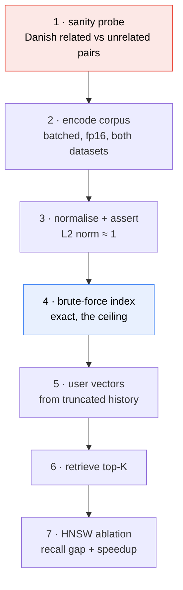

# Phase 3 — Semantic retrieval (Q3)

> [!success] As built (2026-08-25) — `src/retrieval/{encode,semantic,fusion}.py`
> Own embeddings, conditional pooling, brute-force/HNSW index, RRF fusion, and a popularity
> prior. **Not yet scored through the harness** — that run is next.
>
> **D2's encoder choice was settled by measurement, and the plan's theory was right (F37).**
> `danish_probe()` gates every Q3 number:
>
> | Encoder | Related | Unrelated | Margin | Verdict |
> |---|---|---|---|---|
> | `xlm-roberta-base` (768-d) | 0.9972 | 0.9954 | **+0.0018** | **OVERLAPS** |
> | `MiniLM` (384-d) | 0.6523 | 0.0253 | **+0.6271** | **SEPARATES** |
>
> XLM-R rates *"Brøndby beat FCK"* and *"an apple cake recipe"* as 0.995 similar. The
> anisotropy D2 predicted is real and severe. **MiniLM is the working default**; `xlmr-base`
> stays as the brief-named ablation row, reported as a measured failure rather than dropped.
>
> **D3 shipped as a conditional ladder**, not a plain recency-weighted mean: mean when history
> coherence ≥ τ, else recent-half, else max-pool. `strategy_counts` is reported so the branch
> is only justified if it actually branches.
>
> **Scored on both datasets (2026-08-26).** The Q3.5 answer **flips between datasets**:
>
> | recall@100, n=4,000 | EB-NeRD | MIND |
> |---|---|---|
> | lexical (bm25) | **0.2375** [0.2244, 0.2490] | 0.0142 [0.0108, 0.0172] |
> | semantic (minilm) | 0.2307 [0.2175, 0.2432] | **0.0163** [0.0130, 0.0199] |
> | RRF fusion | 0.0070 — *no gain* | **0.0181** — *best retriever* |
>
> On MIND semantic beats lexical and fusion beats both; on EB-NeRD lexical edges ahead and fusion
> helps nothing, because the two agree there (overlapping CIs) and fusion needs disagreement.
>
> **The cold/warm crossover is the sharper finding** (EB-NeRD recall@100): semantic 0.2468 cold vs
> 0.2253 warm; bm25 0.2216 cold vs 0.2428 warm. **The ordering reverses** — exactly D6's hypothesis.
> CIs overlap, so suggestive rather than established.
>
> **D3's conditional pooling branches on one dataset only.** EB-NeRD: mean 3,991 / recent_half 9.
> MIND: mean 2,117 / **recent_half 1,462 / max_pool 270** — 46% falling back against 0.2%. The
> complexity is justified on MIND and is dead weight on EB-NeRD; report both counts.
>
> **Encoder throughput, measured on the RTX 4060:** length-sorted batching (1.80×) plus
> pipelined tokenisation (1.27×) plus vector caching = **6,286 art/s**. Larger batches are
> *slower* — the model is launch-latency bound, and VRAM (0.36 of 8 GB) is not the constraint.

The second retriever, satisfying the same `Retriever` interface defined in [[2-Lexical-BM25]].
Scored by the same harness ([[4-Evaluation-Harness]]). Architecture context in [[Pipeline]].

> [!abstract] What this phase commits to
> **Own embeddings** from a single multilingual encoder over both corpora, a **brute-force exact
> index** for headline numbers with **HNSW as the scale ablation**, a **recency-weighted user vector**,
> and the **lexical-vs-semantic comparison** Q3.5 asks for. EB-NeRD's provided vectors run as a
> baseline row on EB-NeRD only.

> [!important] Computing embeddings is not training anything
> Q3 says "compute or load". Computing = **one forward pass of an already-trained encoder** over
> ~72K articles (51K MIND + 21K EB-NeRD). No gradients, no labels, minutes on the RTX 4060. This is
> completely different from fine-tuning an encoder, which is out of scope.

## Q3 requirements

| # | Requirement | Where |
|---|---|---|
| Q3.1 | Compute or load article embeddings, both datasets | D1, D2 |
| Q3.2 | Build an ANN index (FAISS, ScaNN, **or brute force at small scale**) | D4 |
| Q3.3 | User representation from click history; retrieve top-K | D3 |
| Q3.4 | recall@K for K ∈ {50, 100, 200} | Phase 4 harness |
| Q3.5 | Compare lexical vs. semantic — which wins, on which slices? | D6 |

## Design decisions

### D1 — Own embeddings vs. provided

**Decided: compute our own for both datasets; provided vectors as an EB-NeRD-only baseline.**

| Option | Buys | Costs |
|---|---|---|
| **Provided only** | Zero GPU time; EB-NeRD's contrastive vectors are *click-trained*, so they are strong | **EB-NeRD-only — MIND ships no equivalent.** Mixing sources across datasets makes Q3.5 uninterpretable |
| **Own only** | One encoder over both corpora → the comparison measures the *dataset*, not the encoder; real throughput numbers for Q6 | A forward pass (minutes) and a model download |
| **Own + provided baseline** ✅ | Everything above, plus a reference that catches bugs | One extra ablation row |

> [!tip] The provided baseline is cheaper than expected — [[execution_plan_log|F13]]
> Both artifacts cover **all 125,541 EB-NeRD articles**, and the small tier's 20,738 are a strict
> subset with **zero missing ids**. So the baseline is a plain join on `article_id` — no subsetting,
> no coverage gap, and it keeps working unchanged at the large tier.
> `Ekstra_Bladet_word2vec` is 300-dim; `google_bert_base_multilingual_cased` is 768-dim.

> [!important] The deciding argument is comparability, not compute cost
> If EB-NeRD uses provided vectors and MIND uses ours, every cross-dataset statement conflates two
> variables. Q3.5 and Q6 both ask for cross-dataset observations, so the encoder must be held constant.
> The provided vectors then become **a correctness check**: they are click-trained and *should* beat
> generic mBERT on EB-NeRD. **If ours win, suspect a bug** — pooling, truncation, or normalisation —
> rather than celebrating.

### D2 — Which encoder?

| Option | Dim | Multilingual | Verdict |
|---|---|---|---|
| `bert-base-multilingual-cased` | 768 | 104 langs | Safe, matches a provided artifact for direct comparison. **But vanilla BERT `[CLS]` is a poor sentence embedding** |
| `xlm-roberta-base` | 768 | 100 langs | Stronger multilingual than mBERT; same `[CLS]` caveat |
| **`paraphrase-multilingual-MiniLM-L12-v2`** (SBERT) | 384 | 50+ langs incl. Danish | **Trained so cosine similarity is meaningful** — the property we actually need. Half the dimensions → half the memory and faster search |
| `intfloat/multilingual-e5-base` | 768 | 100 langs | Stronger retrieval performance; needs `query:`/`passage:` prefixes |
| Danish-specific (e.g. `Maltehb/danish-bert-botxo`) | 768 | Danish only | Best for EB-NeRD, useless for MIND — breaks the one-encoder rule |

**Chosen: `paraphrase-multilingual-MiniLM-L12-v2` as primary, `multilingual-e5-base` as the ablation.**

Rationale: vanilla BERT and XLM-R are trained for masked-language modelling, **not** for producing
vectors whose cosine similarity means anything. Their `[CLS]` vectors occupy a narrow cone where
everything looks similar — a well-documented failure that would show up as mediocre semantic recall
and be easy to misattribute. SBERT-family models are trained precisely so that nearby vectors mean
related texts, which is the entire premise of this retriever.

> [!warning] The Danish problem is a correctness issue, not a quality one
> An English-only encoder on Danish text does not degrade gracefully — it tokenises into
> near-meaningless subwords and produces vectors with no useful geometry. The numbers would still be
> *numbers*. **This is the highest-risk silent failure in the assignment.** Mitigation: a sanity probe
> before any metrics — embed 20 known-related Danish article pairs and 20 unrelated pairs, confirm the
> related pairs score higher. If that probe fails, nothing downstream is worth running.

**Pooling:** mean-pool the final hidden states (masked by attention), **not** `[CLS]`. Then
**L2-normalise** — see D5.

### D3 — User representation

| Option | Buys | Costs |
|---|---|---|
| Mean-pool clicked vectors | Brief's suggested default; free | A user who reads football *and* recipes gets a centroid between the two, matching neither |
| **Recency-weighted mean** ✅ | News decays fast; recent clicks predict the next one. One line more than plain mean | One parameter (λ) to justify |
| Max-pool | Preserves peak activations | Noisy; one outlier dimension dominates |
| Multi-query (cluster history, retrieve per centroid) | Handles multi-interest users properly | c× the searches; merge strategy needed |
| Last-click only | Sharpest recency signal | Throws away everything else; high variance |

**Chosen: recency-weighted mean with $w_j = e^{-\lambda \Delta t_j}$**, plain mean as the ablation,
multi-query named as considered-not-built.

$$\mathbf{u} = \frac{\sum_j w_j \mathbf{v}_j}{\sum_j w_j}, \qquad w_j = e^{-\lambda \Delta t_j}$$

> [!warning] λ is not available on MIND
> Recency weighting needs per-click timestamps. **EB-NeRD has them; MIND does not** (see
> [[1-Data-Pipeline]] D2). So on MIND, "recency" can only mean *position in the history list*, and
> only if we assume the list is chronologically ordered — which the dataset does not document.
> **Options:** (a) plain mean on MIND, recency-weighted on EB-NeRD, and state the asymmetry;
> (b) positional decay on MIND under a stated assumption; (c) plain mean on both for strict
> comparability. **Lean (c) for the headline, (b) as a MIND-only ablation** — comparability wins for
> the number that goes in the table.

**Truncation:** same last-N question as [[2-Lexical-BM25]] D4, but the failure mode is different —
averaging 160 vectors produces a bland centroid near the corpus mean. Sweep N over {5, 10, 20, 50}
and expect the optimum to be *shorter* than BM25's.

### D4 — ANN index vs. brute force

Corpus sizes: MIND 51,282 articles, EB-NeRD 20,738. At 384 dims float32 that is **~79 MB and ~32 MB**
— trivially in RAM.

| Option | Buys | Costs |
|---|---|---|
| **Brute force (`IndexFlatIP`)** ✅ | **Exact — recall 1.0 by definition**; zero tuning; milliseconds at this scale; the ceiling every ANN method is measured against | O(N·d) per query; would not scale to millions |
| HNSW | O(log N) queries; 0.95+ recall typical | Build time; three parameters (`M`, `efConstruction`, `efSearch`); approximate |
| IVF | Tunable via `nprobe` | k-means training; degenerates to brute force at high `nprobe` |
| IVF+PQ | Tiny memory footprint | Lossy; only pays off at millions of vectors |

**Chosen: brute force for all headline numbers, HNSW as the Q6 scale ablation.**

Q3.2 **explicitly sanctions brute force at small scale**, so this is compliant, not a shortcut. The
pairing is what makes it valuable: brute force gives the exact recall ceiling, HNSW gives the
speed/recall trade-off, and **the gap between them is a measured answer to "where does it break at
10×"** rather than speculation. This is the best cost/benefit addition in the assignment.

### D5 — Similarity metric, and the trap

On L2-normalised vectors, cosine / dot / L2 give **identical rankings**. On un-normalised vectors they
diverge sharply: dot product rewards long vectors.

> [!warning] Normalise before indexing, and assert it
> FAISS `IndexFlatIP` computes raw inner product. Feed it un-normalised vectors and you have silently
> built a **popularity ranker** — longer/verbose articles win regardless of relevance. **Symptom: the
> semantic retriever returns nearly the same articles for every user.** This is the most common bug in
> this part of the pipeline. Assert `‖v‖ ≈ 1` on every vector at index time.

**Chosen: L2-normalise everything, use inner product.** Cheapest correct option, and the assertion
makes the failure impossible to ship silently.

### D6 — The lexical-vs-semantic comparison (Q3.5)

Not a single number — the question is *on which slices* each wins. Expected shape of the finding:

| Slice | Expected winner | Why |
|---|---|---|
| Warm users (long history) | Lexical | Plenty of query terms; exact matching is precise |
| Cold-start (few clicks) | Semantic | Generalises from little text; BM25 has almost no query |
| Head articles (popular) | Either | Both find them |
| Tail articles | Semantic | Rare terms hurt lexical; embeddings still place them near topic neighbours |
| Danish (EB-NeRD) | Depends on the encoder | The multilingual-quality question in D2 |

**These are hypotheses to test, not results.** Write them down now, then report where the data
disagreed — a documented wrong prediction is a stronger design-note entry than a vague confirmation.

**Fusion (optional):** if lexical and semantic win on different slices, Reciprocal Rank Fusion is the
natural follow-up: $\text{RRF}(d) = \sum_r 1/(k + \text{rank}_r(d))$ with $k=60$. Combines by *rank*,
so no score normalisation is needed — which matters because BM25 scores are unbounded and
distribution-dependent. Only worth building if the slice analysis shows genuine disagreement.

## Build order

**Read it as:** the sanity probe comes *first* because every later step is worthless if the encoder
cannot represent Danish. Cheap gate, catastrophic failure prevented.

| Step | Module | Done when |
|---|---|---|
| 1 | `src/retrieval/probe.py` | Related pairs score above unrelated, both languages |
| 2 | `src/retrieval/encode.py` | `embeddings.npy` per dataset; throughput + VRAM logged |
| 3 | (in encode) | `‖v‖ ≈ 1` asserted for every vector |
| 4 | `src/retrieval/semantic.py` | Satisfies `Retriever`; exact top-K |
| 5 | (in semantic) | Uses only history `< t` |
| 6 | — | recall@{50,100,200} via the harness |
| 7 | `src/retrieval/ann_ablation.py` | Recall gap and speedup vs. brute force, tabulated |

## Acceptance criteria

- [ ] Danish sanity probe passes before any metric is computed
- [ ] Both datasets encoded by the **same** model; version and revision pinned
- [ ] All vectors L2-normalised, asserted at index time
- [ ] `SemanticRetriever` satisfies the same `Retriever` protocol as BM25
- [ ] recall@{50,100,200} on both datasets
- [ ] Provided-vector baseline run on EB-NeRD; if own > provided, investigate before reporting
- [ ] HNSW ablation: recall gap and query-time speedup vs. exact
- [ ] Encoder throughput (articles/sec) and peak VRAM logged — Q6 input
- [ ] History-length sweep run, optimum reported

## Expected pitfalls

| Symptom | Likely cause |
|---|---|
| Same results for every user | Un-normalised vectors with inner product (D5) |
| EB-NeRD ≈ 0, MIND fine | Encoder has no useful Danish geometry — the probe should have caught this |
| Semantic ≫ lexical everywhere | Embeddings may encode category/popularity rather than relevance — inspect neighbours by hand |
| Mediocre recall with mBERT/XLM-R | `[CLS]` used instead of mean pooling (D2) |
| Cold-start slice near zero | Users with no history have no vector — needs the same fallback decision as Phase 2 D4 |
| OOM during encoding | Lower `--batch-size`; it is the VRAM dial, independent of `--mem-gb` |

---
[[2-Lexical-BM25|← Phase 2]] · [[4-Evaluation-Harness|next: Phase 4 →]] · [[execution_plan_log|log]]
