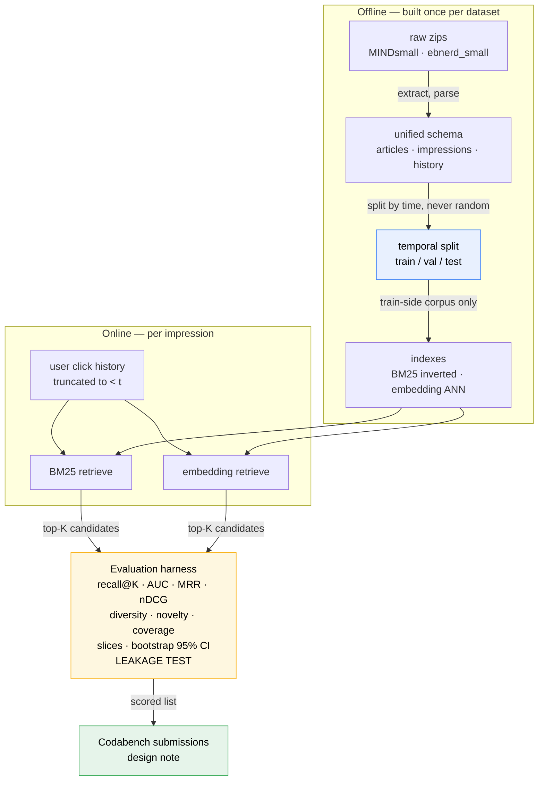

# Pipeline — what we are building and why

The **architectural** half of A1 Component-1. This file says what a correct pipeline looks like and
why it is shaped this way; the numbered phase files say what to actually do, in order. Decisions and
progress are logged in [[execution_plan_log]]. Design rationale that predates this plan set lives in
[[../architecture|architecture.md]]; dates live in [[../Assignment-1-Lexical-Semantic-Retrieval]].

> [!abstract] What this plan commits to
> **Small tier only** — MIND-small + EB-NeRD small — through Q1–Q6. Two retrievers (BM25, embeddings)
> behind **one `Retriever` interface**, scored by **one harness**, with every number carrying a
> **bootstrap 95% CI**. The leakage boundary is decided *before* any pipeline code exists and is
> asserted by a test that fails when broken. Large-tier data is downloaded but untouched until the
> small pipeline runs end to end.

> [!important] The constraint that shapes everything
> This is **candidate generation**, not ranking. The metric that matters is **recall@K for
> K ∈ {50, 100, 200}** — did the clicked article survive the cut? A re-ranker (Component-2) fixes
> ordering later, but **cannot recover an item that was never shortlisted**. Every design choice below
> is made in favour of recall, and a K that looks absurdly large is correct here.

## The four stages

**Read it as:** everything above the dashed middle is built once and reused; everything below runs per
impression. The split is drawn *before* the indexes are built, which is what makes the boundary
enforceable rather than aspirational.

## Why this decomposition

The four stages are not arbitrary — each boundary exists because something must not cross it.

| Boundary | What must not cross it | Consequence if it does |
|---|---|---|
| raw → unified | dataset-specific field names | Every downstream component written twice |
| unified → split | **future information** | Every reported number invalid (Q9) |
| split → index | test-period articles and clicks | Silent recall inflation |
| retriever → harness | retriever-specific scoring assumptions | Q2 and Q3 stop being comparable (Q4.5) |

The `Retriever` interface exists for the last row. Q4.5 requires *one* harness over *both* retrievers;
the cheapest way to guarantee that is to make them satisfy one contract.

## Phase files

| Phase | File | Covers | Depth |
|---|---|---|---|
| 1 | [[1-Data-Pipeline]] | Q1 — extract, unify, temporal split, feature store, one-command rebuild | **Full** |
| 2 | [[2-Lexical-BM25]] | Q2 — inverted index, query construction, BM25, recall@K | **Full** |
| 3 | [[3-Semantic-Embeddings]] | Q3 — encode, ANN, user vectors, lexical-vs-semantic | **Full** |
| 4 | [[4-Evaluation-Harness]] | Q4 — metrics, beyond-accuracy, slices, bootstrap CIs, leakage test | **Full** |
| 5 | [[5-Submission-and-Note]] | Q5, Q6, Q7 — Codabench, design note, deliverables | Outline |

Phases 1–4 are written to be executed. Phase 5 is deliberately an outline: its content is determined
by what phases 1–4 actually produce, and writing it in detail now would be inventing results.

## The data, as measured

Counted directly off the archives on **2026-08-18**. These supersede any earlier estimate.

### MIND-small (English)

| | train | dev |
|---|---|---|
| Impressions | 156,965 | 73,152 |
| Articles (`news.tsv`) | 51,282 | 42,416 |
| Users | 50,000 | 50,000 |
| Date range | **9–14 Nov 2019** | **15 Nov 2019** (one day) |

Users overlap by only **5,943** (12%) — train and dev are largely *different people*.

### EB-NeRD small (Danish)

| | train | validation |
|---|---|---|
| Impressions | 232,887 | 244,647 |
| Users | 15,143 | 15,342 |
| Sessions | 120,587 | 121,837 |
| Date range | **18–25 May 2023** | **25 May – 1 Jun 2023** |
| Articles | 20,738 (one shared file) | — |

History: mean **160 clicks/user** (min 5, max 1,896). In-view slate: mean **11–12 articles**
(max 100). Clicked per impression: **99.5% exactly one**.

> [!warning] Four schema facts that change the design
> 1. **MIND ships two different `news.tsv` files** (51,282 train / 42,416 dev articles). The corpus is
>    the *union*, or dev-only articles are unretrievable — see [[1-Data-Pipeline]] decision D3.
> 2. **MIND history is inline** in `behaviors.tsv` col 4; **EB-NeRD history is a separate parquet**
>    keyed by user. The unified schema must reconcile these.
> 3. **EB-NeRD history is pre-truncated** (`*_fixed` columns) — the authors already fixed a window.
>    We do not get raw per-click timestamps for the history period.
> 4. **Neither small tier has a test split.** Both official test sets are separate downloads, and
>    MIND has no small test set at all — only `MINDlarge_test`.

## Scale decision — small only, for now

**Working tier: MIND-small + EB-NeRD small.** Reasons, in order of weight:

1. **Comparability.** Cross-dataset claims (Q3.5, Q6) are only meaningful if both sides are the same
   tier. Small-vs-large would measure the tier, not the dataset.
2. **The brief names it.** Q1.1 says "MIND-small and EB-NeRD demo/small".
3. **Iteration speed.** ~230K + ~477K impressions is minutes per run locally, so the pipeline can be
   rebuilt many times per day. That matters more than absolute numbers this week.

**EB-NeRD demo** stays as the smoke test — every code change runs against it first (5K users, seconds).
**Large tiers are downloaded and deliberately idle** until the small pipeline is complete and correct.
Revisiting them is a Q6 scale measurement, not a source of headline numbers.

## Compute budget

Measured hardware: **i9-14900HX (24 cores / 32 threads), 31 GB RAM, RTX 4060 Laptop 8 GB VRAM,
torch 2.5.1 + CUDA**, 134 GB free disk. Sufficient for all of C1 — see
[[../architecture|architecture.md]] decision 7b.

> [!important] Resource limits are arguments, never constants
> The machine is shared with other work (observed: load average 26.5 and 9.5 GB swap in use while
> another job ran). Every stage that parallelises or allocates in bulk takes:
>
> | Arg | Controls | Default |
> |---|---|---|
> | `--n-jobs` | worker processes | **26** |
> | `--mem-gb` | host memory ceiling, sizes chunked reads | **26** |
> | `--batch-size` | encoder batch — the VRAM dial, separate from host memory | 64 |
>
> Defaults are for an **idle** machine. Every run reads actual availability at startup and scales
> down or refuses rather than swapping itself to death, and logs the resolved values next to the
> metrics so any number can be traced to the budget that produced it.

## Non-negotiables

Five properties that, if wrong, invalidate the work regardless of how good the numbers look:

1. **Temporal split with truncated history.** For a test impression at time *t*, that user's history
   contains only clicks `< t`.
2. **A leakage test that fails when the boundary is broken.** A test that passes both before and after
   you introduce leakage proves nothing. See [[4-Evaluation-Harness]].
3. **Two retrievers, one interface, one harness.**
4. **recall@K at K ∈ {50, 100, 200}**, both datasets, both retrievers.
5. **Every number carries a bootstrap 95% CI**, resampled at the *impression* level.

## What this plan deliberately excludes

| Excluded | Why |
|---|---|
| Learned re-ranker | Explicitly Component-2. Building it now costs C1 marks. |
| Fine-tuning or training an encoder | Overkill; a forward pass of a pre-trained encoder is what Q3 sanctions. |
| Large-tier headline results | Comparability (above). Q6 scale story only, after small works. |
| Session-context modelling | Named in the brief's axes but lands in C2's click-log modelling. Stated as a scope choice, not an oversight. |
| Serving API / web UI | Zero marks; not in the rubric. |

---
[[../Assignment-1-Lexical-Semantic-Retrieval|← tracking note]] · [[../architecture|architecture.md]] ·
[[execution_plan_log|execution log]]
